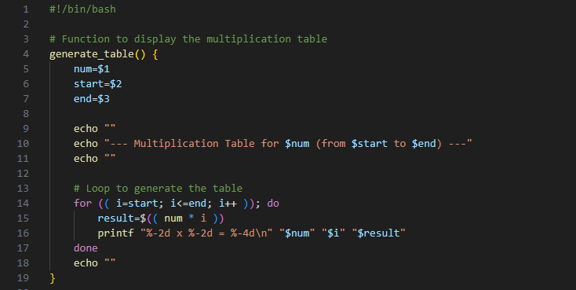
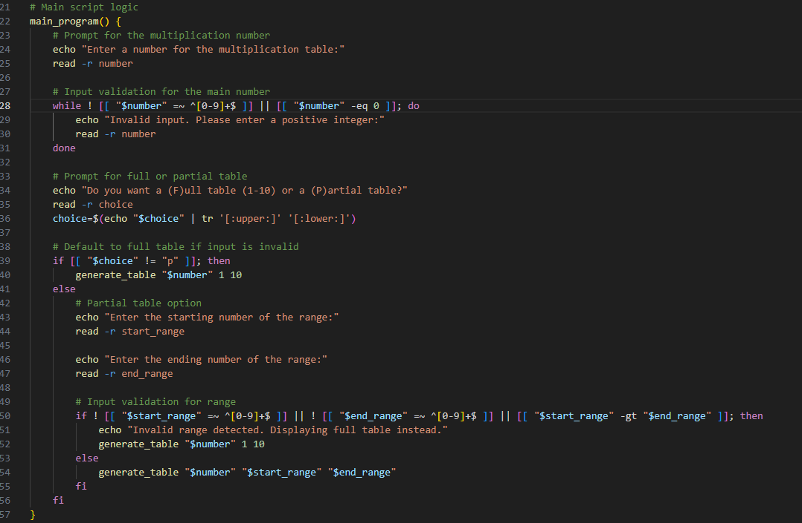
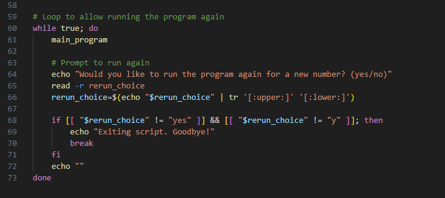
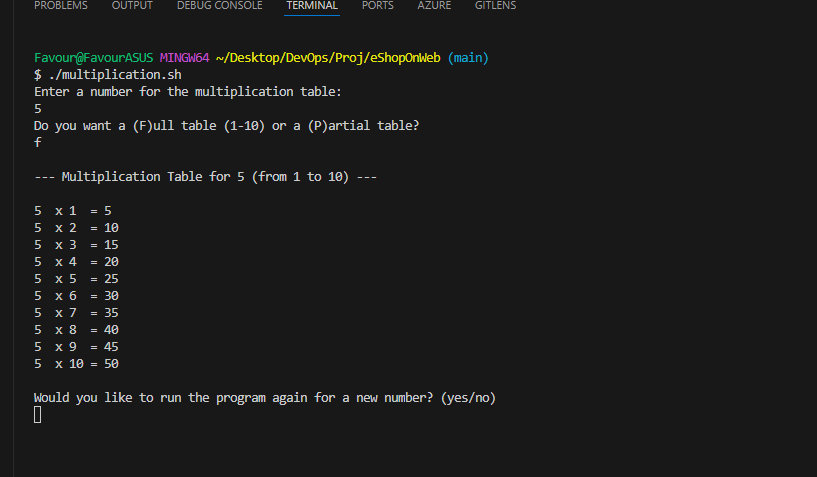
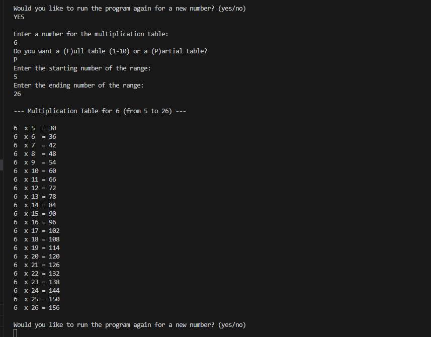
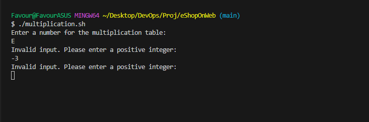
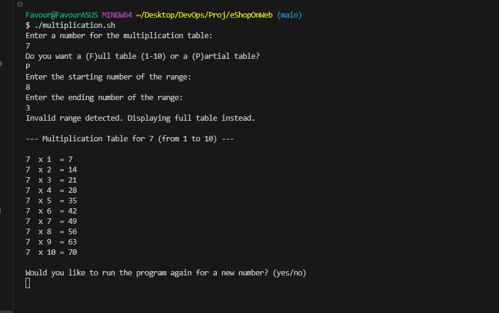

## CAPSTONE PROJECT
### Bash Scripting for generating a multiplication table. 
In this project, we will be making use of mainly two functions the generate_table() and main_program() for generating a full multiplication table and partial multiplication table.

The screnshot above represents the function that generates a multiplication table. The function accepts three arguments num, start, end. For loop is the used to genereate a sequence of numerical values and then evaluates the multiplication.

The main_program does the logical decision making. Line 28 defines a while loop followed by a regEx used to ensure the value entered by the user is a positive integer. Line 39 ensure whatever letter the user is providing whether lower or upper case, the scripts still runs either way. The result is then passed into the $choice variable again. Line 50 ensures the end range value entered by the user is always greater than the value of the start range. Line 52 and 54 calls the generate_table function withe the arguments number, start_range and end_range. 

The image above shows a While loop to prompt the user is he wants to continue with the program then rerun main_program() else quit.

#### Results

Requesting a number for its multiplication table to be generated. 
Prompts the user to specify whether a partial table or full table is to be generated with responses F and P

Provided all necessary conditions are met, 
Here, the value new is inputted by the user and the program is ready to accept a new number for processing.

This time, the user wants to generate a partial multiplication table by inputting P. User enters the upper rnage value and lower range values. 

Ouput for the partial multiplication table.

 ## Error handling. 

 The script outputs "Invalid input. Please enter a positive integer: " when the user enters non positive intergers (E and -3) as an input. 

 

 Here, the user a start range value that is larger than the end range value. 
 The scripts prints the full table instead.  

 As explained from the script, it prompts the user about the invalid inputs and consequently displaying the full multiplication table as a result.

 

In a case where the user wants to voluntarily end the scripts.