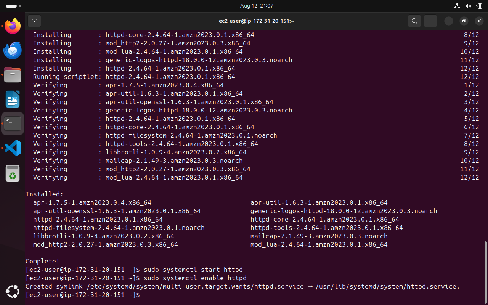

## E-Commerce Platform: Deployment with Git Linux and AWS

Start by the basic Git operation on the local machine. Operations such as 

Mkdir MarketPeak_Ecommerce (Create directory)

cd /MarketPeak_Ecommerce (Navigate into the newly created folder)

git init (Initialize git) 

Then dowload the website template provided and maually extracting the content of the zip file into MarketPeak_Ecommerce folder.

Having already created an empty repository on github with a name matching the name of the local repos on the local machine, The images above show git operations for staging, commit at local repository level, creating a main branch with git branch -m main command and then pushing to the remote main repository (GitHub)

### AWS Deployment

Image above show the Amazon Linux EC2 Instance deployed on AWS  

On deployment, a keypair was created and downloaded inside the Dowloads folder of the local machine. Read permissions were also granted to the keypair file. Then the linux server was connected fromm the local terminal with the ssh command.

#### Cloning the repository onto the linux server 

SSH method: 

HTTP method:

#### Installing a Web Server EC2

#### Configuring https (apache) for website on the remote server.

#### Accessing the deployed website

The website is then accessed by loading the Public IP address of the EC2 instance on any web browser

### Continuous Integration and Deployment

To ensure a smooth workflow for developing testing and deploying of the ecommerce website, CI/CD is implemeted. It inloves making chages to the development environment, implementing version control with git and deploying updates to the prodution server on AWS. 

We begin by creating a development branch. This isolates new featutures and bug fixes from the stable version of the website. 

Develop Locally: Create a new Git branch, make your code changes, and save them.

Commit & Push: Record your changes with git commit and upload them to GitHub with git push.

Pull Request & Merge: Open a Pull Request on GitHub for review, then merge your changes into the main branch.

After successfully merging, a copy of the the folder is the pulled from the remote repository. The httpd web server is then reloaded using the "sudo systemctl reload httpd" command. 

however, when the changes were made on the local repository the changes were not effected on the main website. After troubleshooting for a couple of days, i realized i was yet to replace the files in the /var/www/html folder with the latest website files pulled from the remote repository into the local repos. 

Changes were only made to the time and phone numbers provided on the website. 

Before: Mon-Fri 10:00 - 19:00 and phone no was 240-480-9600

After the changes: Mon-Fri 10:00 - 23:00 and phone no was 240-480-960023

.