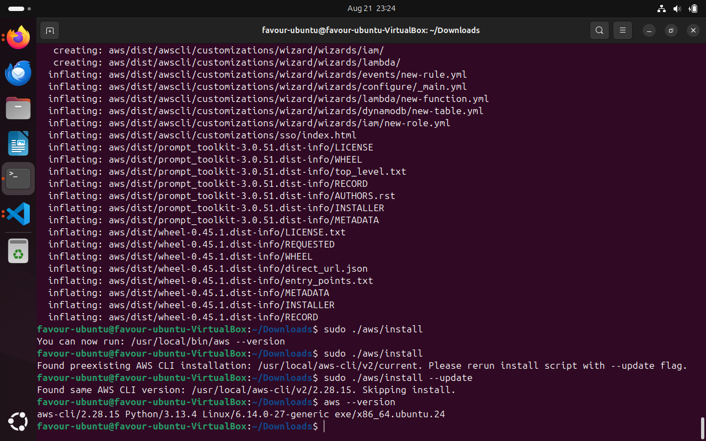
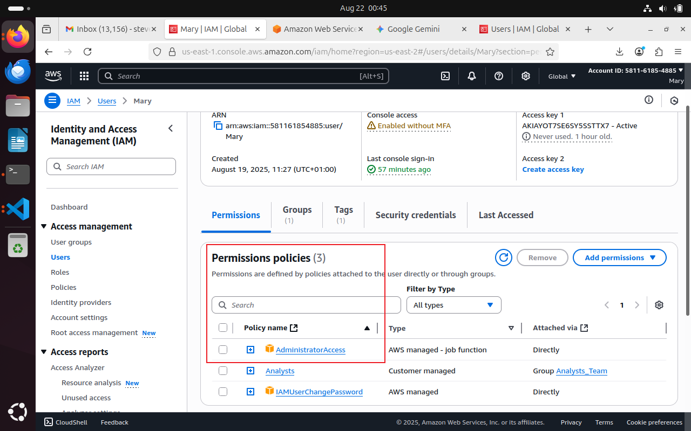
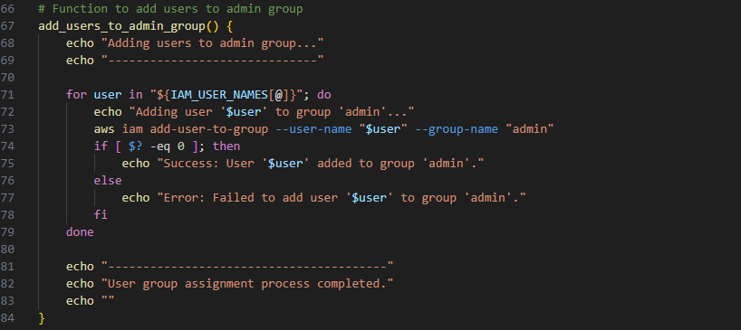
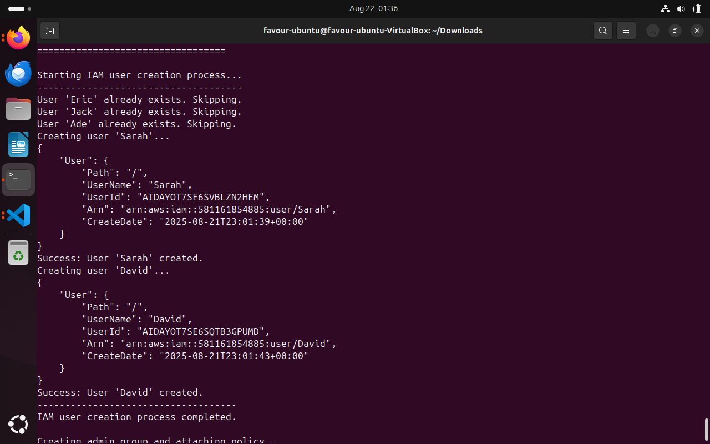
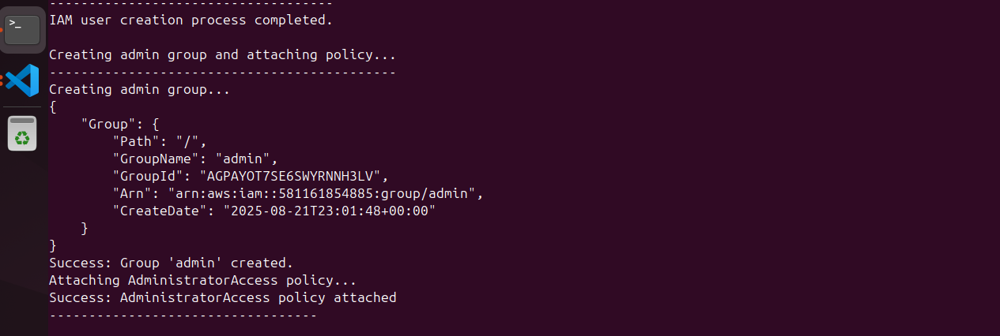
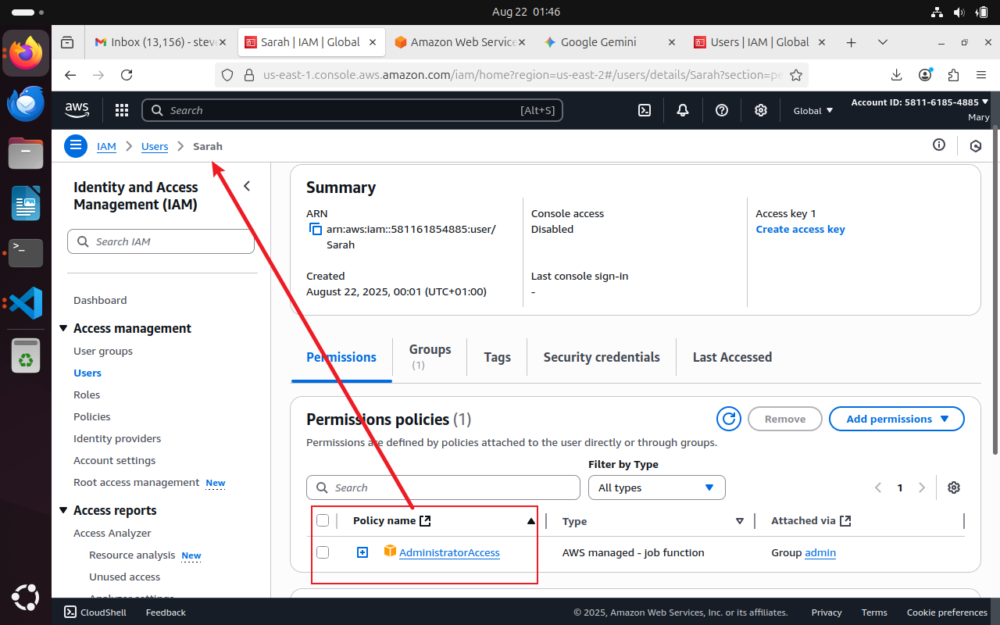

<<<<<<< HEAD
# Shell Script for AWS IAM manangemnt. 

The shell script will automates the process of creating IAM users and groups, and attaching policies to them using the AWS CLI. This automation is a key aspect of efficient cloud management and is crucial for implementing a strong security posture.

The script demonstrates the following core concepts of AWS Identity and Access Management (IAM):

IAM Users: The script first creates individual IAM users, which represent specific people or applications within your AWS environment. This is the foundation for granting unique access to each team member.

IAM Groups: It then creates a central IAM group called admin. IAM groups are collections of users that simplify permission management by allowing you to apply policies to the group rather than to each user individually.

IAM Policies: The script attaches an administrative policy to the group. A policy is a set of rules that define what actions a role or user can perform on AWS resources. By attaching the AdministratorAccess policy to the admin group, all users in that group inherit those administrative permissions.

This approach ensures that permissions are managed efficiently and securely, aligning with the Principle of Least Privilege by organizing users into roles based on their job functions. Instead of manually configuring each user, you can simply add them to a group, and they will automatically inherit the correct permissions.

Before we proceed, there is a very crucial task to carry out. To configure the local linux terminal to help carry out the project. We need to configure AWS CLI on the local machine and as well as to configure the AWS account so as to have appropriate permsissions to manage IAM resources.

### Step 1

#### Install AWS CLI v2

To do this, run the command 

curl "https://awscli.amazonaws.com/awscli-exe-linux-x86_64.zip" -o "awscliv2.zip"

Next is to unzip the downloaded zip file using the command below

unzip awscliv2.zip

After unzipping, run the command below to complete the installation.

sudo ./aws/install

To verify the installation, run the command 

aws --version

### Step 2
#### Configure the AWS CLI
The next step is to configure the CLI with your user's access keys and default region.
As a root user, you should not use your root account credentials directly to configure the AWS CLI. The root account has unrestricted access to all resources and services in your AWS account. Using it for daily tasks, including CLI configuration, poses a significant security risk.

The recommended best practice is to begin by creating a dedicated IAM user with administrative privileges. This aligns with the Principle of Least Privilege, ensuring that even if the credentials for this user are compromised, the scope of potential damage is limited compared to the root account.

Log in as a root user and create a user, here we are using an already created IAM user (Mary) under the root user. This IAM user has an AdminAccess permission, the permission required to create other users. 

So as to then enable us communicate with the console from the terminal, we will require an access key, created by the IAM user Mary. 
Retrive this as it will be required on the terminal.

The image below shows the user mary under the root user (Stevenfavour). The access key and secret are retrieved.

After AWS CLI versio verification, Now head back to the terminal and run the command "aws configure"

You will be prompted to enter four values:

AWS Access Key ID: The unique ID for your IAM user.

AWS Secret Access Key: The secret key associated with your Access Key ID.

Default region name: The AWS Region you want to use by default (e.g., us-east-1).

Default output format: The format you want the output to be in (e.g., json).

The retrieved access key information will be used here.

To validate this, we run the command  aws iam list-users.
Since the purpose of your configured user is to manage IAM, you can run a command to list all the IAM users in your account. This is a good way to confirm that the new user has the correct permissions.

If the configuration and permissions are correct, this command will return a JSON output listing all the IAM users in your account. 

## Developing the Shell script.

As discussed earlier, the shell script will automates the process of creating IAM users and groups, and attaching policies to them using the AWS CLI.

Based on the provided script and objectives, here is a step-by-step breakdown of how to complete the task.

Step 1: Define the IAM User Names Array and Create User function.

The first objective is to define an array with the names of five IAM users. This makes it easy to iterate through the names when creating the users. I'll add the user names to the IAM_USER_NAMES array already defined in the script.

Line 7 defines the name array and line 10 defines the function to create users, according to the names in the declared array in line 7.

Next is writing the loop inside the create_iam_users function. The loop will iterate through the IAM_USER_NAMES array, creating a user with the corresponding name for each iteration. The aws iam create-user --user-name "$user" command is used for this purpose. I'll include a check to see if the user already exists to prevent errors.

Step 2: Create the Admin Group

The create_admin_group function will be used to create the admin group. The aws iam create-group --group-name "admin" command will be used. This command is a straightforward way to create a new group in IAM. The script already includes a check to see if the group exists, which is good practice.

Step 3: Attach the AdministratorAccess Policy

As part of the create_admin_group function, attach the AdministratorAccess policy to the newly created admin group. The AWS CLI command for this is aws iam attach-group-policy. 

The policy-arn for the AdministratorAccess managed policy is arn:aws:iam::aws:policy/AdministratorAccess. This grants the group full administrative privileges, as required.

This part of the code is already integrated into the create_admin_group function from the previous step.

Step 4: Add Users to the Admin Group

Write a loop in the add_users_to_admin_group function to add each user from the IAM_USER_NAMES array to the admin group. The aws iam add-user-to-group command is used for this task. This command takes both the group name and the user name as arguments.

Fianlly, create a main fuction that encapsulates all the other written function above and also checks if AWS CLI is installed. 

The fuction main is then called at line 110. 

So before running the script on the terminal, execution permission has to be given to the script in order to run. Upon execution, it is discovered that userS Jack, Eric and Ade alrady exist so the script skips their creation. 

User Sarah and User David were both created successfully. 

Next, a user group (admin) is created and policy attached to the created user group.

Jack, Ade, Eric, Sarah and David are then added to the group also giving them admin permission. 

To verify these processess, head back to the console.

In the console, we can see that two new users have been created  and also given the required permissions.

Having successfully completed the project, the project demonstrated a strong understanding of AWS IAM and its core components. The automated script developed is a practical example of how to implement security best practices in a real-world cloud environment.

This project not only helped understand the theoretical concepts of IAM but also gave hands-on experience in:

Automation: Focused on how to use the AWS CLI and shell scripting to automate tasks, which is a fundamental skill for any DevOps professional.

Security: Applied the principle of least privilege by creating a dedicated IAM user for administrative tasks instead of using the root account.

Efficiency: By using IAM groups, it simplified the process of managing permissions for multiple users.

Below is the link to the extended shell script for the project. 

https://github.com/Stevenfavour/Linuxfundametal0/blob/main/Capstones/aws_iam_manager.sh  or  

=======
# Shell Script for AWS IAM manangemnt. 

The shell script will automates the process of creating IAM users and groups, and attaching policies to them using the AWS CLI. This automation is a key aspect of efficient cloud management and is crucial for implementing a strong security posture.

The script demonstrates the following core concepts of AWS Identity and Access Management (IAM):

IAM Users: The script first creates individual IAM users, which represent specific people or applications within your AWS environment. This is the foundation for granting unique access to each team member.

IAM Groups: It then creates a central IAM group called admin. IAM groups are collections of users that simplify permission management by allowing you to apply policies to the group rather than to each user individually.

IAM Policies: The script attaches an administrative policy to the group. A policy is a set of rules that define what actions a role or user can perform on AWS resources. By attaching the AdministratorAccess policy to the admin group, all users in that group inherit those administrative permissions.

This approach ensures that permissions are managed efficiently and securely, aligning with the Principle of Least Privilege by organizing users into roles based on their job functions. Instead of manually configuring each user, you can simply add them to a group, and they will automatically inherit the correct permissions.

Before we proceed, there is a very crucial task to carry out. To configure the local linux terminal to help carry out the project. We need to configure AWS CLI on the local machine and as well as to configure the AWS account so as to have appropriate permsissions to manage IAM resources.

### Step 1

#### Install AWS CLI v2

To do this, run the command 

curl "https://awscli.amazonaws.com/awscli-exe-linux-x86_64.zip" -o "awscliv2.zip"

Next is to unzip the downloaded zip file using the command below

unzip awscliv2.zip

After unzipping, run the command below to complete the installation.

sudo ./aws/install

To verify the installation, run the command 

aws --version

### Step 2
#### Configure the AWS CLI
The next step is to configure the CLI with your user's access keys and default region.
As a root user, you should not use your root account credentials directly to configure the AWS CLI. The root account has unrestricted access to all resources and services in your AWS account. Using it for daily tasks, including CLI configuration, poses a significant security risk.

The recommended best practice is to begin by creating a dedicated IAM user with administrative privileges. This aligns with the Principle of Least Privilege, ensuring that even if the credentials for this user are compromised, the scope of potential damage is limited compared to the root account.

Log in as a root user and create a user, here we are using an already created IAM user (Mary) under the root user. This IAM user has an AdminAccess permission, the permission required to create other users. 

So as to then enable us communicate with the console from the terminal, we will require an access key, created by the IAM user Mary. 
Retrive this as it will be required on the terminal.

The image below shows the user mary under the root user (Stevenfavour). The access key and secret are retrieved.

After AWS CLI versio verification, Now head back to the terminal and run the command "aws configure"

You will be prompted to enter four values:

AWS Access Key ID: The unique ID for your IAM user.

AWS Secret Access Key: The secret key associated with your Access Key ID.

Default region name: The AWS Region you want to use by default (e.g., us-east-1).

Default output format: The format you want the output to be in (e.g., json).

The retrieved access key information will be used here.

To validate this, we run the command  aws iam list-users.
Since the purpose of your configured user is to manage IAM, you can run a command to list all the IAM users in your account. This is a good way to confirm that the new user has the correct permissions.

If the configuration and permissions are correct, this command will return a JSON output listing all the IAM users in your account. 

## Developing the Shell script.

As discussed earlier, the shell script will automates the process of creating IAM users and groups, and attaching policies to them using the AWS CLI.

Based on the provided script and objectives, here is a step-by-step breakdown of how to complete the task.

Step 1: Define the IAM User Names Array and Create User function.

The first objective is to define an array with the names of five IAM users. This makes it easy to iterate through the names when creating the users. I'll add the user names to the IAM_USER_NAMES array already defined in the script.

Line 7 defines the name array and line 10 defines the function to create users, according to the names in the declared array in line 7.

Next is writing the loop inside the create_iam_users function. The loop will iterate through the IAM_USER_NAMES array, creating a user with the corresponding name for each iteration. The aws iam create-user --user-name "$user" command is used for this purpose. I'll include a check to see if the user already exists to prevent errors.

Step 2: Create the Admin Group

The create_admin_group function will be used to create the admin group. The aws iam create-group --group-name "admin" command will be used. This command is a straightforward way to create a new group in IAM. The script already includes a check to see if the group exists, which is good practice.

Step 3: Attach the AdministratorAccess Policy

As part of the create_admin_group function, attach the AdministratorAccess policy to the newly created admin group. The AWS CLI command for this is aws iam attach-group-policy. 

The policy-arn for the AdministratorAccess managed policy is arn:aws:iam::aws:policy/AdministratorAccess. This grants the group full administrative privileges, as required.

This part of the code is already integrated into the create_admin_group function from the previous step.

Step 4: Add Users to the Admin Group

Write a loop in the add_users_to_admin_group function to add each user from the IAM_USER_NAMES array to the admin group. The aws iam add-user-to-group command is used for this task. This command takes both the group name and the user name as arguments.

Fianlly, create a main fuction that encapsulates all the other written function above and also checks if AWS CLI is installed. 

The fuction main is then called at line 110. 

So before running the script on the terminal, execution permission has to be given to the script in order to run. Upon execution, it is discovered that userS Jack, Eric and Ade alrady exist so the script skips their creation. 

User Sarah and User David were both created successfully. 

Next, a user group (admin) is created and policy attached to the created user group.

Jack, Ade, Eric, Sarah and David are then added to the group also giving them admin permission. 

To verify these processess, head back to the console.

In the console, we can see that two new users have been created  and also given the required permissions.

Having successfully completed the project, the project demonstrated a strong understanding of AWS IAM and its core components. The automated script developed is a practical example of how to implement security best practices in a real-world cloud environment.

This project not only helped understand the theoretical concepts of IAM but also gave hands-on experience in:

Automation: Focused on how to use the AWS CLI and shell scripting to automate tasks, which is a fundamental skill for any DevOps professional.

Security: Applied the principle of least privilege by creating a dedicated IAM user for administrative tasks instead of using the root account.

Efficiency: By using IAM groups, it simplified the process of managing permissions for multiple users.

Below is the link to the extended shell script for the project. 

https://github.com/Stevenfavour/Linuxfundametal0/blob/main/Capstones/aws_iam_manager.sh  or  

>>>>>>> a90996b03a7e969c4559c3110485420de20a2c9d
