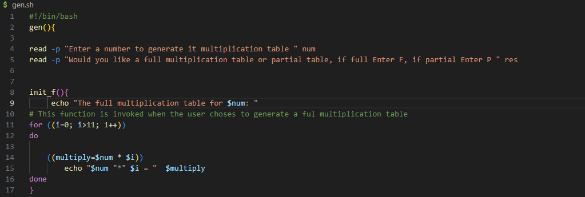
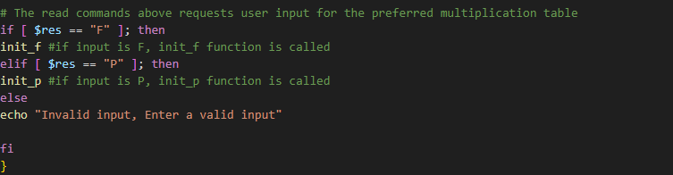
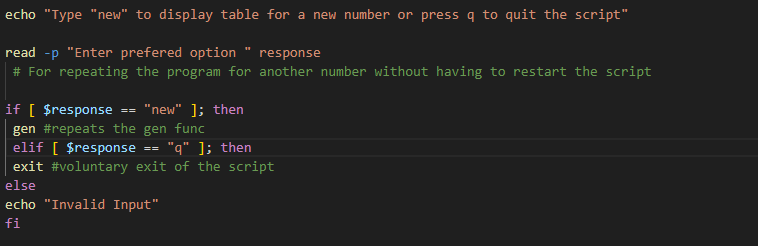
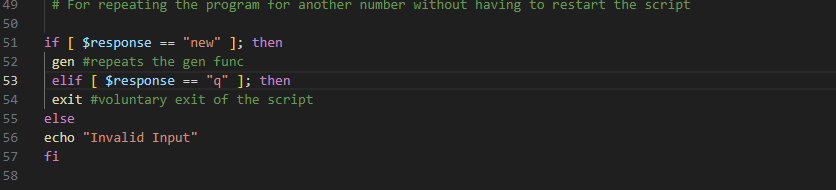
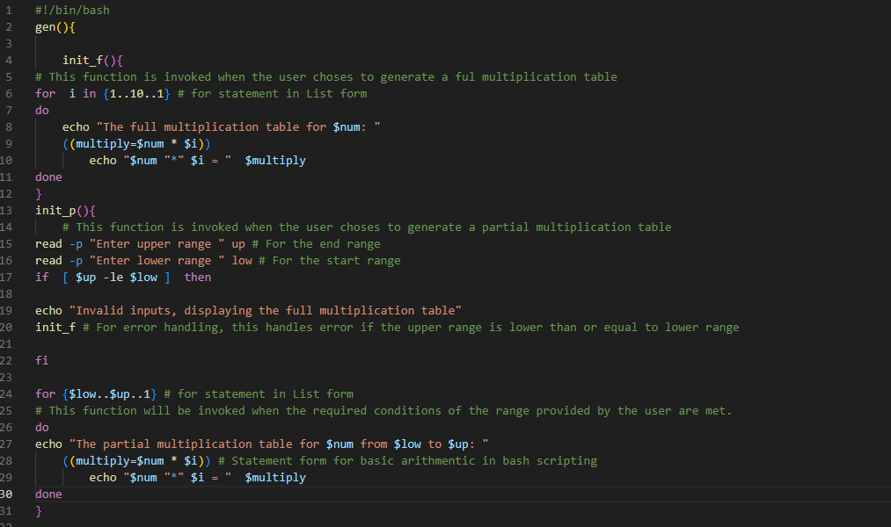

# Linux Fundamentals

Starting with an already created Ubuntu based EC2 Instance on AWS below shows the steps take to carry out this project.

## 1. Linux-3mtt Instance
Below is the image of the provisioned EC2 instance (server).

## 2. Instance Details
Details of the instance are shown in the image below, displating the Instance ID, Private and Publi DNS addresses and IP addresses as well as the newly created SSH keypair.

## 3. Client Tool

Client tool that will be used in creating the connection with the remote server from the local environment is GitBash. Having also located the directory of the downloaded public keypair

## 4. Creating the connection with SSH

Below show the command for creating the connection using ssh -l command and successfully connected to linux-3mtt instance. The image also show the details of the remote server including memory usage percentage and IP addresses. 

## 5. Package Manager

Refreshing the package list using the "sudo apt update" command 

## 6. Package Manager

Installing the tree package. 

Removing the tree package and verifying 

