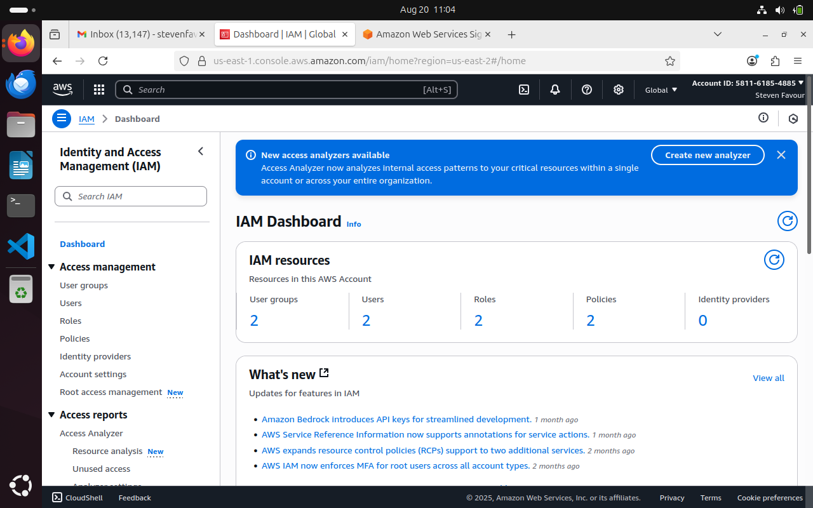
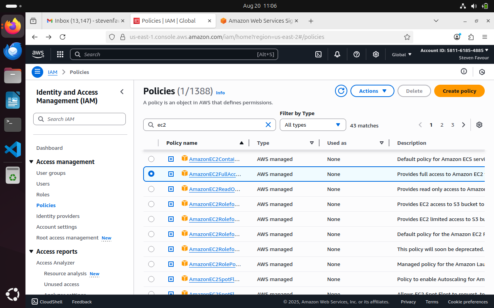

## AWS Identity and Access Management (IAM)

### What is IAM?
IAM, or Identity and Access Management. Think of it as the gatekeeper for your AWS resources, its job is to decide who gets in and what they're allowed to do once they're inside.

Imagine you have this big digital "house" full of all your AWS stuff-your data, your applications, the whole shebang. Now, you don't just want anyone wandering in and messing around with your things, right? That's where IAM steps in.

It's like having your own VIP list for your digital world. IAM helps you keep your AWS resources safe and sound, making sure only the right people get in and that they're only allowed to do what you say they can. It's all about keeping your digital house in order and protecting your precious stuff from any unwanted guests.

### What is IAM user?
IAM users are like individual accounts for different people or entities within your AWS environment.

For example, if you have a team working on a project, you can create separate IAM users for each team member. Each IAM user would have their own unique username and password, allowing them to access the AWS resources they need for their work.

IAM users help you manage and control access to your AWS resources securely, ensuring that each user only has access to the resources they need to perform their tasks.

### What is IAM group?
IAM Groups are like collections of IAM users. Instead of managing permissions for each user individually, you can organize users into groups based on their roles or responsibilities.

You can think IAM Groups as these neat little collections of users with similar roles or responsibilities. It's like putting everyone into teams based on their tasks. So, you might have a group for developers, another for administrators, and so on. Instead of setting permissions for each person one by one, you set them up for the whole group at once.

For example, let's say you have a development team working on a project. Instead of assigning permissions to each developer one by one, you can create an IAM Group called "Developers" and add all the developers to that group. Then, you assign permissions to the group as a whole. So, if you want all developers to have access to the same resources, you only need to set it up once for the group.

### What is IAM Role?
An IAM role defines what someone or something (like an application or service) can do within your AWS account. Each role has a set of permissions that determine which actions it can perform and which AWS resources it can access.

For example, you might have an "admin" role that gives full access to all resources, or a "developer" role that only allows access to certain services for building applications.

Or if we take another example, imagine you have a visitor who needs temporary access to your house to fix something. Instead of giving them a permanent key (IAM user), you give them a temporary key (IAM role) that only works for a limited time and grants access to specific rooms (AWS resources).

IAM roles are flexible and can be assumed by users, services, or applications as needed. They are commonly used for tasks such as granting permissions to AWS services, allowing cross-account access, or providing temporary access to external users. IAM roles enhance security and efficiency by providing controlled access to AWS resources without the need for permanent credentials.

### What is IAM Policy?
An IAM policy is a set of rules that define what actions a role can take. These rules specify the permissions granted to the role. Think of a policy as a rulebook for the role. It outlines which actions are allowed and which are not, helping to ensure secure and controlled access to your AWS resources.

For example, the rulebook might say that the "admin" key (IAM role or user) can open any door and perform any action within the house (AWS resources), while the "viewer" key (IAM role or user) can only open certain doors and look around, but not make any changes.

IAM policies define the permissions granted to IAM roles and users, specifying which AWS resources they can access and what actions they can take. They are essential for maintaining security and controlling access to AWS resources, ensuring that only authorized actions are performed by users and roles within your AWS account.

## Steps invoolved in creating custom IAM policy for User and User group for a specific role within an organization.

## Part 1

The goal is to create an IAM policy that grants full access to EC2. Create an IAM user named Eric and attach the EC2 access policy to him.

Navigate into the AWS management console and locate IAM services dashboard.

Click Policies on the left pane of the screen. 
Search EC2 on the search bar and select "AmazonEC2FullAccess" from the suggested policy list.
Click on Create Policy

Now select all EC2 actions to give the user (eric) full access.

This is the policy created for the user. The policy grants the user full access to all EC2 actions. 

We then move on to create a user that will consume the previously created policy.
Provide the name and allow the user access to AWS management console. Create a Password.

Attach the policy directly here by selecting "Policy_for_eric" policy.

User Eric created succesfully. Retrieve the Password. 

## Part 2 

The goal is to create an IAM group. Create two new IAM users, Jack and Ade, and add them to this group. Create a new IAM policy that grants full access to both EC2 and S3, and attach this policy to the group.

Navigate to the dashboard and click on user groups on the left pane of the dashboard. Provide the name for the usergroup and then click Create User Group

User Group Dev_Team created. 

Proceed to the User section and create a user named Jack. 

Under Permission, Click "Add user to group" Add Jack to the previously created user group. (Dev_Team)

Review and create. 

Follow the same process to create a user for Ade and add him to the Dev_Team Group. 

Upon completion, Users Ade and Jack has been created.

Navigate to Policy to create a new Policy. 
Select the two services (EC2 and S3) to give full access to.  
Specify the permissions.

Provide name and description for the policy. 

Permission "EC2_S3_permission" created. 

We then go back to the group with Ade and Jack (Dev_Team) to attach the neccessary permission to it. Click "Attach Policy"

Search for the previoulsy created customer managed permission policy type and select the required permission. 

To validate this, Navigate back to the user Jack and check for list of permissions assigned to him. 

He now has the neccessary permission to access EC2 and S3 services by the virtue of being in the Dev_Team user group. 

This project of setting up IAM for Eric, Jack, and Ade directly demonstrates the core concepts of IAM.

Understanding IAM: The project uses IAM as the security foundation. Instead of giving everyone the main AWS account credentials, we create separate IAM identities (users and a group) to control access to specific resources (EC2 and S3).

Security Importance: By creating separate policies and attaching them to users and groups, the project ensures data protection and prevents unauthorized access. For example, Eric only gets full access to EC2, not S3. This limits his access to what is necessary for his job, embodying the principle of least privilege.

Policy Creation: The project is a practical exercise in crafting IAM policies to regulate access effectively. The first policy is specific to EC2, while the second policy is broader, giving access to both EC2 and S3 for a group of users.

Imagine Eric is a backend developer who only needs to manage EC2 instances to deploy applications. We give him a specific IAM user with a policy that only allows him to access EC2. This prevents him from accidentally (or intentionally) accessing or deleting sensitive data stored in S3 buckets.

Meanwhile, Jack and Ade are DevOps engineers who need to manage both the EC2 instances for deployment and the S3 buckets for storing application artifacts and logs. Instead of granting each of them the same permissions individually, we create a Dev_Team group. We attach a single IAM policy to this Dev_Team group that grants full access to both EC2 and S3. Now, whenever Jack or Ade logs in, they automatically inherit the correct permissions from their group, which is a much more efficient way to manage access for a team.