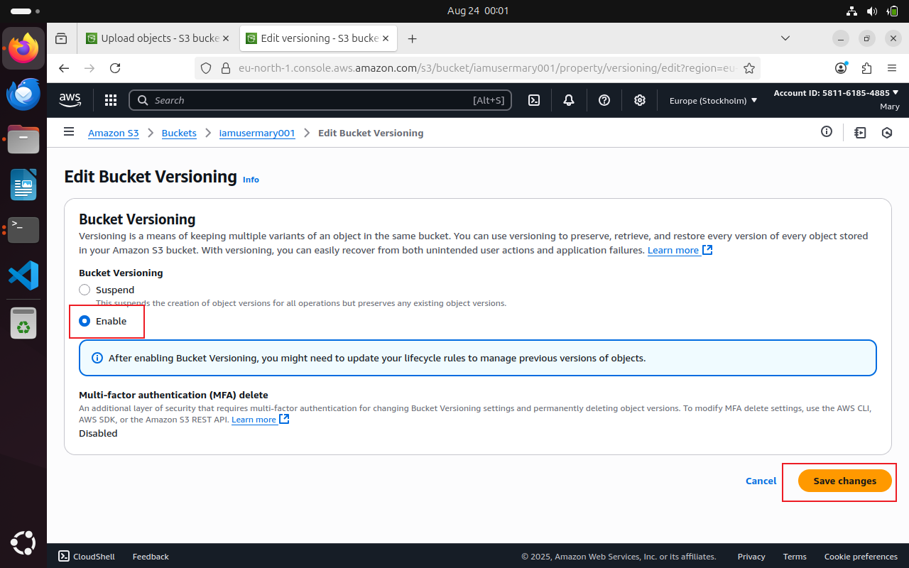

## Amazon S3 (Simple Storage Service)
### What is Amazon S3?

Amazon S3, or Simple Storage Service, is like a big digital warehouse where you can store all kinds of data. It's part of Amazon Web Services (AWS), which is a collection of cloud computing services.

Think of S3 as a giant virtual filing cabinet in the cloud. You can put files, documents, pictures, videos, or any other digital stuff you want to keep safe and accessible.

What's cool about S3 is that it's super reliable and secure. Your data is stored across multiple servers in different locations, so even if something goes wrong with one server, your files are still safe.

Plus, S3 is really flexible. You can easily access your files from anywhere in the world using the internet, and you can control who gets to see or edit your stuff with different levels of permissions.

### S3 Benefits

Amazon S3 offers a range of benefits that make it a top choice for storing and managing data in the cloud.

Firstly, S3 provides exceptional durability and reliability. Your data is stored across multiple servers and data centers, ensuring that even if one server fails, your files remain safe and accessible.

Secondly, S3 offers scalability, meaning you can easily increase or decrease your storage capacity as needed. Whether you're storing a few gigabytes or petabytes of data, S3 can handle it without any hassle.

Another key benefit of S3 is its accessibility. You can access your data from anywhere in the world using the internet, making it convenient for remote teams or distributed applications.

Security is also a top priority with S3. You have full control over who can access your data and can encrypt your files to ensure they remain confidential and secure.

Additionally, S3 is cost-effective. You only pay for the storage you use, with no upfront fees or long-term contracts, making it a budget-friendly option for businesses of all sizes.

### S3 Use Cases

Backup: Think of it as a safe place to keep copies of important files, like your computer's backup. If anything happens to your computer, you can get your files back from S3.

Website Stuff: S3 can also hold all the pieces of a website, like images and videos. So, when you visit a website, some of the stuff you see might be stored in S3.

Videos and Photos: You know all those videos and photos you share online? They're often stored in S3 because it's really good at keeping them safe and making sure they load fast.

Apps and Games: S3 is also used by apps and games to store things like user profiles or game levels. It helps keep everything running smoothly and makes sure your progress is saved.

Big Data: Companies use S3 to store huge amounts of data for things like analyzing customer behavior or trends. It's like having a big library where you can find all sorts of useful information.

Emergency Backup: Some companies use S3 to store copies of their data in case something bad happens, like a natural disaster. It's like having a backup plan to keep things going no matter what. Keeping Old Stuff: Sometimes, companies have to keep old records for legal reasons. S3 has special storage options that are really cheap, so it's a good place to keep all that old stuff without spending too much money.

Sending Stuff Fast: S3 works with a service called CloudFront, which helps deliver stuff really quickly to people all over the world. So, if you're watching a video or downloading a file, S3 helps make sure it gets to you fast.

### What is S3 Versioning?

Imagine you're working on a big project and you accidentally delete an important file. But wait, with S3 versioning, it's like having a magic undo button.

Here's how it works: Normally, when you delete a file in S3, it's gone for good. But with versioning turned on, S3 keeps a copy of every version of your file, even if you delete it or overwrite it. So if you make a mistake, you can easily go back to a previous version and restore it, just like rewinding time.

This feature is super handy for protecting your data from accidents or malicious actions. It's like having a safety net for your files, ensuring that even if something goes wrong, you can always recover your precious data. Plus, it's easy to turn on and manage, giving you peace of mind knowing that your files are always safe and sound in Amazon S3.

Breaking it down into five parts so that it will help us understand it more clearly.

Firstly, we will create a new bucket in Amazon S3 to store our files. Following that, we will upload a file into this newly created bucket. Subsequently, we will enable versioning for the bucket, allowing us to retain multiple versions of our uploaded files for tracking changes over time. Next, we will configure the permissions for the bucket to enable public access, ensuring that the files can be accessed by anyone with the appropriate link. Finally, we will implement lifecycle policies to automate the management of our files.

Lets get into it. 

Step 1

We will start by creating a bucket with an IAM user who has the neccessary permissionn to create bucketand not working from the root user profile, following the recommended best practice. 

Selecting the bucket type and specifying a bucket name. This name has to be a global name as no two bucket in the world share a name. 

Disable ACL (Access Control List) and also block public access to the bucket. This makes it impossible for this bucket to be accessed from anywhere asides through the console. 

Disable Bucket Versioning (for now) and use the default encryption setting.
Click Create. 

iamusermary001 bucket has been created successfully and we are ready to upload a file into it by clicking Uplaod.

Step 2

We will then Upload a shell script into this bucket.

Click add file 

Having selected hello.sh from the local machines folder, click upload to upload the file into the bucket.

Upload successful.

To enable Bucket versioning, go to the properties tab, under bucket versioning, click edit.

Click enable, then save the changes.

Success 

Then we go back to the shell script to do a few editing using Vim on the terminal.

Save the changes and re upload the .sh file into the bucket.

Now we have two versions of hello.sh files. We can identify this by their version ID.

Step 3

Next, we will configure the permissions for the bucket to enable public access, ensuring that the files can be accessed by anyone with the appropriate link. 

Under the permission tab of the bucket, locate Public acccess setting and click edit.

Uncheck "Block all Public Access" box, this will disable the rest of the boxes.
Then save the chnages. 

Confirm this setting by typing Confirm in the space. This is to ensure the user knows exactly what he is doing. 

Success 

Now, we need to create a bucket policy to specify the actions you want the public to be able to perform on the file. Click Edit. 
Now click "Policy Generator"

Now, select the "Type of Policy" as "S3 Bucket Policy"

Set the "Effect" to "Allow",

specify the "Principal" as "**", which means all users.

Choose the action "Get object" and "Get object version",

In the field of Amazon Resource Name (ARN), type the ARN of your bucket and add by "/*" after the ARN. Then,

click on "Add statement".

click on "Generate Policy".

Copy the genearated policy

Copy the policy.

Had issues with inputing the ARN name from the AWS policy generator.
I had to input specify this policy manually under the Resource value of the generate json content. This ensures the policy is applied to all objects in iamusermary001 bucket

Success

Copy the Object url an dpaste in a browser. This opens the previous version of shell script. 

Copy the object url of the latest version of shell script file. 

Opens the modiified version of the script. 

Step 4 

This involves cretaing lifecycle policies. 

Under the management tab of the bucket, click "Create lifecycle rule"

Specify lifecylce name 

Choose a rule scope, this ensures this policy applies to only specific files in the bucket.

Specify prefix here we use the .sh prefix. which means only files that ends with .sh are affected by this policy. 

Also specify minimum and maximum file sizes and action to be taken and it should be taken.
Here, the action should be taken after 35 days of creation. 

Success 

