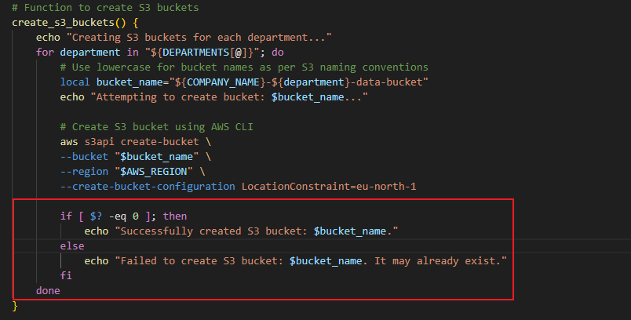

<<<<<<< HEAD
## Automating Cloud Infrastructure: Shell Scripting, AWS, and Secure Networking

Shell scripting is a powerful tool for automating tasks on Unix-like operating systems. It allows you to write a series of commands in a single file and execute them all at once, which is incredibly useful for repetitive tasks in cloud environments.
How Shell Scripting Automates AWS Tasks
For an e-commerce startup using AWS services like EC2 and S3, shell scripts can streamline various operations, from server management to data handling. Here's how:

EC2 Instance Management
Shell scripts, combined with the AWS Command Line Interface (CLI), can automate the entire lifecycle of an EC2 instance. You can write scripts to:

Launch new instances: A script can launch an EC2 instance by specifying the image ID, instance type, and other configurations. This is particularly useful for scaling up during peak traffic.

Start or stop instances: Scripts can be scheduled to automatically start or stop instances at specific times, helping to reduce costs by not running servers when they aren't needed.

Monitor and manage instances: A script can query and report on the status of running instances, or even terminate instances that are no longer in use.

S3 Bucket Operations
Shell scripting is also essential for automating tasks related to Amazon S3, which is often used for storing customer data, product images, and other static content for e-commerce sites.

### VPC Endpoints and Secure Networking
A VPC Endpoint is a private connection that allows you to connect your Virtual Private Cloud (VPC) to supported AWS services, such as Amazon S3, without requiring an internet gateway, NAT device, or public IP addresses. By using VPC endpoints, the data traffic is contained within the AWS network, providing a more secure and performant connection.

When a shell script, running on an EC2 instance within a private subnet, needs to interact with an S3 bucket, it must be configured to use the VPC endpoint instead of the public S3 endpoint. The AWS CLI commands automatically recognize and use the VPC endpoint if it's correctly configured in the VPC's route tables.

A shell script for a task like uploading product images to an S3 bucket would look like this:

aws s3 sync /path/to/local/images s3://your-ecom-bucket

When this command runs from an EC2 instance in a subnet associated with a gateway endpoint, the networking automatically routes the traffic securely and privately to S3. There is no need to modify the script itself to specify the endpoint; the underlying network configuration handles it seamlessly.

 Scripts can be created to:

Create and configure buckets: A script can be used to automatically create new S3 buckets with specified names and permissions.

Exmaple of this is shown in the image below:

Upload and synchronize data: You can write scripts to upload files from a local server to an S3 bucket, or to sync local directories with the cloud storage. This is vital for tasks like backing up data or updating product catalogs.

Manage file access and permissions: Scripts can set permissions on S3 objects, ensuring that data is secure and accessible only to authorized users.

The image above shows the significance of shell scripting. By using written functions, names of s3 buckets can be retrieved depending on its prefix.

Concepts for Building Scripts
To create these automation scripts, a developer at DataWise Solutions would use several key shell scripting concepts:

Variables: To store dynamic information like bucket names or instance IDs.
An example of this is shown below:

Functions: To group related commands for reusability.

Here, create_s3_bucket is the name of the function, its a function written to create s3 buckets and can be called anytime, hence encourages resuability.

Command-line arguments: To pass input to the script at runtime, making it more flexible.

Error handling: To ensure the script exits gracefully if a command fails.
An example of this is shown in the image below

What this does is to handle possible errors that might erupt while attempting to create an s3 bucket using the function.

=======
## Automating Cloud Infrastructure: Shell Scripting, AWS, and Secure Networking

Shell scripting is a powerful tool for automating tasks on Unix-like operating systems. It allows you to write a series of commands in a single file and execute them all at once, which is incredibly useful for repetitive tasks in cloud environments.
How Shell Scripting Automates AWS Tasks
For an e-commerce startup using AWS services like EC2 and S3, shell scripts can streamline various operations, from server management to data handling. Here's how:

EC2 Instance Management
Shell scripts, combined with the AWS Command Line Interface (CLI), can automate the entire lifecycle of an EC2 instance. You can write scripts to:

Launch new instances: A script can launch an EC2 instance by specifying the image ID, instance type, and other configurations. This is particularly useful for scaling up during peak traffic.

Start or stop instances: Scripts can be scheduled to automatically start or stop instances at specific times, helping to reduce costs by not running servers when they aren't needed.

Monitor and manage instances: A script can query and report on the status of running instances, or even terminate instances that are no longer in use.

S3 Bucket Operations
Shell scripting is also essential for automating tasks related to Amazon S3, which is often used for storing customer data, product images, and other static content for e-commerce sites.

### VPC Endpoints and Secure Networking
A VPC Endpoint is a private connection that allows you to connect your Virtual Private Cloud (VPC) to supported AWS services, such as Amazon S3, without requiring an internet gateway, NAT device, or public IP addresses. By using VPC endpoints, the data traffic is contained within the AWS network, providing a more secure and performant connection.

When a shell script, running on an EC2 instance within a private subnet, needs to interact with an S3 bucket, it must be configured to use the VPC endpoint instead of the public S3 endpoint. The AWS CLI commands automatically recognize and use the VPC endpoint if it's correctly configured in the VPC's route tables.

A shell script for a task like uploading product images to an S3 bucket would look like this:

aws s3 sync /path/to/local/images s3://your-ecom-bucket

When this command runs from an EC2 instance in a subnet associated with a gateway endpoint, the networking automatically routes the traffic securely and privately to S3. There is no need to modify the script itself to specify the endpoint; the underlying network configuration handles it seamlessly.

 Scripts can be created to:

Create and configure buckets: A script can be used to automatically create new S3 buckets with specified names and permissions.

Exmaple of this is shown in the image below:

Upload and synchronize data: You can write scripts to upload files from a local server to an S3 bucket, or to sync local directories with the cloud storage. This is vital for tasks like backing up data or updating product catalogs.

Manage file access and permissions: Scripts can set permissions on S3 objects, ensuring that data is secure and accessible only to authorized users.

The image above shows the significance of shell scripting. By using written functions, names of s3 buckets can be retrieved depending on its prefix.

Concepts for Building Scripts
To create these automation scripts, a developer at DataWise Solutions would use several key shell scripting concepts:

Variables: To store dynamic information like bucket names or instance IDs.
An example of this is shown below:

Functions: To group related commands for reusability.

Here, create_s3_bucket is the name of the function, its a function written to create s3 buckets and can be called anytime, hence encourages resuability.

Command-line arguments: To pass input to the script at runtime, making it more flexible.

Error handling: To ensure the script exits gracefully if a command fails.
An example of this is shown in the image below

What this does is to handle possible errors that might erupt while attempting to create an s3 bucket using the function.

>>>>>>> a90996b03a7e969c4559c3110485420de20a2c9d
This automation not only saves a significant amount of time and effort but also minimizes the risk of human error, leading to a more consistent and reliable cloud infrastructure for the e-commerce client.