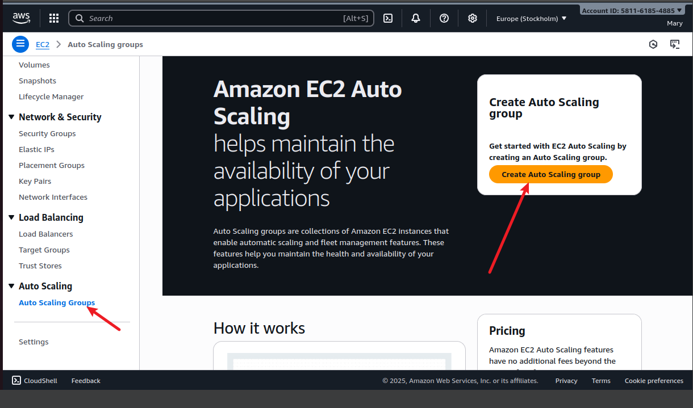
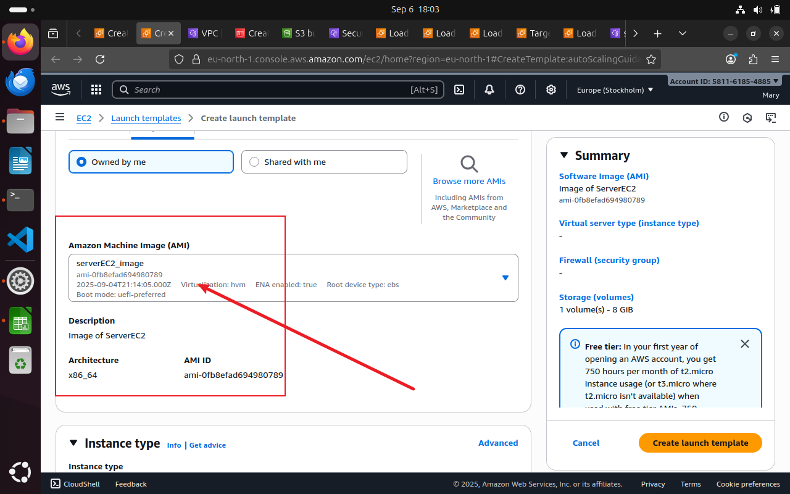
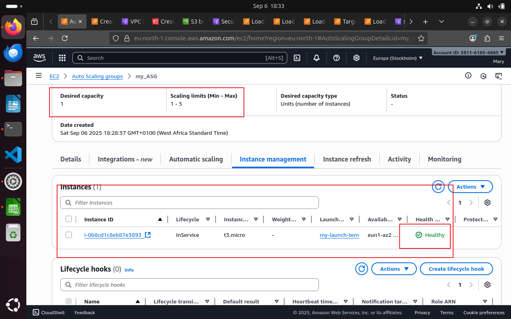

<<<<<<< HEAD
## Configuring Auto scaling with AWS Load Balancer using Launch Template

Creating and configuring Auto Scaling with a load balancer and a launch template is crucial for building a highly available, scalable, and cost-effective application.

The load balancer ensures incoming traffic is distributed across healthy instances, providing high availability. The launch template guarantees that every new instance is an exact, consistent replica. Auto Scaling then uses this launch template to automatically add or remove instances based on demand, ensuring your application can handle traffic spikes and dips without manual intervention, while also optimizing costs by only running the resources you need.

We will staart by creating an auto scaling group then create a launch template on-the-fly using an exixting AMI.

Navigate to the EC2 nstance dashboard, on the left pane, go to Auto Scaling Groups.

Click Create Auto Scaling Group

Provide a name and then clicK Create Launch Template to create a lauch template on-the-go. 

Select a pre-existing AMI 

We have successfully created a Launch Template. 

Going back, we shoulf be able to view our newly created launch template. 

Click and proceed.

Select a custom VPC and their corrresponding subnets. These subnets must exists in different availability region. This is to ensure high availabilty. 

Turn on Health Checks to ensure the provisioned instances health status will be monitored.

Configure Scaling policy. Here what this means is as soon as the average CPU usage of an instance crosses 50%, a new instance is automatically provisioned.

Add a notification for various event types anad click create. 

Next step is to link the Load balancer to the Auto Scaling Group but before that we will need to create a load balancer.

Navigate to Load Balancers on the EC2 dashboard and click.
 Select Application type load balancer.

 

 Set up basic configurations.

  

  We will also create a Target Group.
  A Target Group is a fundamental component of an AWS Elastic Load Balancer (ELB) that serves as a collection point for your application's servers or resources, known as "targets." Its primary purpose is to define a destination for the traffic that the load balancer routes. 
  
  In essence, the load balancer is the traffic director, and the target group is the specific destination. The target group not only receives the traffic but also ensures that the destination is ready and healthy to receive it. It is an essential part of creating a scalable, resilient, and highly available application.

Select the Target Group type, here our target group type will be Instances.

Register the targets and create.

Recal that the auto scaling policy demands we have at least one instance provisioned. We can now see below that our target group is linked with the load balancer containing the instancces provisioned by the Auto scaling group. 

Our Load balancer is up but still in the provisioning state. 

After few minutes, the load balancer is now active. 

We can also see the target groups containing the instances are now linked.

### Validation and Verification

Navigate to the Auto scaling group (ASG)

We can see the instance automatically launched by the ASG.

Under the target group as well, one more instance has been provisioned. Take a closer look, you realize they have the same instance ID, we viewed the under the ASG.

Let us go back to the instance list, we can also see the instance here. 

=======
## Configuring Auto scaling with AWS Load Balancer using Launch Template

Creating and configuring Auto Scaling with a load balancer and a launch template is crucial for building a highly available, scalable, and cost-effective application.

The load balancer ensures incoming traffic is distributed across healthy instances, providing high availability. The launch template guarantees that every new instance is an exact, consistent replica. Auto Scaling then uses this launch template to automatically add or remove instances based on demand, ensuring your application can handle traffic spikes and dips without manual intervention, while also optimizing costs by only running the resources you need.

We will start by creating an auto scaling group, then create a launch template on the fly using an existing AMI.

Navigate to the EC2 instance dashboard, on the left pane, go to Auto Scaling Groups.

Click Create Auto Scaling Group

Provide a name and then click Create Launch Template to create a launch template on the go. 

Select a pre-existing AMI 

We have successfully created a Launch Template. 

Going back, we should be able to view our newly created launch template. 

Click and proceed.

Select a custom VPC and its corresponding subnets. These subnets must exist in different availability regions. This is to ensure high availability. 

Turn on Health Checks to ensure the provisioned instances' health status will be monitored.

Configure the Scaling policy. Her,e what this means is that as soon as the average CPU usage of an instance crosses 50%, a new instance is automatically provisioned.

Add a notification for various event types and click create. 

Next step is to link the Load balancer to the Auto Scaling Group, but before that, we will need to create a load balancer.

Navigate to Load Balancers on the EC2 dashboard and click.
 Select Application type load balancer.

 

 Set up basic configurations.

  

  We will also create a Target Group.
  A Target Group is a fundamental component of an AWS Elastic Load Balancer (ELB) that serves as a collection point for your application's servers or resources, known as "targets." Its primary purpose is to define a destination for the traffic that the load balancer routes. 
  
  In essence, the load balancer is the traffic director, and the target group is the specific destination. The target group not only receives the traffic but also ensures that the destination is ready and healthy to receive it. It is an essential part of creating a scalable, resilient, and highly available application.

Select the Target Group type. Here, our target group type will be Instances.

Register the targets and create.

Recal that the auto scaling policy demands we have at least one instance provisioned. We can now see below that our target group is linked with the load balancer containing the instances provisioned by the Auto scaling group. 

Our Load balancer is up but still in the provisioning state. 

After a few minutes, the load balancer is now active. 

We can also see that the target groups containing the instances are now linked.

### Validation and Verification

We generated enough traffic by loading the webpage hosted by the instances multiple times

Navigate to the Auto scaling group (ASG)

We can see the instance automatically launched by the ASG.

Under the target group as well, one more instance has been provisioned. Take a closer look, you realize they have the same instance ID, we viewed the under the ASG.

Let us go back to the instance list; we can also see the instance here. 

>>>>>>> a90996b03a7e969c4559c3110485420de20a2c9d
