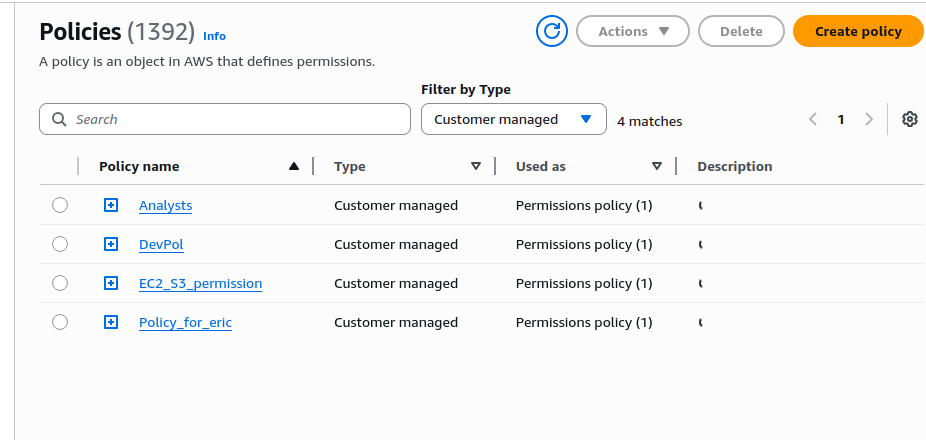

## Setting up Secure Autehntication to AWS API

Prior to this projet, i have been using this authentication method connecting to AWS service for a while. 

To fulfil the requiremnet of this project, I will focus on documenting these approach. Thes approach of mine i believe follow AWS best practice to ensure secure access and authorization to a secure AWS cloud services. 

### The IAM role

Below shows the IAM roles for the automation_user

### IAM Policies.

These are the customer managed policies assigned to the automation user. 
These policies enable the user, permission to perform specific tasks within the organization.

### IAM User.

Here, I have multiple users with user Mary taking priority as highlighted in the image below. This is the user I often use to perform tasks on AWS rather than working as the root user. This ensures AWS best practices. 

Assigning IAM policies to the automation user (Mary)

User Mary already has couple of permission policies attached. 

User Mary also has an Access key and Secret provisioned. These credentials are indispensable for authenticating our script with the AWS API through the Linux terminal, allowing it to create and manage cloud resources programmatically

I also have a CSV file containing these credentials and are kept safe on the local machine

I also have AWS CLI installed on the machine. 
By running the "AWS --version" commmand, The image below validates this. 
 

Before proceeding further, it's essential to understand what an API (Application Programming Interface) is and its relevance here. An API is a set of protocols and tools that allows different software applications to communicate with each other. In the context of AWS, the AWS API enables your scripts or the AWS CLI to interact with AWS services programmatically. This means you can create, modify, and delete AWS resources by making API calls, which are just structured requests that the AWS platform can understand and act upon.

Running "AWS configure", this command initiates the setup for the the AWS CLI interaction. 

We will then enter the neccessary credentials. 

The setup has established communication with AWS API. 

### Validation and Verification

To verif that the AWS CLI is configured correctly and csn communicate with AWS services, we wil run this basic command to list all the AWS regions.

 "aws ec2 describe-regions --output table"

I will also run "aws iam list-users", this command is to request for the iam users registerd under the specified user (Mary)

It returns the list pf the IAM users as expected. 

This Validates the purpose of this project. 

