<<<<<<< HEAD
## Understanding Environment Variable and Infrastructure Environment

**Infrastructure Environments**

Infrastructure environments refer to the various settings where software applications are developed, tested, and deployed, each serving a unique purpose in the software lifecycle.

Lets say you are working with a development team to build a FinTech product. The journey would be something like;

VirtualBox + Ubuntu: The development environment where all local development is done on your laptop

AWS Account 1: The testing environment where, after local development is completed, the code is pushed to an EC2 instance here for further testing

AWS Account 2: The production environment, where after tests are completed in AWS Account 1, the code is pushed to an EC2 instance in AWS Account 2, where the customers consume the Fintech product through a website.

Each setup is considered as an Infrastructure Environment.

On the other hand, environment variables are key-value pairs used in scripts or computer code to manage configuration values and control software behavior dynamically.

Environment Variables
Imagine your FinTech product needs to connect to a database to fetch financial data. However, the details of this database connection, like the database URL, username, and password differ between your development, testing, and production environments.

If you need to develop a shell script that will be reused across all the 3 different environments, then it is important to dynamically fetch the correct value for your connectivity to those environments.

Here's how environment variables come into play:

Development Environment (VirtualBox + Ubuntu):

Environment Variables:

DB_URL=localhost

DB_USER=test_user

DB_PASS=test_pass

Here, the environment variables point to a local database on your laptop where you can safely experiment without affecting real or test data.

Testing Environment (AWS Account 1):

Environment Variables:

DB_URL=https://www.google.com/search?q=testing-db.example.com

DB_USER=testing_user

DB_PASS=testing_pass

In this environment, the variables are configured to connect to a remote database dedicated to testing. This ensures that tests are performed in a controlled environment that simulates production settings without risking actual customer data.

Production Environment (AWS Account 2):

Environment Variables:

DB_URL=https://www.google.com/search?q=production-db.example.com

DB_USER=prod_user

DB_PASS=prod_pass

Finally, when the application is running in the production environment, the environment variables switch to ensure the application connects to the live database. This is where real customer interactions happen, and the data needs to be accurate and secure.

By clarifying these differences early on, we set a solid foundation for navigating the complexities of technology development with greater ease and precision.

Now lets begin developing our shell script to manage cloud infrastructure

We will start by developing the script to handle different functionalities.

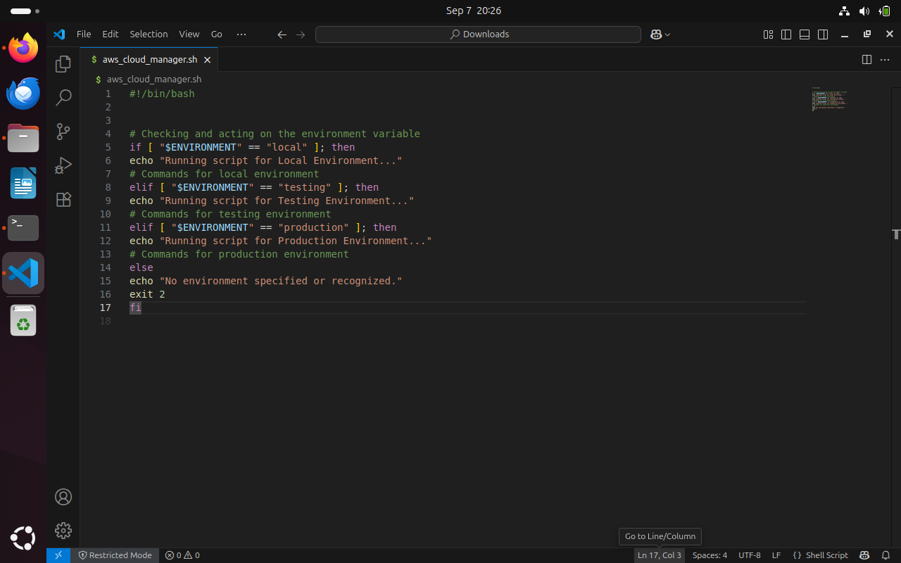

Then give the script the necessary permissions to execute and execute the script.

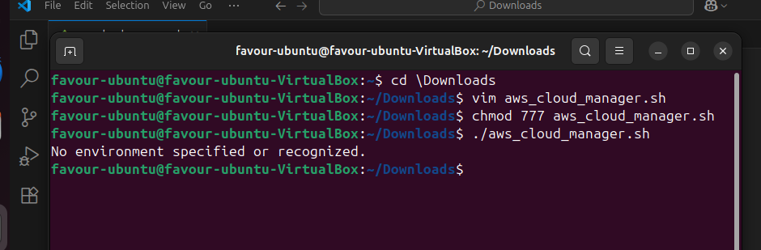

From the image, we cam see that the script autamtically goes to the else statement. This is because $ENVIRONMENT variable is not set. 

We will use the "export" to declare the variable and then we run the script once more.

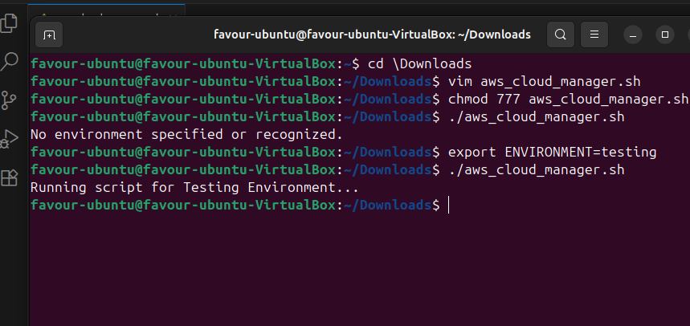

The script ran successfully, based on the set variable from the previous command.

Now, we can also set this environmental variable form within the script itself as shown below.

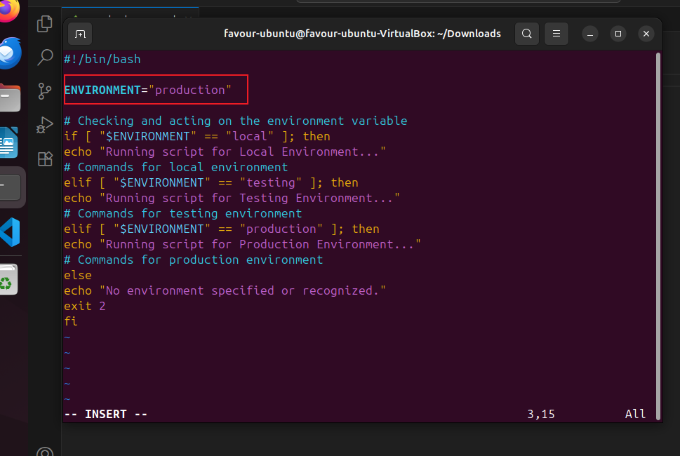

Result

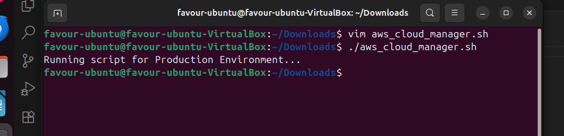

Running this version of the script would mean everytime you run it, it will consider the logic for testing environment. Because the value has been "hard coded" in the script, and that is no longer dynamic.

The best way to do this would be to use command line arguments.

**Positional parameters in Shell Scripting**

As we've learned, hard-coding values directly into scripts is considered poor practice. Instead, we aim for flexibility by allowing scripts to accept input dynamically. This is where positional parameters come in - a capability in shell scripting that enables passing arguments to scripts at runtime, and then replaces the argument with the parameter inside the script.

The argument passed to the script is the value that is provided at runtime.

As in the case of the below where the argument is "testing", and it is also the value to the variable within the script.

./aws_cloud_manager.sh testing

Inside the script, we will have this: ENVIRONMENT=$1. This is demonstrated below. 

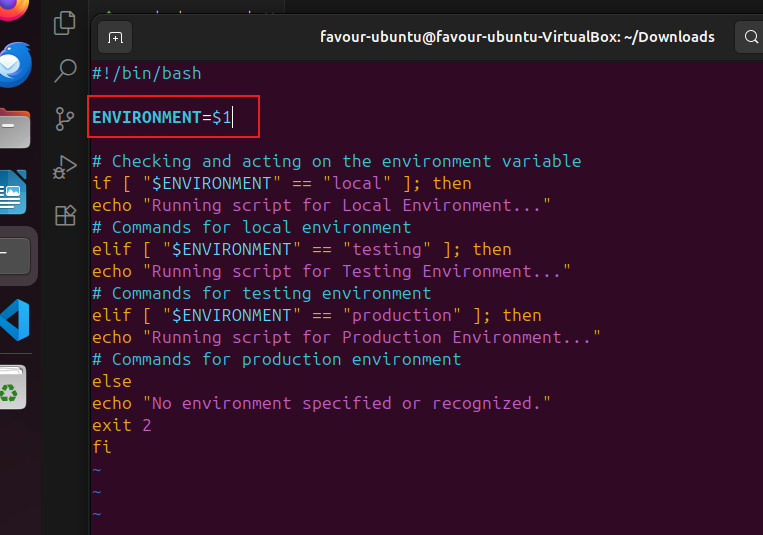

$1 is the positional parameter which will be replaced by the argument passed to the script.

Because it is possible to pass multiple parameters to a script, dollar sign $ is used to prefix the position of the argument passed to the script. Imagine if another variable within the script is called NUMBER_OF_INSTANCES that determines how many EC2 instances get provisioned, then calling the script might look like: 

./aws_cloud_manager.sh testing 5 

The positional parameter in the script wold look like this:

 ENVIRONMENT=$1
NUMBER_OF_INSTANCES=$2

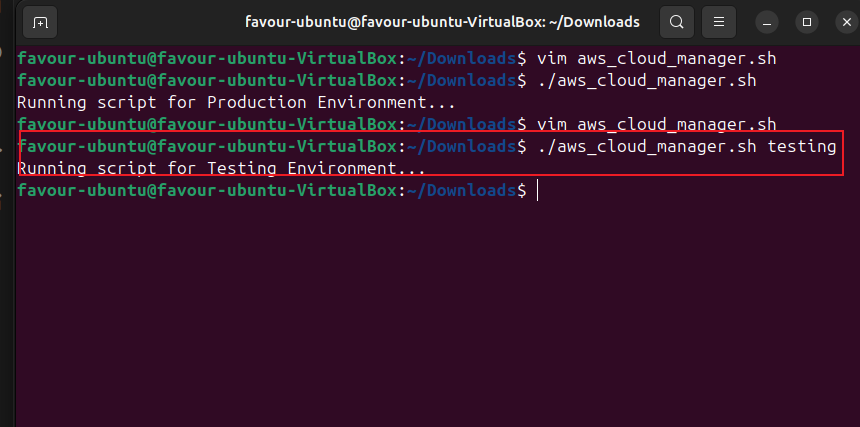

**Condition to check the number of arguments** 

Creating shell scripts to meet specific requirements is one aspect of development, but ensuring their cleanliness and freedom from bugs is equally crucial. Integrating logical checks periodically to validate data is considered a best practice in script development.

A prime example of this is verifying the number of arguments passed to the script, ensuring that the script receives the correct input required for its execution, and providing clear guidance to users in case of incorrect usage.

Below code ensures that when the script is executed, exactly 1 argument is passed to it, otherwise it fails with an exit code of 1 and an shows a message telling the user how to provide the correct number of arguments.

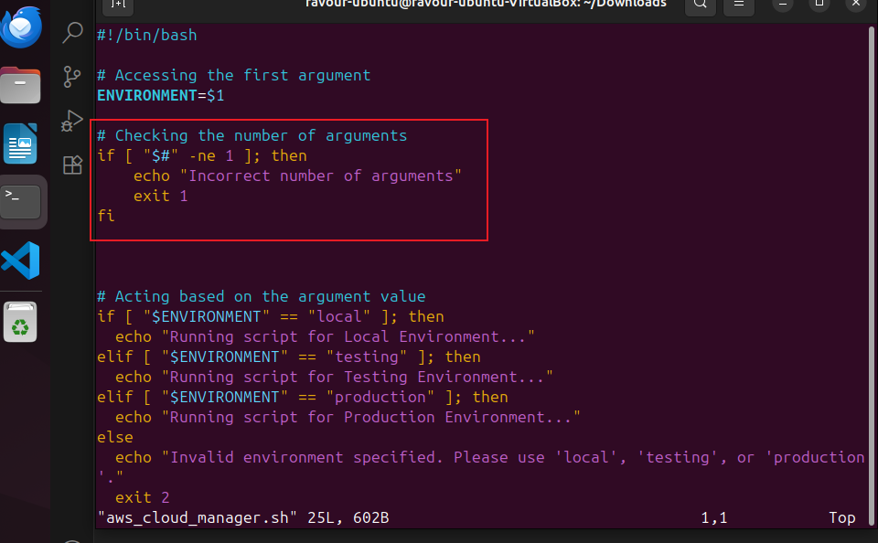

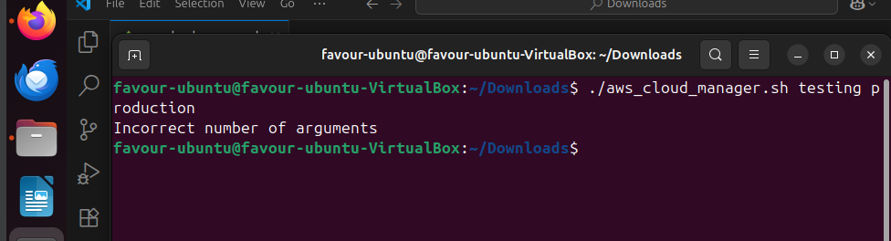

If the user's argument does not staisfy any conditions declared within the script, the else block of the script kicks in.

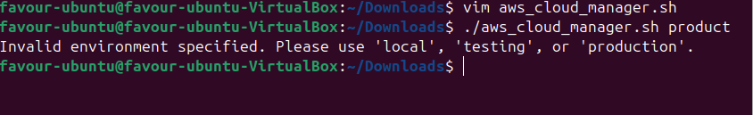

When the user provides the required number of arguments, the script runs the way it meant to. 

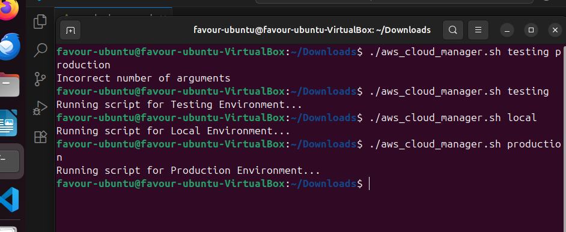

=======
## Understanding Environment Variables and Infrastructure Environment

**Infrastructure Environments**

Infrastructure environments refer to the various settings where software applications are developed, tested, and deployed, each serving a unique purpose in the software lifecycle.

Let's say you are working with a development team to build a FinTech product. The journey would be something like;

VirtualBox + Ubuntu: The development environment where all local development is done on your laptop

AWS Account 1: The testing environment where, after local development is completed, the code is pushed to an EC2 instance here for further testing

AWS Account 2: The production environment, where, after tests are completed in AWS Account 1, the code is pushed to an EC2 instance in AWS Account 2, where the customers consume the Fintech product through a website.

Each setup is considered an Infrastructure Environment.

On the other hand, environment variables are key-value pairs used in scripts or computer code to manage configuration values and control software behavior dynamically.

Environment Variables
Imagine your FinTech product needs to connect to a database to fetch financial data. However, the details of this database connection, like the database URL, username, and password, differ between your development, testing, and production environments.

If you need to develop a shell script that will be reused across all the 3 different environments, then it is important to dynamically fetch the correct value for your connectivity to those environments.

Here's how environment variables come into play:

Development Environment (VirtualBox + Ubuntu):

Environment Variables:

DB_URL=localhost

DB_USER=test_user

DB_PASS=test_pass

Here, the environment variables point to a local database on your laptop where you can safely experiment without affecting real or test data.

Testing Environment (AWS Account 1):

Environment Variables:

DB_URL=https://www.google.com/search?q=testing-db.example.com

DB_USER=testing_user

DB_PASS=testing_pass

In this environment, the variables are configured to connect to a remote database dedicated to testing. This ensures that tests are performed in a controlled environment that simulates production settings without risking actual customer data.

Production Environment (AWS Account 2):

Environment Variables:

DB_URL=https://www.google.com/search?q=production-db.example.com

DB_USER=prod_user

DB_PASS=prod_pass

Finally, when the application is running in the production environment, the environment variables switch to ensure the application connects to the live database. This is where real customer interactions happen, and the data needs to be accurate and secure.

By clarifying these differences early on, we set a solid foundation for navigating the complexities of technology development with greater ease and precision.

Now, let's begin developing our shell script to manage cloud infrastructure

We will start by developing the script to handle different functionalities.

Then give the script the necessary permissions to execute and execute the script.

From the image, we can see that the script automatically goes to the else statement. This is because the $ENVIRONMENT variable is not set. 

We will use the "export" to declare the variable and then we run the script once more.

The script ran successfully, based on the set variable from the previous command.

Now, we can also set this environmental variable from within the script itself, as shown below.

Result

Running this version of the script would mean everytime you run it, it will consider the logic for the testing environment. Because the value has been "hard-coded" in the script, that is no longer dynamic.

The best way to do this would be to use command line arguments.

**Positional parameters in Shell Scripting**

As we've learned, hard-coding values directly into scripts is considered poor practice. Instead, we aim for flexibility by allowing scripts to accept input dynamically. This is where positional parameters come in - a capability in shell scripting that enables passing arguments to scripts at runtime, and then replaces the argument with the parameter inside the script.

The argument passed to the script is the value that is provided at runtime.

As in the case below, where the argument is "testing", and it is also the value of the variable within the script.

./aws_cloud_manager.sh testing

Inside the script, we will have this: ENVIRONMENT=$1. This is demonstrated below. 

$1 is the positional parameter which will be replaced by the argument passed to the script.

Because it is possible to pass multiple parameters to a script, the dollar sign $ is used to prefix the position of the argument passed to the script. Imagine if another variable within the script is called NUMBER_OF_INSTANCES that determines how many EC2 instances get provisioned, then calling the script might look like: 

./aws_cloud_manager.sh testing 5 

The positional parameter in the script would look like this:

 ENVIRONMENT=$1
NUMBER_OF_INSTANCES=$2

**Condition to check the number of arguments** 

Creating shell scripts to meet specific requirements is one aspect of development, but ensuring their cleanliness and freedom from bugs is equally crucial. Integrating logical checks periodically to validate data is considered a best practice in script development.

A prime example of this is verifying the number of arguments passed to the script, ensuring that the script receives the correct input required for its execution, and providing clear guidance to users in case of incorrect usage.

Below code below ensures that when the script is executed, exactly 1 argument is passed to it, otherwise it fails with an exit code of 1 and an shows a message telling the user how to provide the correct number of arguments.

If the user's argument does not satisfy any conditions declared within the script, the else block of the script kicks in.

When the user provides the required number of arguments, the script runs the way it meant to. 

>>>>>>> a90996b03a7e969c4559c3110485420de20a2c9d
