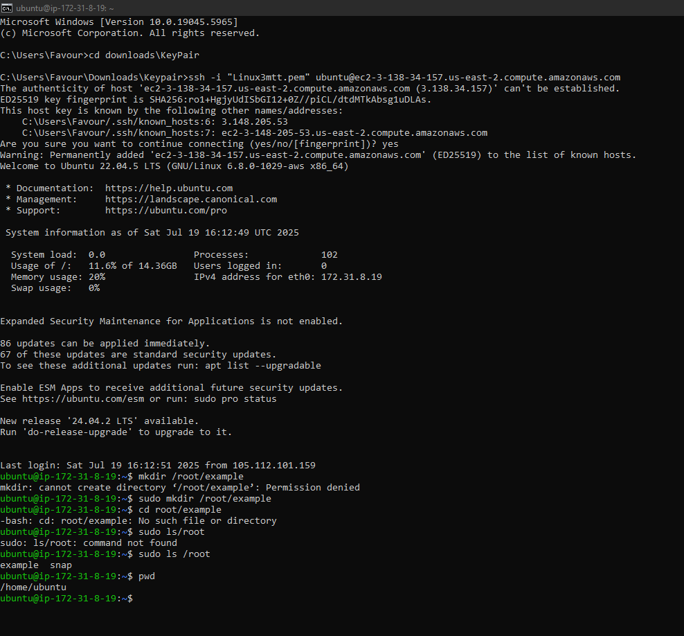
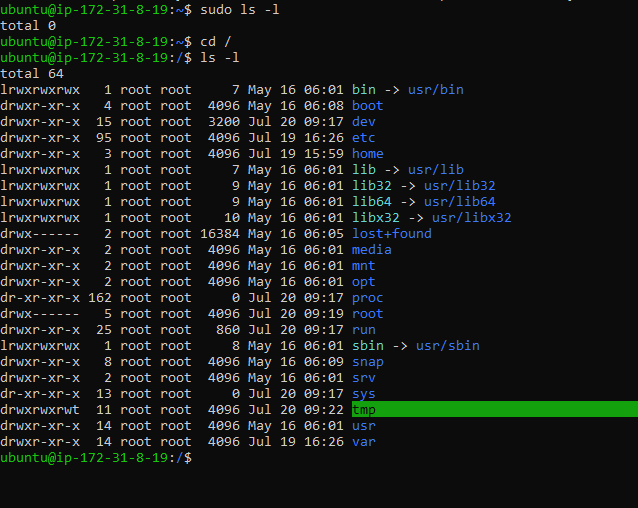
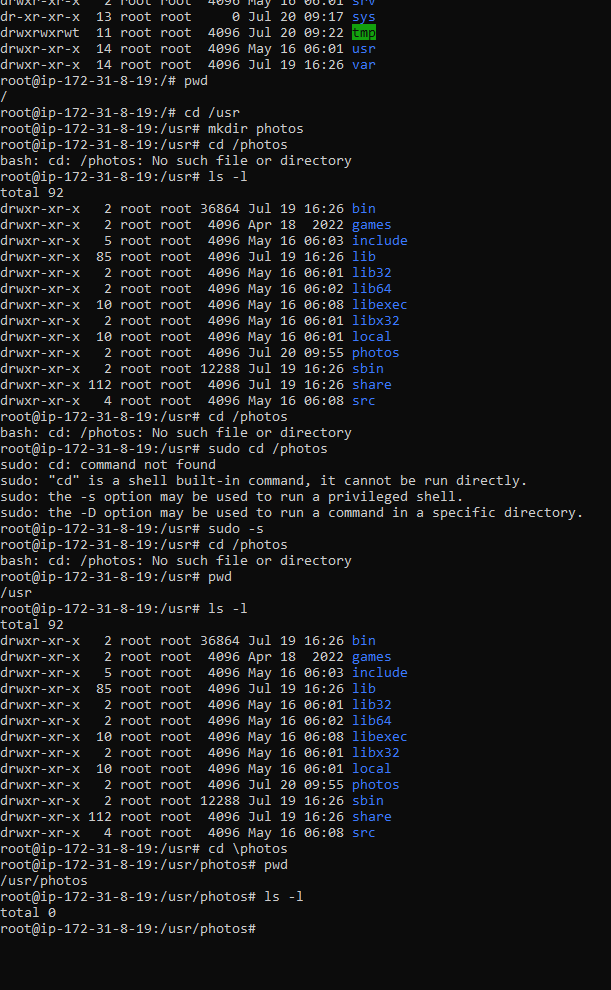
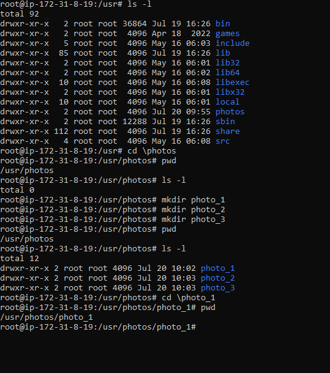
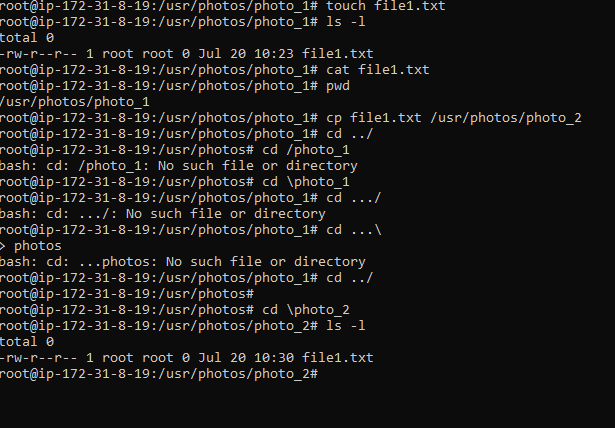
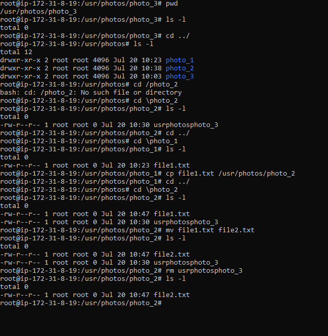

# Linux Commands

Below show the command for creating the connection using ssh -l command and successfully connected to linux-3mtt instance. The image also show the details of the remote server including memory usage percentage and IP addresses. 
It also shows the creation of example folder in the root folder using the sudo command to initiate the sudo program.

The image below shows the files existing inside the root while using the sudo command to obtain neccessary privileges to acccess the files.

A folder named Photos was created inside the usr folder within the root using the mkdir command. pwd command shows the folder path currently on and ls -l is used to display the content of the current folder.

The next image shows the creation of three new folders photo_1, photo_2 and photo_3 within the previously created folder (Photos).

A text file file1.txt was then created inside the photo_1 folder using the touch command and cp command was used to copy the file1.txt file into photo_2 folder. ls -l is the further used to verify the successful copy operation. 

The last image showing the copy operation of the text file from photo_1 folder to photo_2 folder. After that mv was used to rename the new text file file in photo_2 folder and finally rm command was used to delete the usrphotosphoto_3 folder in the current folder remaining only the file2.txt text file.

