<<<<<<< HEAD
## Introduction to Docker and Containers

### What are Conatiners

Docker, a tool that emerged to a major problem IT industry. A man named Solomon Hykes, who, in 2013, unveiled Docker, a containerization platform that promised to revolutionize the way IT professionals built, shipped, and ran applications.

Imagine containers as magical vessels that encapsulate everything an application needs to run smoothly - its code, libraries, dependencies, and even a dash of configuration magic. These containers ensure that an application remains consistent and behaves the same, whether it's running on a developer's laptop, a testing server, or a live production environment. Docker had bestowed upon IT professionals the power to say goodbye to the days of "it works on my machine."

#### Advantages of Containers 

- Portability across Different Environments
- Resource efficeincy compared to virtual machines
- Rapid Application Deployment and scalling

Comparison of Docker Container with Virtual Machines

Docker and virtual machines (VMs) are both technologies used for application deployment, but they differ in their approach to virtualization. Virtual machines emulate entire operating systems, resulting in higher resource overhead and slower performance. In contrast, Docker utilizes containerization, encapsulating applications and their dependencies while sharing the host OS's kernel. This lightweight approach reduces resource consumption, provides faster startup times, and ensures portability across different environments. Docker's emphasis on microservices and standardized packaging fosters scalability and efficiency, making it a preferred choice for modern, agile application development, whereas virtual machines excel in scenarios requiring stronger isolation but at the cost of increased resource usage. The choice between Docker and VMs depends on specific use cases and the desired balance between performance and isolation.

### Lets get started with Docker Containers

Installing Docker

We start by using a Linux command to refresh the package list on a system, ensuring the latest software information is available for installation. 
This is acheived by using the apt-get command

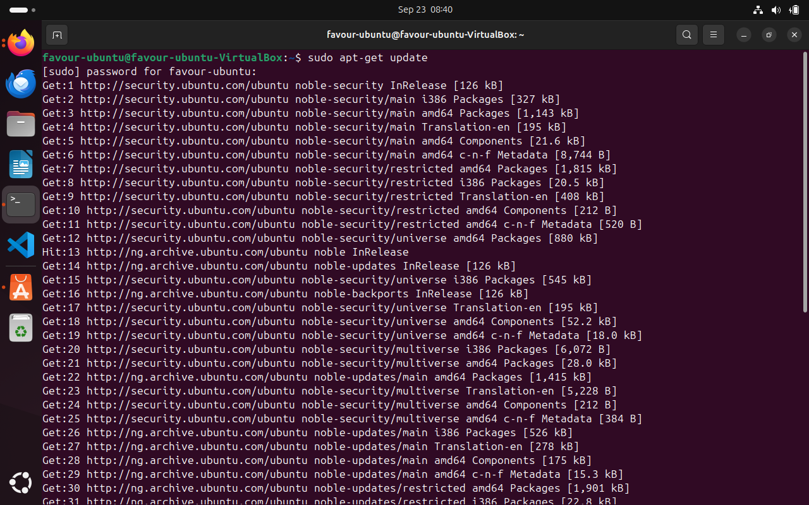

Then, we go ahead to install essential packages including certificate authorities, a data transfer tool (curl) and the GNU for Privacy Guard for secure communication and package verification. 

This is shown in the image below

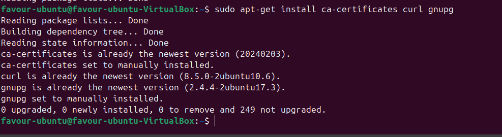

The command below creates a directory /etc/apt/keyrings with specific permissions (0755) for storing keyring files, which are used for docker's authentication, downloads the Docker GPG key using curl and sets read permissions for all users on the Docker GPG key file within the APT keyring directory.

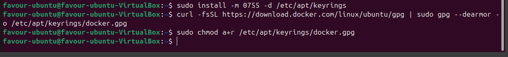

Now lets add the repository to Apt sources

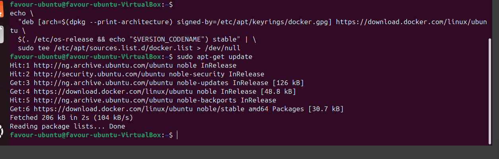

The "echo" command creates a Docker APT repository configuration entry for the Ubuntu system, incorporating the system architecture and Docker GPG key, and then "sudo tee /etc/apt/sources.list.d/docker.list > /dev/null" writes this configuration to the /etc/apt/sources.list.d/docker.list file and then intsalls the latest the latest versiion of docker. 

To verify the installation

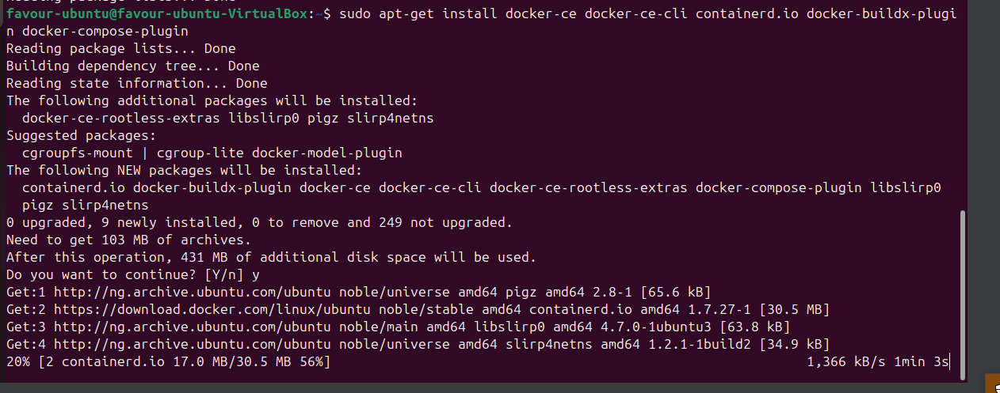

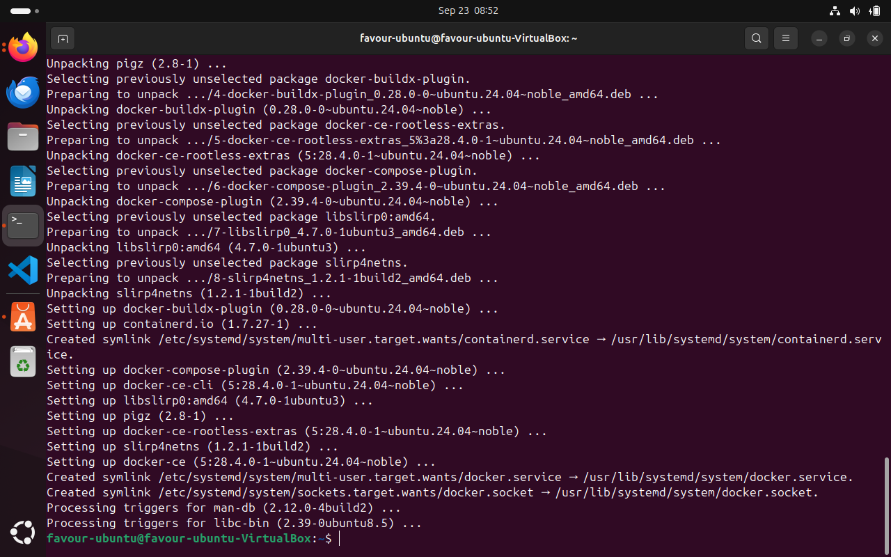

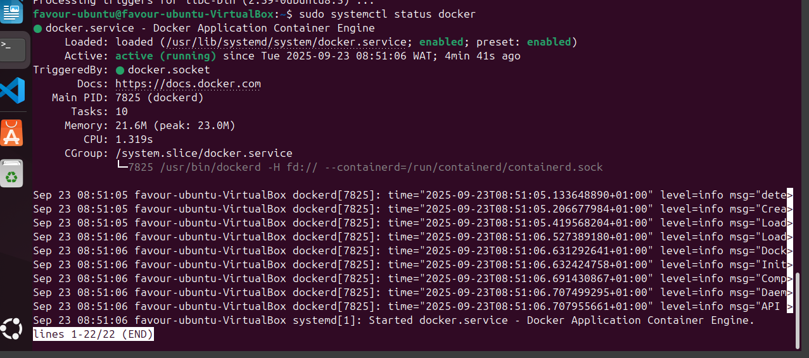

#### Running the Hello-World Container

Using the docker run Command

The docker run command is the entry point to execute containers in Docker. It allows you to create and start a container based on a specified Docker image.

The most straightforward example is the "Hello World" container, a minimalistic container that prints a greeting message when executed.

Upon running the docker, I encountered apermission error.

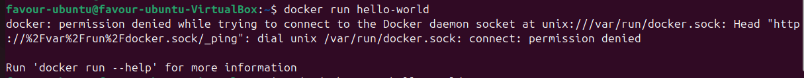

Was resolved by using the super-do command

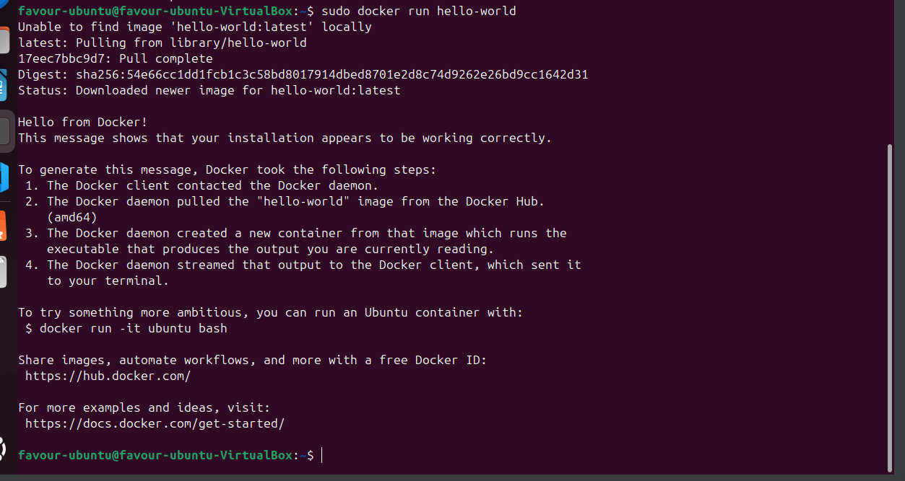

When you execute this command, Docker performs the following steps:

- Pulls Image (if not available locally): Docker checks if the hello-world image is available locally. If not, it automatically pulls it from the Docker Hub, a centralized repository for Docker images.

- Creates a Container: Docker creates a container based on the hello-world image. This container is an instance of the image, with its own isolated filesystem and runtime environment.

- Starts the Container: The container is started, and it executes the predefined command in the hello-world image, which prints a friendly message.

Understanding the Docker Image and Container Lifecycle

Docker Image: A Docker image is a lightweight, standalone, and executable package that includes everything needed to run a piece of software, including the code, runtime, libraries, and system tools. Images are immutable, meaning they cannot be modified once created. Changes result in the creation of a new image.

Container Lifecycle: Containers are running instances of Docker images.

They have a lifecycle: create, start, stop, and delete.

Once a container is created from an image, it can be started, stopped, and restarted.

Verifying the Successful Execution

You can check if the images is now in your local environment with "docker images" command.

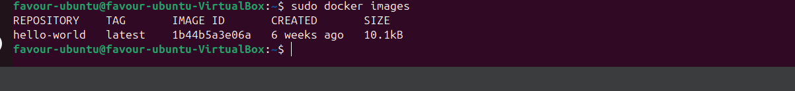

Docker PS

The docker ps command displays a list of running containers. This is useful for monitoring active containers and obtaining information such as container IDs, names, and status. To view all containers, including the ones that have stopped running.

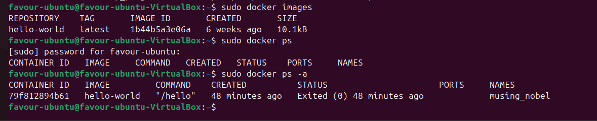

Other Basic container commands

- Docker stop: This halts a runnning container
- Docker pull: downloads a docker image from docker registry to the local machine
- Docker push: Uploads a docker image to a registry making it easy for other to pull. 
- Docker rmi: removes one or more images from the local machine.

These basic Docker commands provide a foundation for working with containers. Understanding how to run, list, stop, pull, push, and manage Docker images is crucial for effective containerization and orchestration.

=======
## Introduction to Docker and Containers

### What are Containers

Docker, a tool that emerged to a major problem IT industry. A man named Solomon Hykes, who, in 2013, unveiled Docker, a containerization platform that promised to revolutionize the way IT professionals built, shipped, and ran applications.

Imagine containers as magical vessels that encapsulate everything an application needs to run smoothly - its code, libraries, dependencies, and even a dash of configuration magic. These containers ensure that an application remains consistent and behaves the same, whether it's running on a developer's laptop, a testing server, or a live production environment. Docker has bestowed upon IT professionals the power to say goodbye to the days of "it works on my machine."

#### Advantages of Containers 

- Portability across Different Environments
- Resource efficeincy compared to virtual machines
- Rapid Application Deployment and scalling

Comparison of Docker Containers with Virtual Machines

Docker and virtual machines (VMs) are both technologies used for application deployment, but they differ in their approach to virtualization. Virtual machines emulate entire operating systems, resulting in higher resource overhead and slower performance. In contrast, Docker utilizes containerization, encapsulating applications and their dependencies while sharing the host OS's kernel. This lightweight approach reduces resource consumption, provides faster startup times, and ensures portability across different environments. Docker's emphasis on microservices and standardized packaging fosters scalability and efficiency, making it a preferred choice for modern, agile application development, whereas virtual machines excel in scenarios requiring stronger isolation but at the cost of increased resource usage. The choice between Docker and VMs depends on specific use cases and the desired balance between performance and isolation.

### Let's get started with Docker Containers

Installing Docker

We start by using a Linux command to refresh the package list on a system, ensuring the latest software information is available for installation. 
This is acheived by using the apt-get command

Then, we go ahead to install essential packages, including certificate authorities, a data transfer tool (curl), and the GNU for Privacy Guard for secure communication and package verification. 

This is shown in the image below

The command below creates a directory /etc/apt/keyrings with specific permissions (0755) for storing keyring files, which are used for docker's authentication, downloads the Docker GPG key using curl, and sets read permissions for all users on the Docker GPG key file within the APT keyring directory.

Now, let's add the repository to the Apt sources

The "echo" command creates a Docker APT repository configuration entry for the Ubuntu system, incorporating the system architecture and Docker GPG key, and then "sudo tee /etc/apt/sources.list.d/docker.list > /dev/null" writes this configuration to the /etc/apt/sources.list.d/docker.list file and then intsalls the latest the latest versiion of docker. 

To verify the installation

#### Running the Hello-World Container

Using the Docker run Command

The docker run command is the entry point to execute containers in Docker. It allows you to create and start a container based on a specified Docker image.

The most straightforward example is the "Hello World" container, a minimalistic container that prints a greeting message when executed.

Upon running the docker, I encountered apermission error.

Was resolved by using the super-do command

When you execute this command, Docker performs the following steps:

- Pulls Image (if not available locally): Docker checks if the hello-world image is available locally. If not, it automatically pulls it from the Docker Hub, a centralized repository for Docker images.

- Creates a Container: Docker creates a container based on the hello-world image. This container is an instance of the image, with its own isolated filesystem and runtime environment.

- Starts the Container: The container is started, and it executes the predefined command in the hello-world image, which prints a friendly message.

Understanding the Docker Image and Container Lifecycle

Docker Image: A Docker image is a lightweight, standalone, and executable package that includes everything needed to run a piece of software, including the code, runtime, libraries, and system tools. Images are immutable, meaning they cannot be modified once created. Changes result in the creation of a new image.

Container Lifecycle: Containers are running instances of Docker images.

They have a lifecycle: create, start, stop, and delete.

Once a container is created from an image, it can be started, stopped, and restarted.

Verifying the Successful Execution

You can check if the images are now in your local environment with the "docker images" command.

Docker PS

The docker ps command displays a list of running containers. This is useful for monitoring active containers and obtaining information such as container IDs, names, and status. To view all containers, including the ones that have stopped running.

Other Basic container commands

- Docker stop: This halts a running container
- Docker pull: downloads a docker image from docker registry to the local machine
- Docker push: Uploads a Docker image to a registry, making it easy for others to pull. 
- Docker rmi: removes one or more images from the local machine.

These basic Docker commands provide a foundation for working with containers. Understanding how to run, list, stop, pull, push, and manage Docker images is crucial for effective containerization and orchestration.

>>>>>>> a90996b03a7e969c4559c3110485420de20a2c9d
