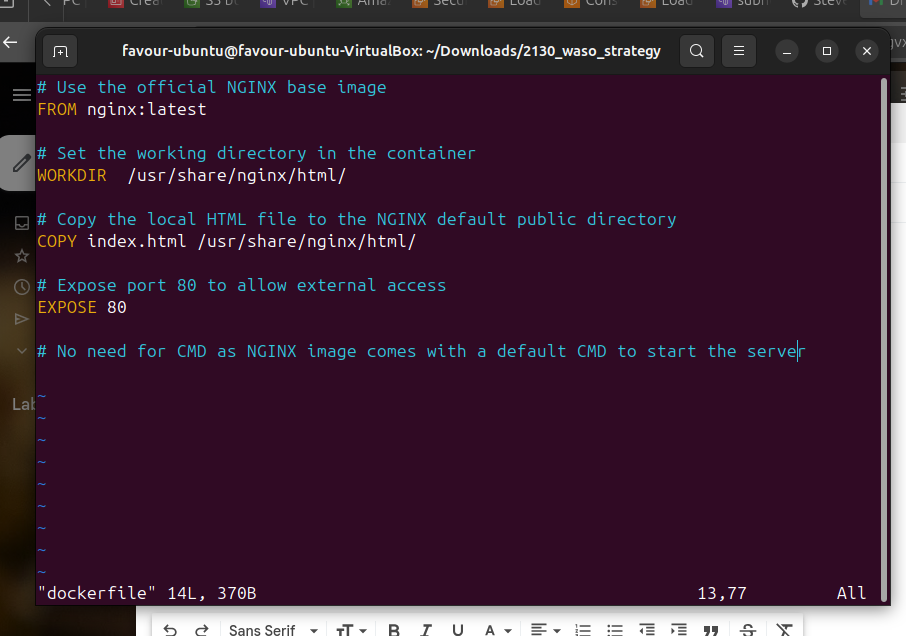

## Working with Docker Images

### Introduction to Docker Images


Docker images are the building blocks of containers. They are lightweight, portable, and self-sufficient packages that contain everything needed to run a software application, including the code, runtime, libraries, and system tools. Images are created from a set of instructions known as a Dockerfile, which specifies the environment and configuration for the application.

### Pulling Images from Docker Hub

Docker Hub is a cloud-based registry that hosts a vast collection of docker images. Similar to git hub, you can pull images from docker hub to your local machine using the "docker pull" command.

To explore available images on Docker Hub, the `docker` command provides a search subcommand. For instance, to find the Ubuntu image, you can execute:

```
docker search amazon
````
This command allows you to discover and explore various images hosted on Docker Hub by providing relevant search results. In this case, the output will be similar to this:


To download the official Amazon-ecs-Agent image to the computer, we use the `docker pull amazon/amazon-ecs-agent` command.


Once an image has been successfully downloaded, you can proceed to run a container using that downloaded image by employing the "run" subcommand. If an image is not present locally when the docker run subcommand is invoked, Docker will automatically download the required image before initiating the container.

To view the list of images that have been downloaded and are available on your local machine, enter the following command:

```
docker images
````

Executing this command provides a comprehensive list of all the images stored locally, allowing you to verify the presence of the downloaded image and gather information about its size, version, and other relevant details.


## Task 
### Dockerize a Basic static web page. 

We will start by launching an EC2 instance and connecting to it.


Next, using the `touch` command, a file named dockerfile is created and edited using vim editor. 



Here, we specified the official NGINX base image from the Docker hub and also specified the working directory in the container.

While ensuring the docker file is located in the same directory as the index.html file


Copy the index.html file to the nginx default public directory, which is where nginx serves static content from. 
Then, expose for external access on Port 80.

Having created the Dockerfile, we then build.

By using `docker build -t dockerfile .` we will build the Dockerfile.


To verify this successful build, we list the available docker images.


The image above highlights the new Dockerfile image.


To run a container based on the custom nginx image created earlier, we run the command below


The webpage can not be accessible now because the EC2 server hosting the container has a security group attached to it, and it's not configured to accept traffic on port 8080. We aim to allow incoming traffic on port 8080.

Navigate to the security group attached to the server and edit inbound rules to accept traffic on port 8080. 


We will then proceed to start the container using the container ID


Here, we should be able to see the status of our container. 


Now that we have started our container, we can access the content on our web browser with http://<public_ip_address>:8080


### Pushing Images to Docker Hub


Let's recall our git project, where we push changes made on our local computer to a remote repository (github) so everyone can track the changes we made and also collaborate on it. Now that we have created a docker images on our own computer, we need to think about how to reuse this image in the future, or how do people in other region make use of this image and possibly collaborate on it. This is where Docker Hub comes in. Let's go ahead and push our image to Docker Hub.

We start by creating a docker account and a repository. 


Next, we rename our local docker image (to match the docker username and repository) and add a tag. 


We then log in to docker from the CLI. 


Upon a successful login, we push the image to Docker Hub with the command below

```
docker push stevenfavour/docker_repos:1.0
````


To verify this, we proceed to Docker Hub.


