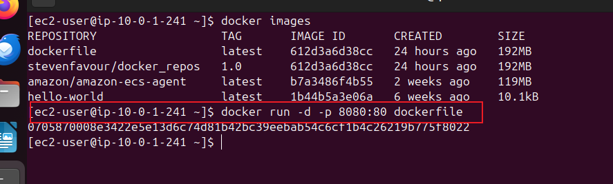
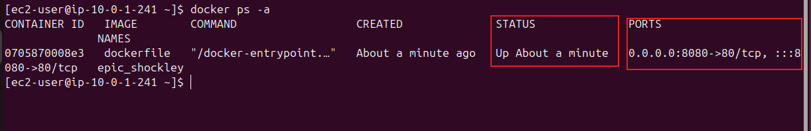
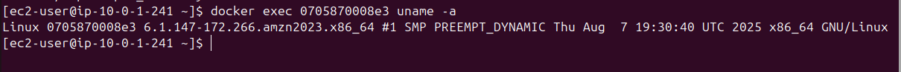
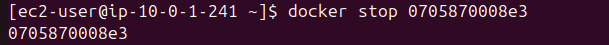
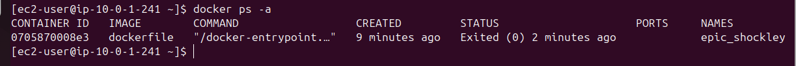
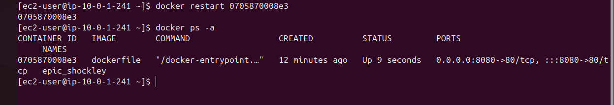

## Working with Docker Containers

### Introduction to Docker Containers

Docker containers are lightweight, portable and executable units that encapsulates an application and it dependecies. In the previous project, we worked a bit with docker containers. We would dive deep into the basics of working with Docker Containers from launching and running containers to managing their lifecycle.

### Task:   Docker Container Operations

 #### Starting a container 

 We will first and foremost use an existing image to start a container.

 

 From the image above, we listed the images and then used `docker run -d -p 8080:80 dockerfile` 

 `-d` tag is to enable us to run the container in the background, this allows us to continue working on the same terminal  session.

 `-p` tag is used to map port 8080:80 for the container.

 

The image above verifies the previous operation. This is indicated under the Status column.

We will also execute a command that displays the system information from within the conatiner.

Use 
```
docker exec <container_id> uname -a
````
- docker exec: Executes a new command in a running container.

- <container_id>: Replace this with the ID of your running container.

- uname -a: This is a common Linux command used to print system information (kernel name, network node hostname, kernel release, version, machine hardware name, operating system).

 

 #### Stopping the container and verify it status

 To stop the running container, use

 ```
docker stop <container_id> 
````
 

 Verify: 
  

  The status column shows the container has been stopped.

#### Restarting the container



The image above shows and verifies this operation.

Upon comparison with the previous stop operation, we see under the status column the difference. The previous stop operation indicates the time of the exit while the current restart operation shows the up time, meaning how long it has been running since the restart.

#### Removing the container


The image above shows the step by step command process to remove the container.
The last line verifies the successful removal. 

We can also use the command below to delete and remove the containers, all at once.

```
docker stop $(docker ps -a -q) && docker rm $(docker ps -a -q)
````
OR 

```
docker rm -f $(docker ps -a -q)
````
`f` tag is uesd to forcefully remove all the containers. It stops all the containers first before removing them