<<<<<<< HEAD
## Introduction to Jenkins

### Introduction To CICD
Continuous Integration and Continuous Delivery (CI/CD) is a set of best practices and methodologies that revolutionize the software development lifecycle by enhancing efficiency, reliability, and speed. CI/CD represents a seamless integration of automation and collaboration throughout the development process, aiming to deliver high-quality software consistently and rapidly. In the realm of CI, developers regularly integrate their code changes into a shared repository, triggering automated builds and tests to detect integration issues early. On the other hand, CD encompasses both Continuous Delivery and Continuous Deployment, ensuring that software is always in a deployable state and automating the deployment process for swift and reliable releases. The CI/CD pipeline fosters a culture of continuous improvement, allowing development teams to iterate quickly, reduce manual interventions, and deliver software with confidence.

### What is Jenkins
Jenkins is widely employed as a crucial CI/CD tool for automating software development processes. Teams utilize Jenkins to automate building, testing, and deploying applications, streamlining the development lifecycle. With Jenkins pipelines, developers can define, version, and execute entire workflows as code, ensuring consistent and reproducible builds. Integration with version control systems allows Jenkins to trigger builds automatically upon code changes, facilitating early detection of issues and enabling teams to deliver high-quality software at a faster pace. Jenkins' flexibility, extensibility through plugins, and support for various tools make it a preferred choice for organizations aiming to implement efficient and automated DevOps practices.

### Getting started with Jenkins

We start by updating the dependencies. 

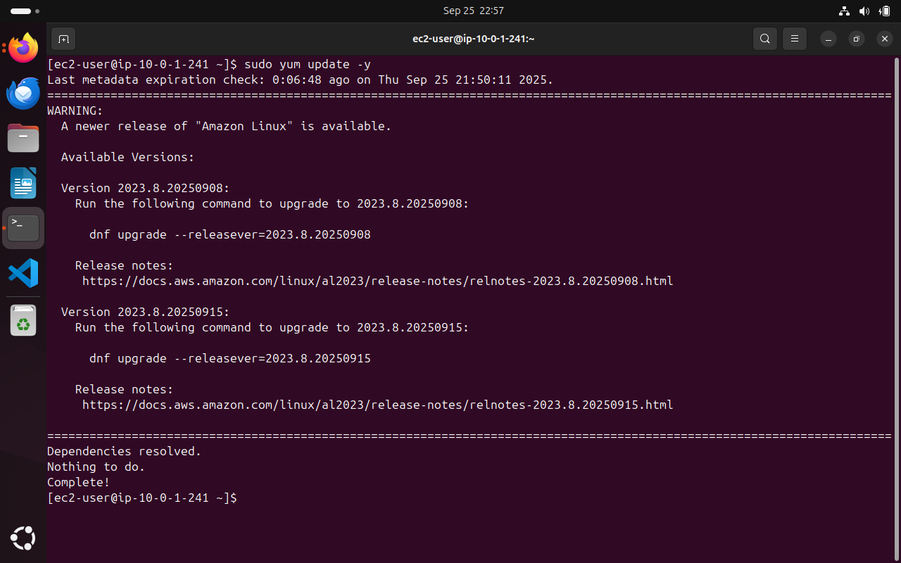

We then move ahead to install java, as this is prerequisite to install and use jenkins.
Jenkins requires Java (version 17 or later is recommended). Amazon Corretto is a good choice.

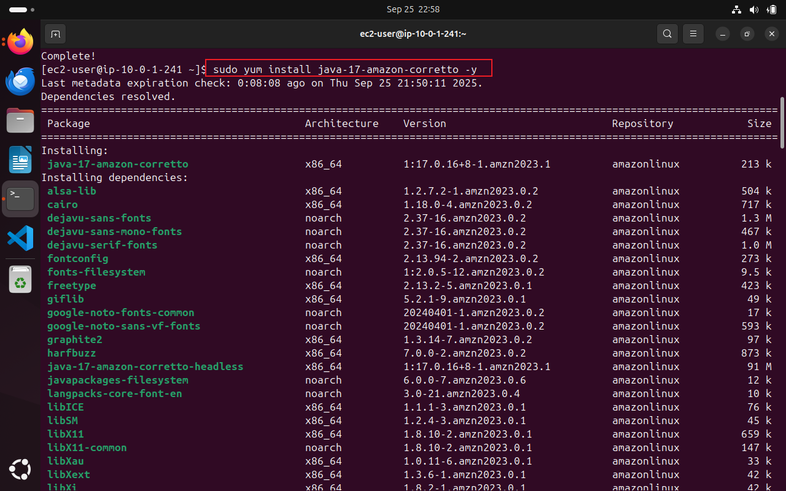

Verify this succefull insatllation using `java -version` command;

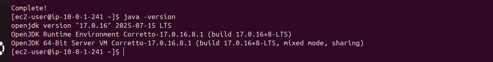

Next, we add the Jenkins Repository

The Jenkins package is not in the default Amazon Linux repositories, so you need to add it and import its key.

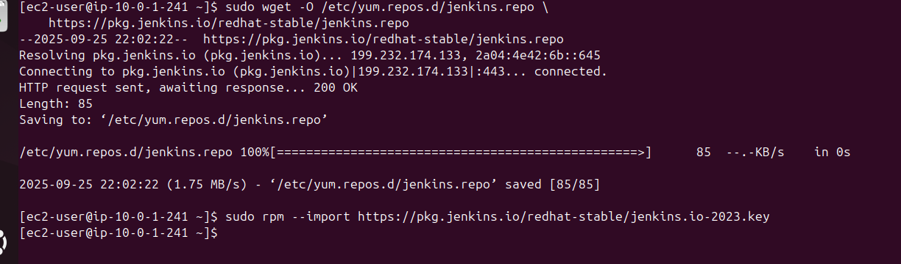

The following command is used to perform this operation.

```
sudo wget -O /etc/yum.repos.d/jenkins.repo \
    https://pkg.jenkins.io/redhat-stable/jenkins.repo

sudo rpm --import https://pkg.jenkins.io/redhat-stable/jenkins.io-2023.key
```
We then update the dependencies to keep everything up to date. 

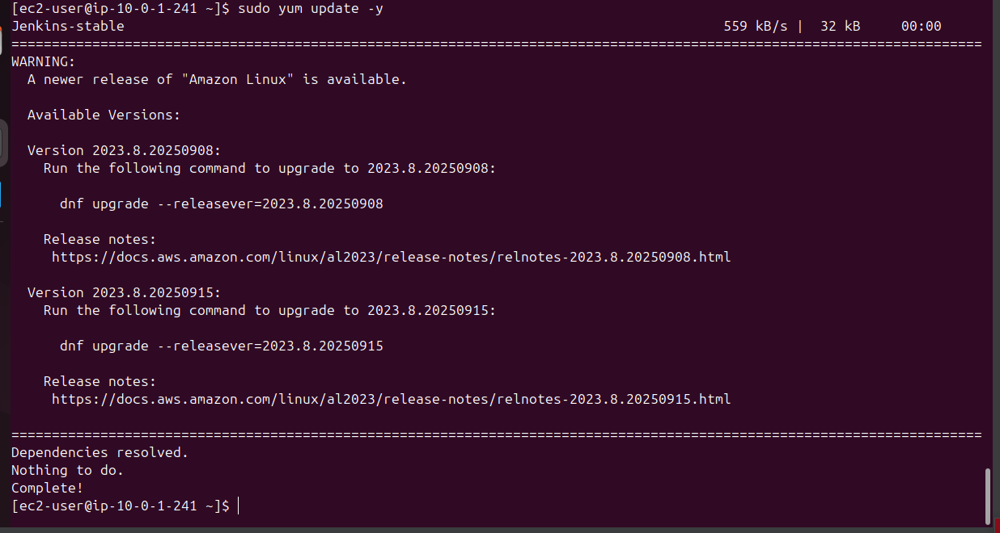

We then go ahead to install Jenkins using the `sudo yum install jenkins -y` command.

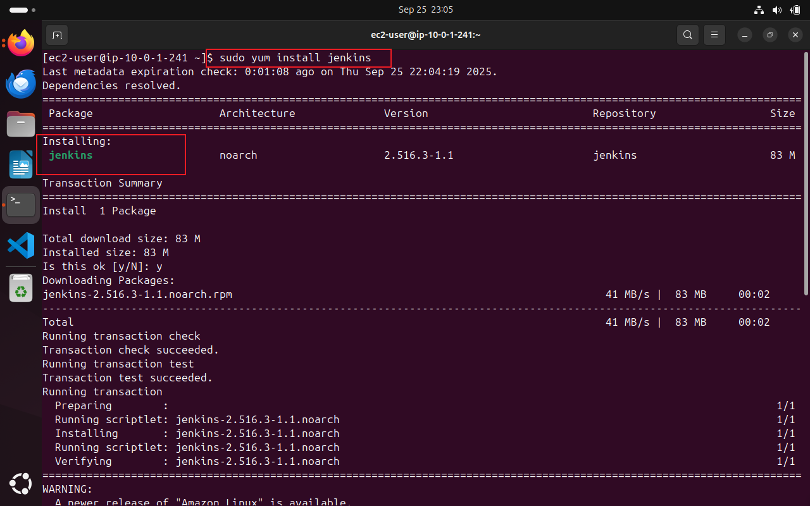

After completing the installation, we verify its status;

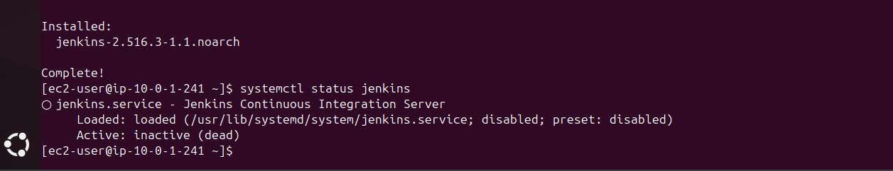

The above image confirms a successful installation, but service is disabled.

We will then enable the service with the `sudo syetemctl enable jenkins` command.

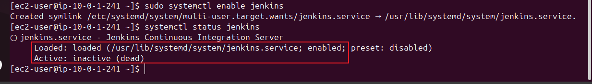

The jenkins service is enabled but still inactive. 

To activate; 

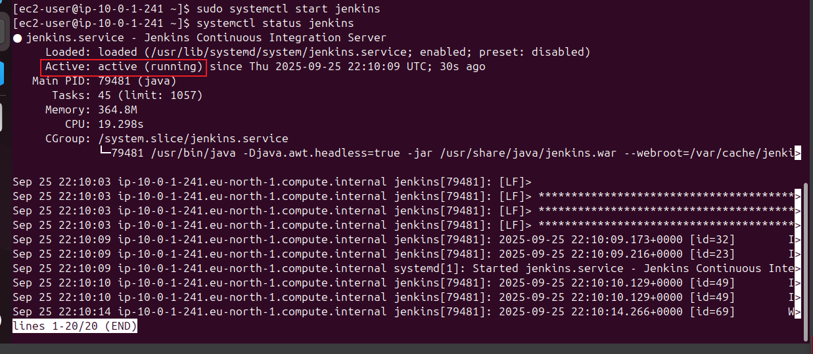

On our Jenkins instance, create new inbound rules for port 8080 in security group
By default, Jenkins listens on port 8080, we need create an inbound rule for this in the security group of our jenkins instance. But since the security group attached to the jenkins instace already has an inbound rule that allows traffic on port 8080, we move to the next steps.

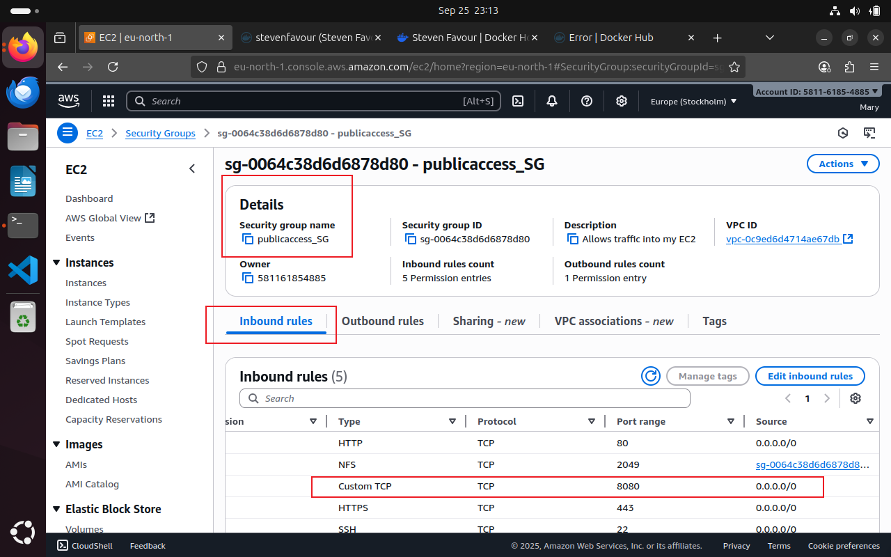

### Setting up Jenkins on the console

We start by using the  Jenkins Instance ip address on the web browser i.e. http://public_ip_address:8080

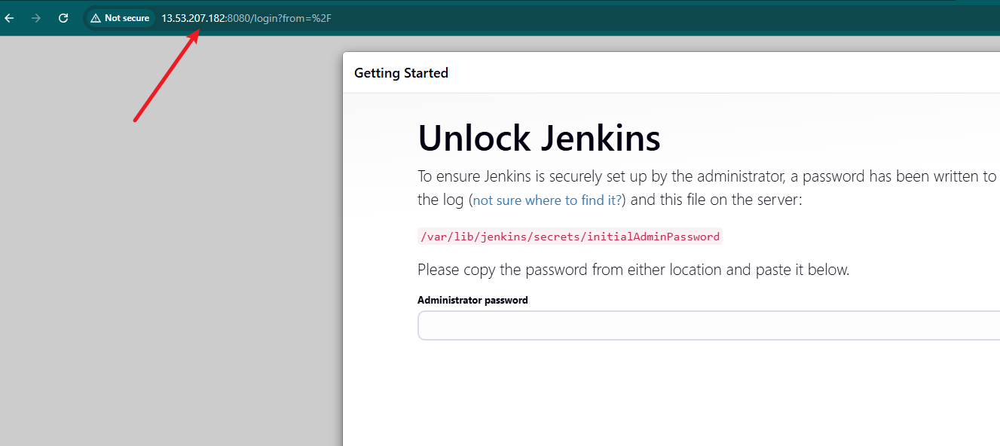

To obtain the password, navigate to the jenkins console to retreive the initial jenkins admin password. 

```
sudo cat /var/lib/jenkins/secrets/initialAdminPassword
```

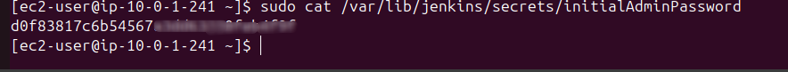

Upon running the command, the password is returned as shown above.

Proceed to install suggested plugins

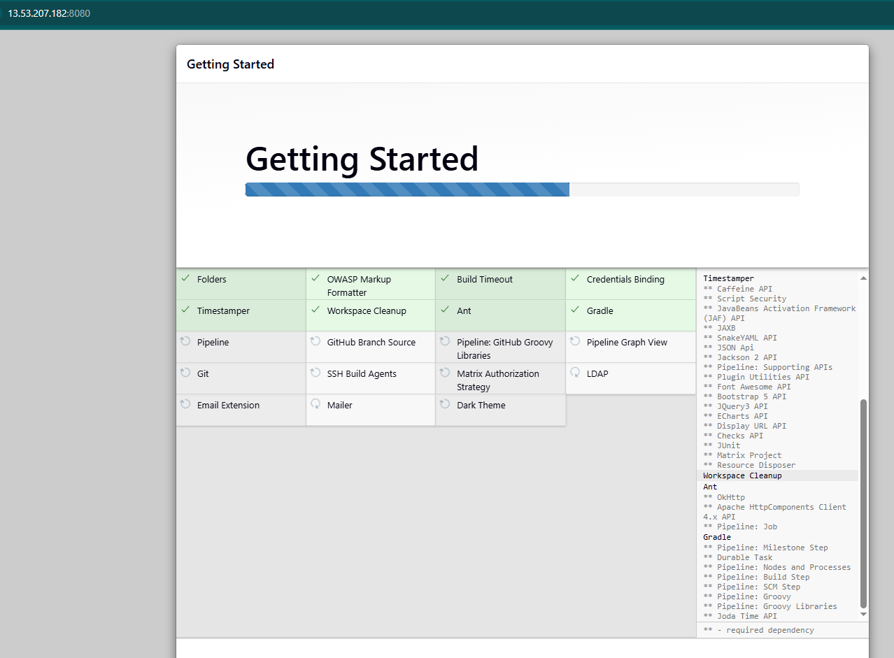

Create user account

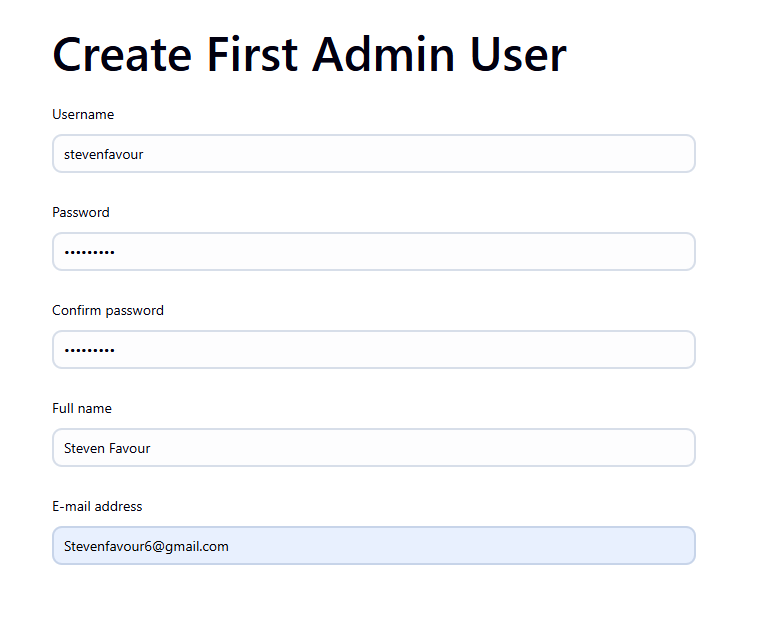

Finally, Log in into the console.

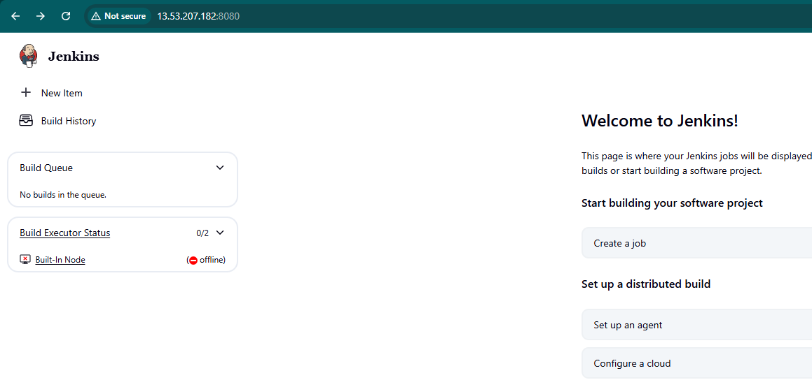
=======
## Introduction to Jenkins

### Introduction To CICD
Continuous Integration and Continuous Delivery (CI/CD) is a set of best practices and methodologies that revolutionize the software development lifecycle by enhancing efficiency, reliability, and speed. CI/CD represents a seamless integration of automation and collaboration throughout the development process, aiming to deliver high-quality software consistently and rapidly. In the realm of CI, developers regularly integrate their code changes into a shared repository, triggering automated builds and tests to detect integration issues early. On the other hand, CD encompasses both Continuous Delivery and Continuous Deployment, ensuring that software is always in a deployable state and automating the deployment process for swift and reliable releases. The CI/CD pipeline fosters a culture of continuous improvement, allowing development teams to iterate quickly, reduce manual interventions, and deliver software with confidence.

### What is Jenkins
Jenkins is widely employed as a crucial CI/CD tool for automating software development processes. Teams utilize Jenkins to automate building, testing, and deploying applications, streamlining the development lifecycle. With Jenkins pipelines, developers can define, version, and execute entire workflows as code, ensuring consistent and reproducible builds. Integration with version control systems allows Jenkins to trigger builds automatically upon code changes, facilitating early detection of issues and enabling teams to deliver high-quality software at a faster pace. Jenkins' flexibility, extensibility through plugins, and support for various tools make it a preferred choice for organizations aiming to implement efficient and automated DevOps practices.

### Getting started with Jenkins

We start by updating the dependencies. 


We then move ahead to install Java, as this is a prerequisite to install and use Jenkins.
Jenkins requires Java (version 17 or later is recommended). Amazon Corretto is a good choice.


Verify this successful installation using the `java -version` command.


Next, we add the Jenkins Repository

The Jenkins package is not in the default Amazon Linux repositories, so you need to add it and import its key.


The following command is used to perform this operation.

```
sudo wget -O /etc/yum.repos.d/jenkins.repo \
    https://pkg.jenkins.io/redhat-stable/jenkins.repo

sudo rpm --import https://pkg.jenkins.io/redhat-stable/jenkins.io-2023.key
```
We then update the dependencies to keep everything up to date. 


We then go ahead to install Jenkins using the `sudo yum install jenkins -y` command.


After completing the installation, we verify its status.


The above image confirms a successful installation, but service is disabled.

We will then enable the service with the `sudo systemctl enable jenkins` command.


The Jenkins service is enabled but still inactive. 

To activate; 


On our Jenkins instance, create new inbound rules for port 8080 in the security group
By default, Jenkins listens on port 8080; we need to create an inbound rule for this in the security group of our Jenkins instance. But since the security group attached to the Jenkins instance already has an inbound rule that allows traffic on port 8080, we move to the next steps.


### Setting up Jenkins on the console

We start by using the  Jenkins instance IP address on the web browser i.e., http://public_ip_address:8080


To obtain the password, navigate to the Jenkins console to retrieve the initial Jenkins admin password. 

```
sudo cat /var/lib/jenkins/secrets/initialAdminPassword
```


Upon running the command, the password is returned as shown above.

Proceed to install the suggested plugins


Create a user account


Finally, log in to the console.


>>>>>>> a90996b03a7e969c4559c3110485420de20a2c9d
