<<<<<<< HEAD
## Jenkins Freestyle Project

### Jenkins Job

In Jenkins, a job is a unit of work or a task that can be executed by the Jenkins automation server.

A Jenkins job represents a specific task or set of tasks that needs to be performed as part of a build or deployment process. Jobs in Jenkins are created to automate the execution of various steps such as compiling code, running tests, packaging applications, and deploying them to servers. Each Jenkins job is configured with a series of build steps, post-build actions, and other settings that define how the job should be executed.

We will begin by creating a new item on the Jenkins dashboard after logging into the console by clicking "New Item"

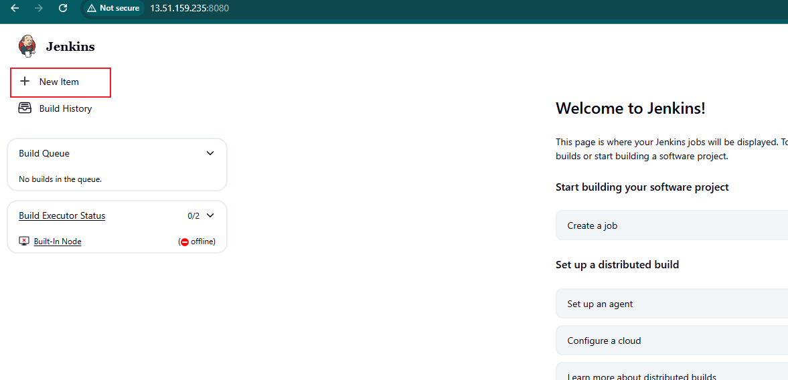

Enter an Item name and type then proceed to create.

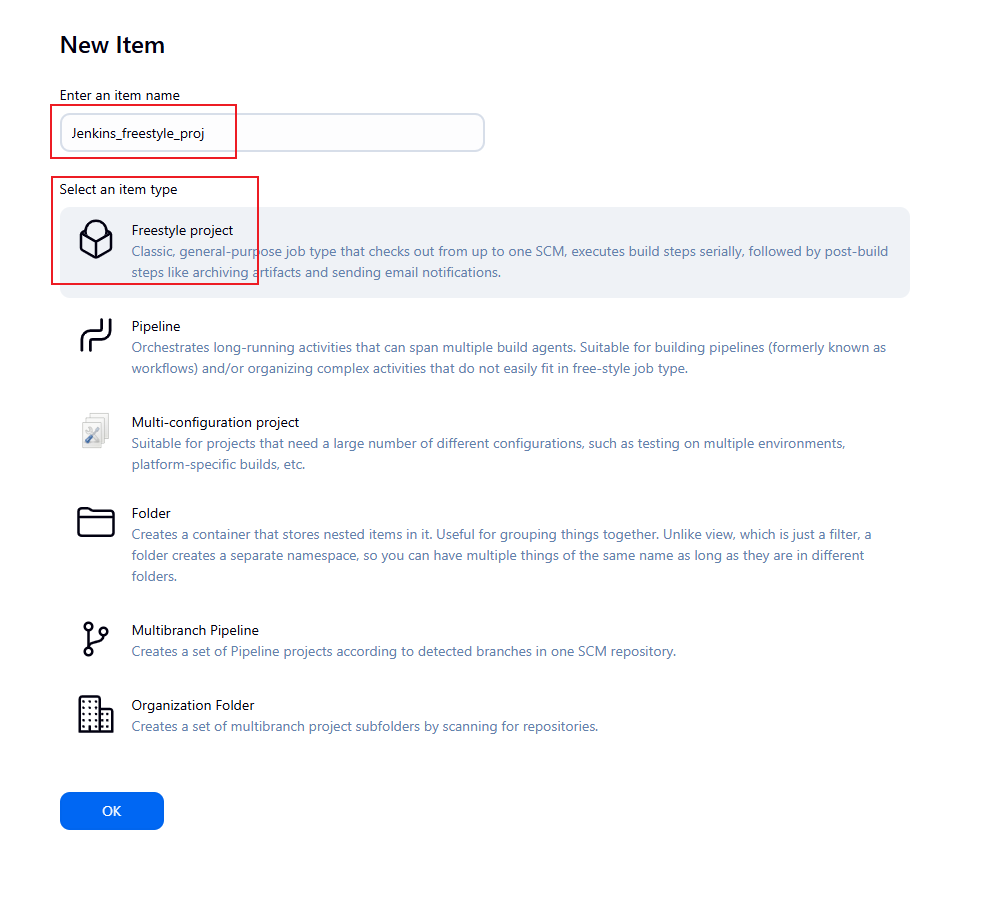

For this demonstration, we will use an existing repository on Github.

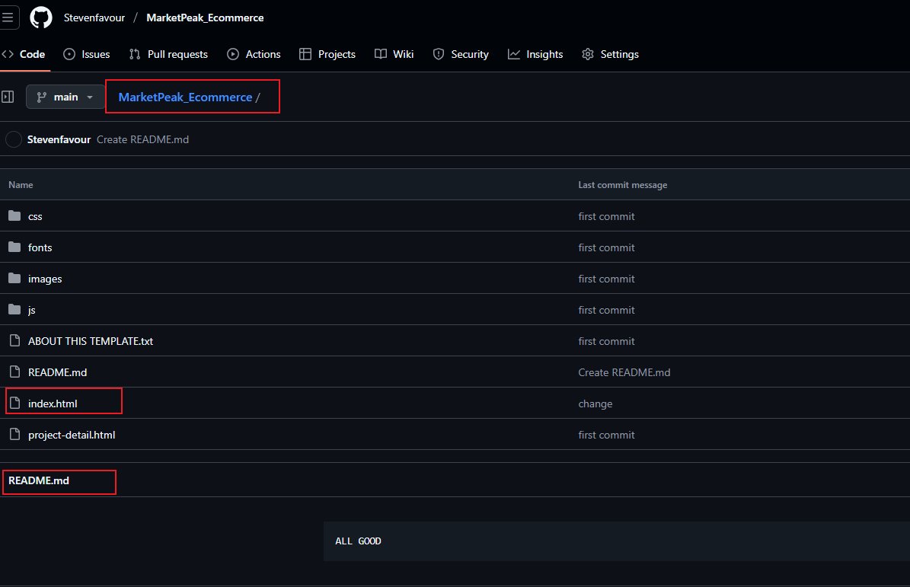

We will then copy this repository URL as we will be needing to configure a build task

Under the Configure option in the newly created item (Jenkins_freestyle_proj), navigate to the Source Code Mangement.

Paste the previously copied repository URL.

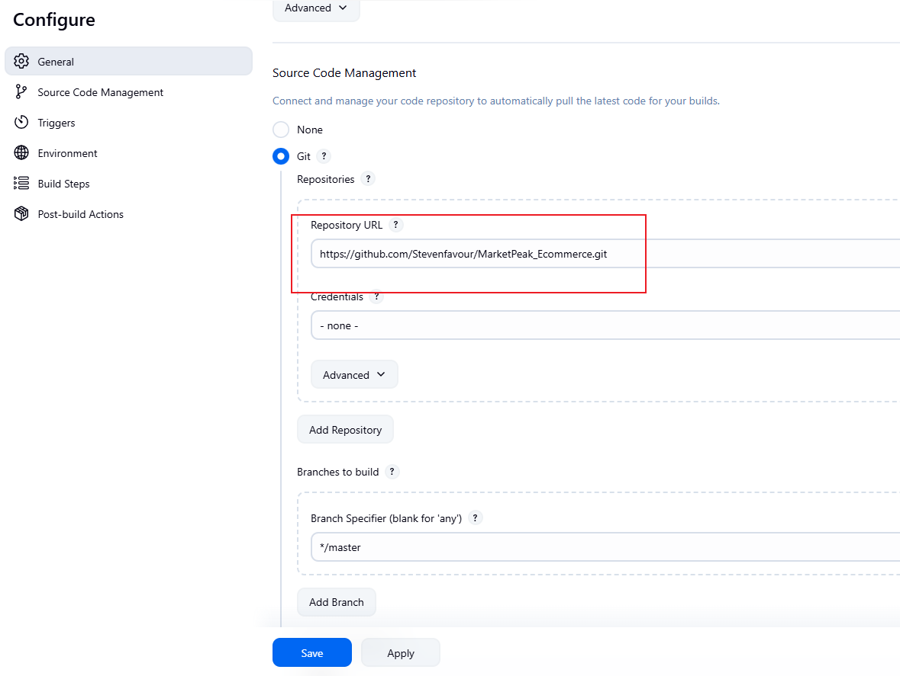

Under the Branches to build, enter the main branch name (Main).

Click Build

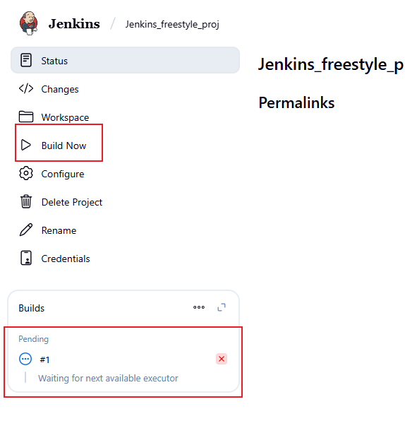

The images below shows a succesful build operation

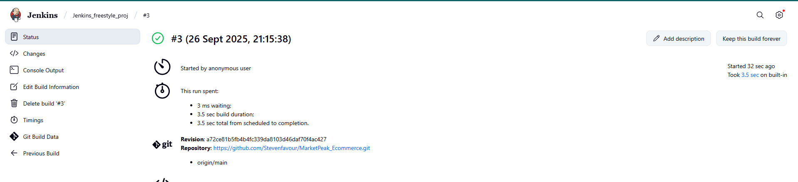

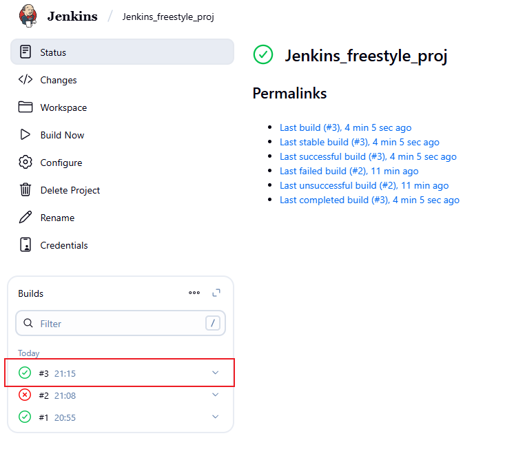

### Configuring a Build Trigger

To use a build trigger, we must configure this both on the Jenkins console and also from the Source Control Management (Github) 

Under Configure from the previous image,  Click Trigger and select GitHub Hook Trigger

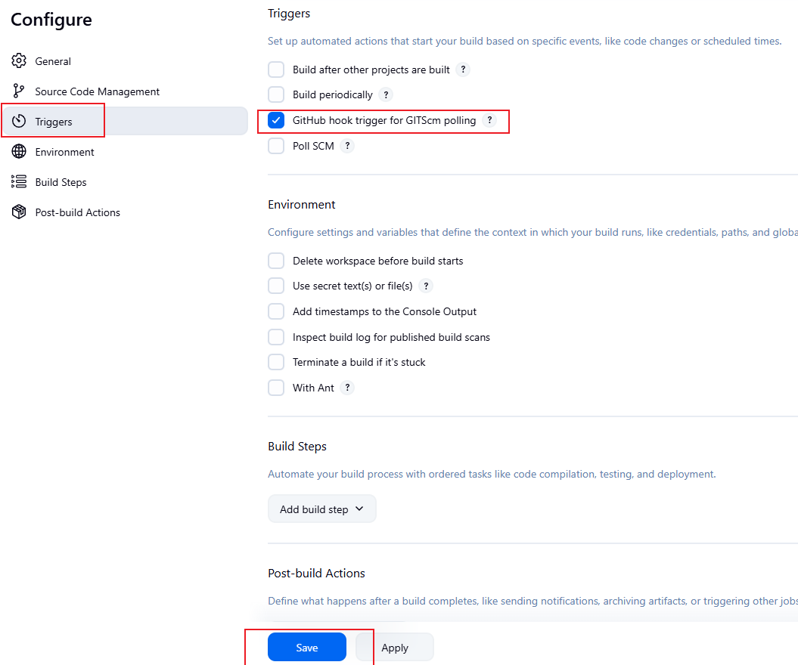

Click Save

Proceed to Github to set up a webhook from the repository setting.

Go to Settings > Webhooks > Add webhook.
Payload URL: Enter your Jenkins base URL followed by /github-webhook/.

Example: http://your.jenkins.ip:8080/github-webhook/

Content type: Select application/json.

Secret: (Optional but highly recommended) Enter a random secret token and save it. You must then configure this secret in the Jenkins job settings under GitHub Hook Secret (if prompted by the plugin).

Which events would you like to trigger this webhook? Select Just the push event (or whichever events you need, like Pull Requests).

Click Add webhook.

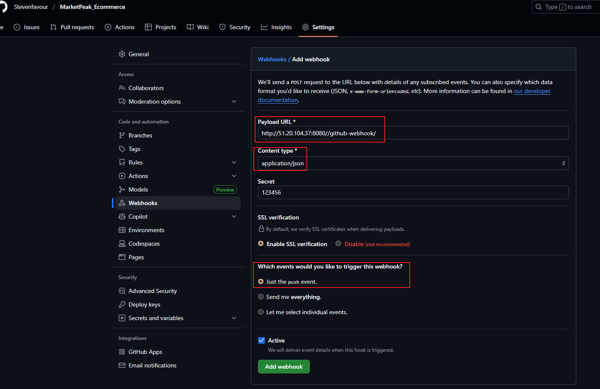

After setting up a webhook, we will make changes to the Readme.md file in the repos so we can verify that this works. 

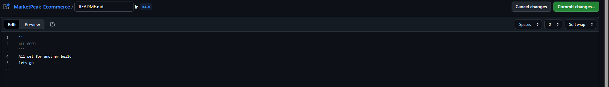

Commmit the changes.

Navigate back to the Jenkins console, we can see that a new build (4) has been launched automatically.

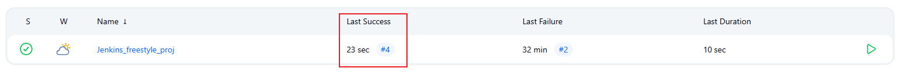

On further investigation, we can see in the image below the details of the gitpush webhook.

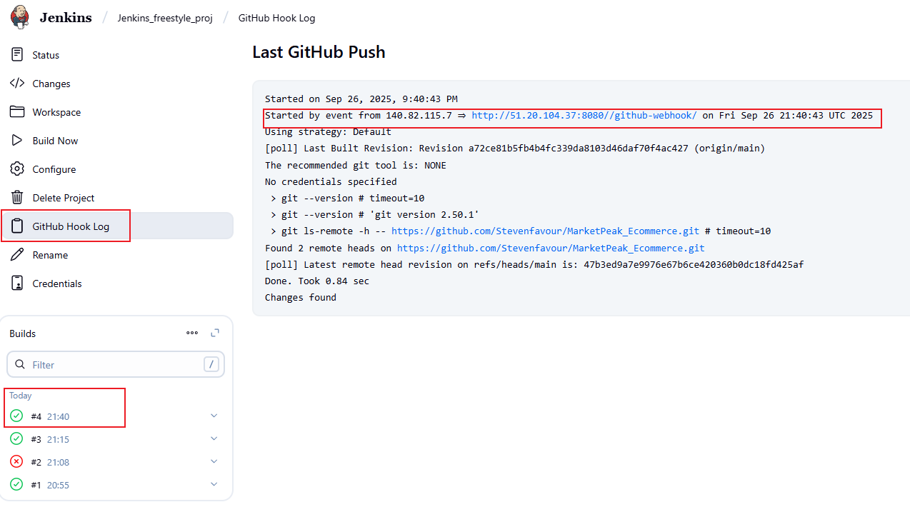

The highlights shows the trigger source was the Jenkins instance server.

This completes the project.

=======
## Jenkins Freestyle Project

### Jenkins Job

In Jenkins, a job is a unit of work or a task that can be executed by the Jenkins automation server.

A Jenkins job represents a specific task or set of tasks that needs to be performed as part of a build or deployment process. Jobs in Jenkins are created to automate the execution of various steps such as compiling code, running tests, packaging applications, and deploying them to servers. Each Jenkins job is configured with a series of build steps, post-build actions, and other settings that define how the job should be executed.

We will begin by creating a new item on the Jenkins dashboard after logging into the console by clicking "New Item."

Enter an Item name and type, then proceed to create.

For this demonstration, we will use an existing repository on Github.

We will then copy this repository URL, as we will be needing to configure a build task

Under the Configure option in the newly created item (Jenkins_freestyle_proj), navigate to the Source Code Management.

Paste the previously copied repository URL.

Under the Branches to build, enter the main branch name (Main).

Click Build

The images below show a successful build operation

### Configuring a Build Trigger

To use a build trigger, we must configure it both on the Jenkins console and also from the Source Control Management (GitHub) 

Under Configure from the previous image,  click Trigger and select GitHub Hook Trigger

Click Save

Proceed to GitHub to set up a webhook from the repository settings.

Go to Settings > Webhooks > Add webhook.
Payload URL: Enter your Jenkins base URL followed by /github-webhook/.

Example: http://your.jenkins.ip:8080/github-webhook/

Content type: Select application/json.

Secret: (Optional but highly recommended) Enter a random secret token and save it. You must then configure this secret in the Jenkins job settings under GitHub Hook Secret (if prompted by the plugin).

Which events would you like to trigger this webhook? Select Just the push event (or whichever events you need, like Pull Requests).

Click Add webhook.

After setting up a webhook, we will make changes to the Readme.md file in the repo so we can verify that this works. 

Commmit the changes.

Navigate back to the Jenkins console, and we can see that a new build (4) has been launched automatically.

On further investigation, we can see in the image below the details of the gitpush webhook.

The highlights show the trigger source was the Jenkins instance server.

This completes the project.

>>>>>>> a90996b03a7e969c4559c3110485420de20a2c9d
