<<<<<<< HEAD
## Jenkins Pipeline Job

### What is a Jenkins Pipeline Job

A Jenkins pipeline job is a way to define and automate a series of steps in the software delivery process. It allows you to script and organize your entire build, test, and deployment. Jenkins pipelines enable organizations to define, visualize, and execute intricate build, test, and deployment processes as code. This facilitates the seamless integration of continuous integration and continuous delivery (CI/CD) practices into software development.

Let's recall our docker foundations project when we created a dockerfile and made a docker image and container with it. Now let's automate the same process with jenkins pipeline code.

First, we create a pipeline job by entering the name and selecting the pipeline.

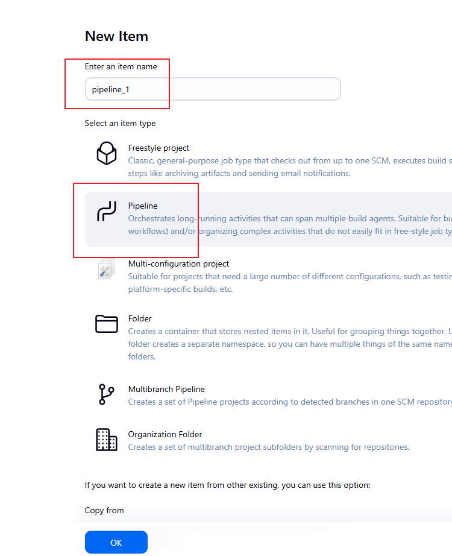

Similarly to what was done in the previous project, we will configure a build trigger for jenkins to trigger a build each time changes are pushed to the working branch.

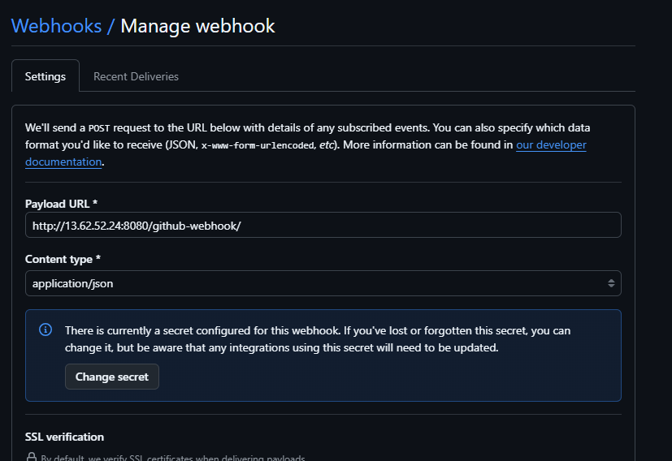

### Writing Jenkins Pipeline Script

A Jenkins pipeline script refers to a script that defines and orchestrates the steps and stages of a continuous integration and continuous delivery (CI/CD) pipeline. Jenkins pipelines can be defined using either declarative or scripted syntax. Declarative syntax is a more structured and concise way to define pipelines. It uses a domain-specific language to describe the pipeline stages, steps, and other configurations while scripted syntax provides more flexibility and is suitable for complex scripting requirements.

Let's write our pipeline script: 

```
pipeline {
    agent any

    stages {
        stage('Connect To Github') {
            steps {
                // The 'checkout' step should use the 'scm' variable, not scmGit, 
                // and the arguments look like they came from the Pipeline Syntax Generator.
                // Assuming you want a standard checkout of the main branch:
                checkout([
                    $class: 'GitSCM', 
                    branches: [[name: '*/main']], 
                    userRemoteConfigs: [[url: 'https://github.com/Stevenfavour/MarketPeak_Ecommerce.git']]
                ])
            }
        }

        stage('Build Docker Image') {
            steps {
                // The script block is not strictly necessary for a single 'sh' command
                // but is kept for consistency if more commands are added later.
                sh 'docker build -t dockerfile .'
            }
        }

        stage('Run Docker Container') {
            steps {
                // Stopping and removing any old container first is good practice
                sh 'docker stop dockerfile || true' 
                sh 'docker rm dockerfile || true' 
                
                // Note: The image name 'dockerfile' is unusual. You usually use 'my-app:1.0'
                sh 'docker run -d -p 8081:80 --name dockerfile dockerfile'
                
                // Removed '-itd' and simplified to '-d' since interactive mode is not needed
                // and a container name is added for easier management.
            }
        }
    }
}
```

Lets breakdown the script

`agent any` Specifies that the pipeline can run on any agent available. Could be a master agent or node agent (slave)

`stages{" "}` Defines the various stages of the pipeline, each representing a phase in the software delivery.

Stage 1 connects jenkins to the github repository where the source code is.

Stage 2 Build the dockerfile that resides inside the repository.

Stage 3 Runs the built docker image. This provisions the container listening on a specific port.

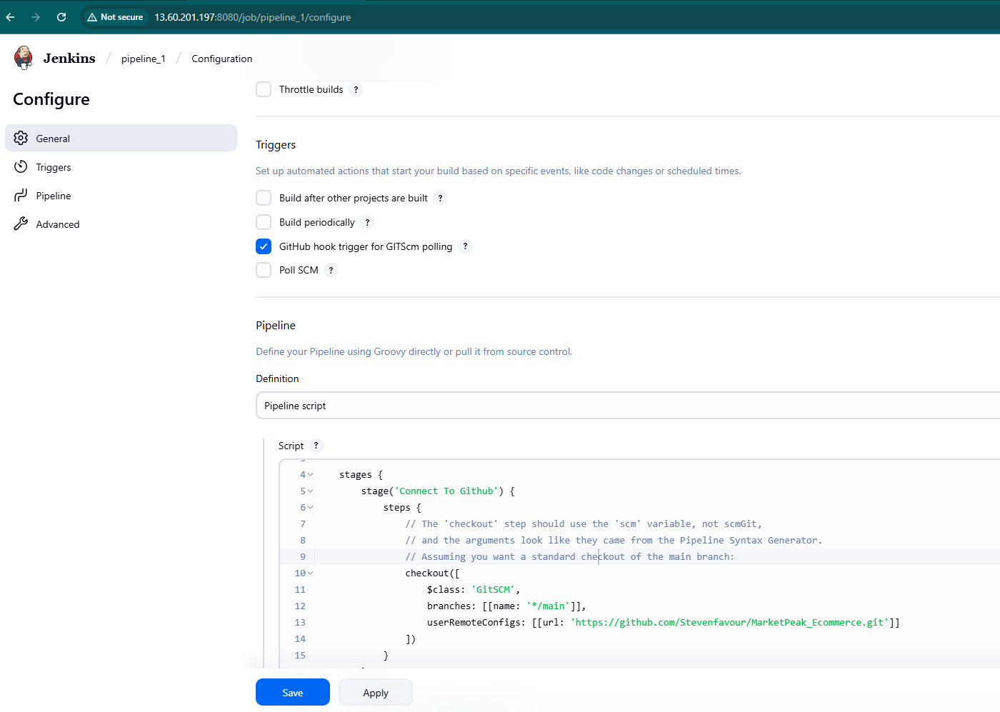


### Overview

This Snippet Generator will help you learn the Pipeline Script code which can be used to define various steps. Pick a step you are interested in frc list, configure it, click Generate Pipeline Script, and you will see a Pipeline Script statement that would call the step with that configuration. You n and paste the whole statement into your script, or pick up just the options you care about. (Most parameters are optional and can be omitted in y script, leaving them at default values.)

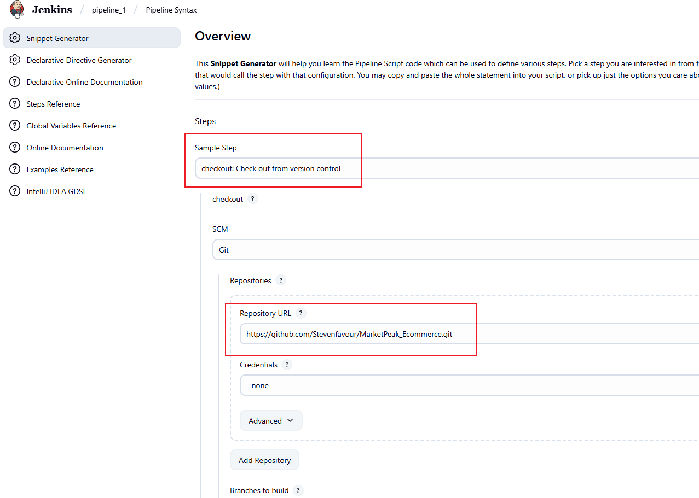

Specify the branch name and generate script.

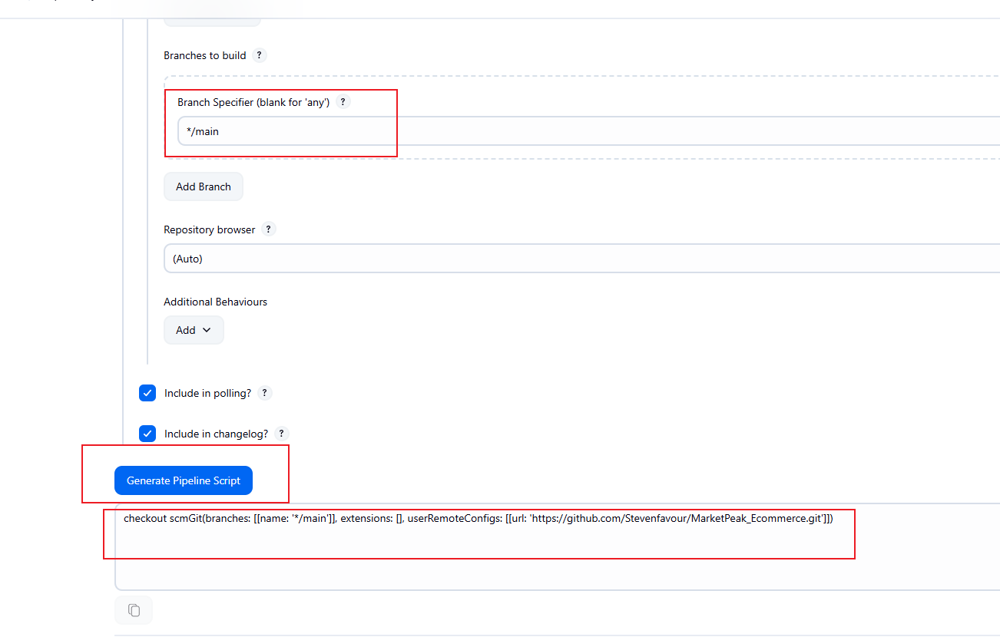

We can the copy the generated script to the pipeline to connect jenkins to github.

Since we have installed docker using User Data when lauching the instance in the previous project, we would skip this step.

Having written the pipeline script, we save and click build.

The image below shows the execution of the pipeline.

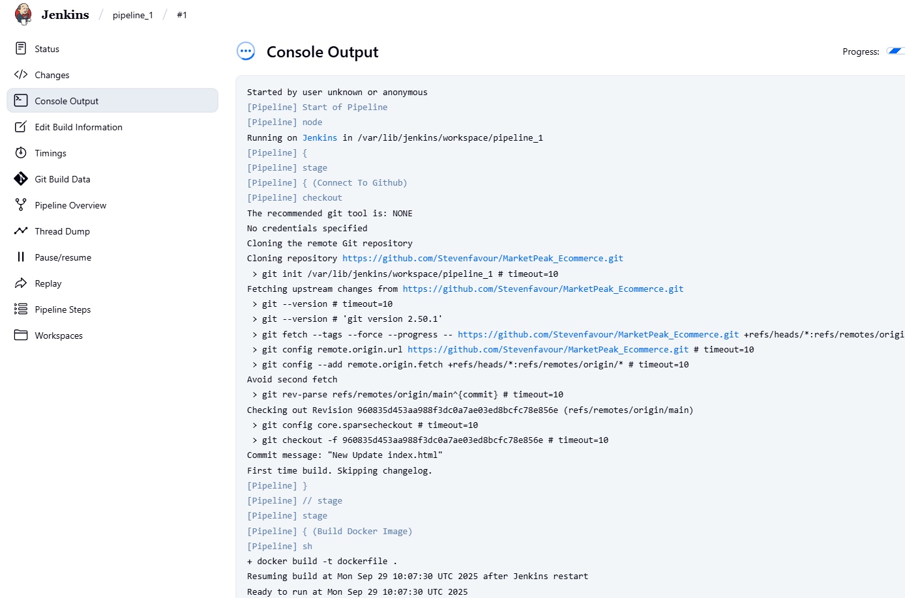

The image below shows a successful pipeline build 

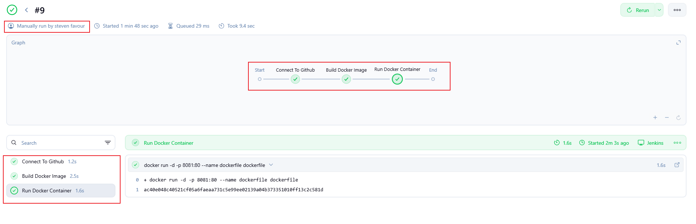

Before we can access the website, we will configure the security group attached to the ec2 server so we can access the webpage on a specific port, same port we have our container listening on.

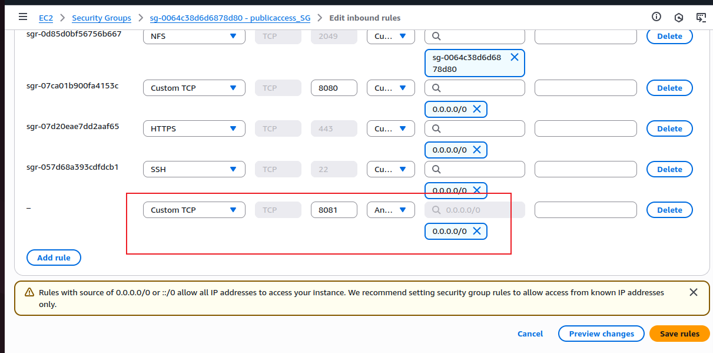

We will go ahead to access the webpage. 

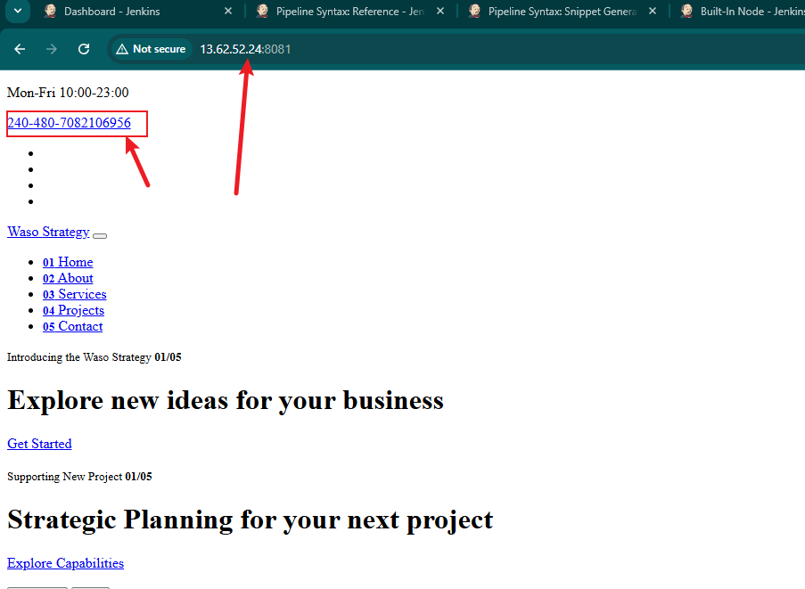

Take note of the phone number highlighted on the image above. We will use its change to trigger an autaomatic build. (Recall that we previously configured a webhook)

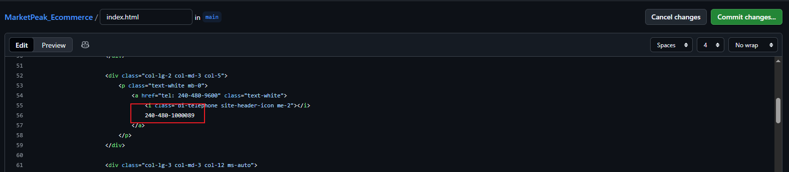

The image above shows a change in the inex.html file.

Upon committing the changes, a build operation will be triggered in the jenkins console.

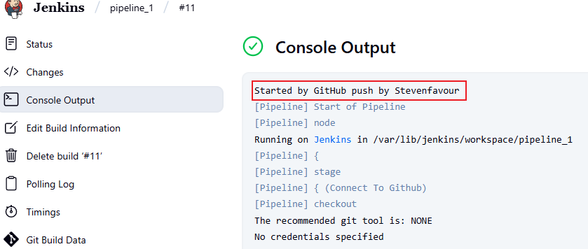

We can see the build being triggered by a Git push

When we reload the webpage, we can see the changes on the webpage already.
=======
## Jenkins Pipeline Job

### What is a Jenkins Pipeline Job

A Jenkins pipeline job is a way to define and automate a series of steps in the software delivery process. It allows you to script and organize your entire build, test, and deployment. Jenkins pipelines enable organizations to define, visualize, and execute intricate build, test, and deployment processes as code. This facilitates the seamless integration of continuous integration and continuous delivery (CI/CD) practices into software development.

Let's recall our docker foundations project when we created a dockerfile and made a docker image and container with it. Now let's automate the same process with jenkins pipeline code.

First, we create a pipeline job by entering the name and selecting the pipeline.


Similarly to what was done in the previous project, we will configure a build trigger for jenkins to trigger a build each time changes are pushed to the working branch.


### Writing Jenkins Pipeline Script

A Jenkins pipeline script refers to a script that defines and orchestrates the steps and stages of a continuous integration and continuous delivery (CI/CD) pipeline. Jenkins pipelines can be defined using either declarative or scripted syntax. Declarative syntax is a more structured and concise way to define pipelines. It uses a domain-specific language to describe the pipeline stages, steps, and other configurations while scripted syntax provides more flexibility and is suitable for complex scripting requirements.

Let's write our pipeline script: 

```
pipeline {
    agent any

    stages {
        stage('Connect To Github') {
            steps {
                // The 'checkout' step should use the 'scm' variable, not scmGit, 
                // and the arguments look like they came from the Pipeline Syntax Generator.
                // Assuming you want a standard checkout of the main branch:
                checkout([
                    $class: 'GitSCM', 
                    branches: [[name: '*/main']], 
                    userRemoteConfigs: [[url: 'https://github.com/Stevenfavour/MarketPeak_Ecommerce.git']]
                ])
            }
        }

        stage('Build Docker Image') {
            steps {
                // The script block is not strictly necessary for a single 'sh' command
                // but is kept for consistency if more commands are added later.
                sh 'docker build -t dockerfile .'
            }
        }

        stage('Run Docker Container') {
            steps {
                // Stopping and removing any old containers first is good practice
                sh 'docker stop dockerfile || true' 
                sh 'docker rm dockerfile || true' 
                
                // Note: The image name 'dockerfile' is unusual. You usually use 'my-app:1.0'
                sh 'docker run -d -p 8081:80 --name dockerfile dockerfile'
                
                // Removed '-itd' and simplified to '-d' since interactive mode is not needed
                // and a container name is added for easier management.
            }
        }
    }
}
```

Let's break down the script

`agent any` Specifies that the pipeline can run on any agent available. Could be a master agent or node agent (slave)

`stages{" "}` Defines the various stages of the pipeline, each representing a phase in the software delivery.

Stage 1 connects jenkins to the github repository where the source code is.

Stage 2: Build the Dockerfile that resides inside the repository.

Stage 3: Runs the built Docker image. This provisions the container listening on a specific port.


### Overview

This Snippet Generator will help you learn the Pipeline Script code, which can be used to define various steps. Pick a step you are interested in frc list, configure it, click Generate Pipeline Script, and you will see a Pipeline Script statement that would call the step with that configuration. You n and paste the whole statement into your script, or pick up just the options you care about. (Most parameters are optional and can be omitted in y script, leaving them at default values.)


Specify the branch name and generate the  script.


We can copy the generated script to the pipeline to connect Jenkins to GitHub.

Since we have installed docker using User Data when launching the instance in the previous project, we would skip this step.

Having written the pipeline script, we save and click build.

The image below shows the execution of the pipeline.


The image below shows a successful pipeline build 


Before we can access the website, we will configure the security group attached to the ec2 server so we can access the webpage on a specific port, the same port we have our container listening on.


We will go ahead and access the webpage. 


Take note of the phone number highlighted on the image above. We will use its change to trigger an automatic build. (Recall that we previously configured a webhook)


The image above shows a change in the inex.html file.

Upon committing the changes, a build operation will be triggered in the Jenkins console.


We can see the build being triggered by a Git push


When we reload the webpage, we can see the changes on the webpage already.
>>>>>>> a90996b03a7e969c4559c3110485420de20a2c9d
