## Continuous Integration and Cotinuous Deployment and GitHub Actions

This project will involve setting up an simple Node.js web application and applying CI/CD practices using GitHub Actions. This application will have basic functionality such as serving a static webpage.

1. Definition and Benefits of CI/CD:

* Continuous Integration (CI) is the practice of merging all developers' working copies to a shared mainline several times a day.
* Continuous Deployment (CD) is the process of releasing software changes to production automatically and reliably.
* Benefits: Faster release rate, improved developer productivity, better code quality, and enhanced customer satisfaction.

2. Overview of the CI/CD Pipeline:

* CI Pipeline typically includes steps like version control, code integration, automated testing, and building the application.
* CD Pipeline involves steps like deploying the application to a staging or production environment, and post-deployment monitoring.
* Tools: Version control systems (e.g., Git), CI/CD platforms (e.g., GitHub Actions), testing frameworks, and deployment tools.

GitHub Actions: A CI/CD platform integrated into GitHub, automation the build, test and deployment ppelines of your software directly within the GitHub repository.

Lets begin a Practical Implementation of this

We begin with creating a new repository on GitHub with name NODE

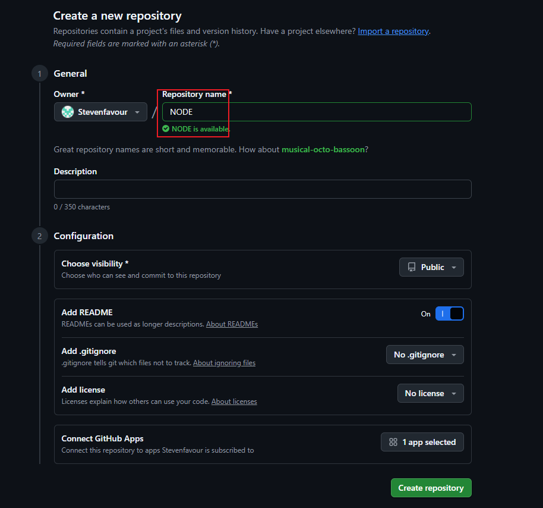

Then we clone this empty repo into our local machine.
Inside the local repo, we then create a .js file ane we write a simple node application. The image below shows the application.

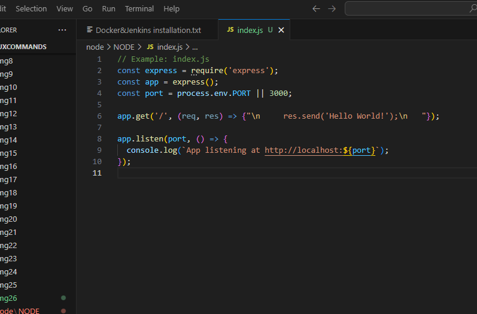

```
// Example: index.js
const express = require('express');
const app = express();
const port = process.env.PORT || 3000;

app.get('/', (req, res) => {"\n     res.send('Hello World!');\n   "});

app.listen(port, () => {
  console.log(`App listening at http://localhost:${port}`);
});

```
Upon attemping to install npm, we ran into this error

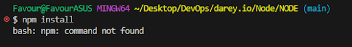

Image above indicates that before we initialize the Node.js application, we will need to install npm on our local machine.

Using this url 

```
https://nodejs.org/en/download
```
We download node to the local machine and reattempt to install npm. To verify a successfull installation, run `node -v` , this returns the version of the installed node. Upon installation a `package-lock.json` file will be created inside the root folder of the local repo.

Alternatively we can install this on the CLI by using  `sudo apt install nodejs npm`

After all these is done, we initialize node with `npm init`
Running this command creates a package.json file inside the root folder also.

We then push all the changes to the remote repository.
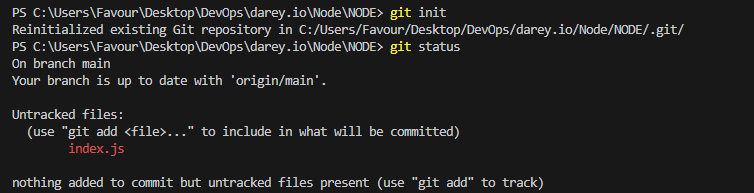

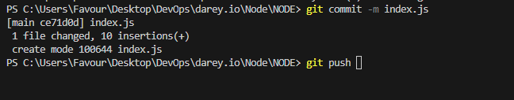

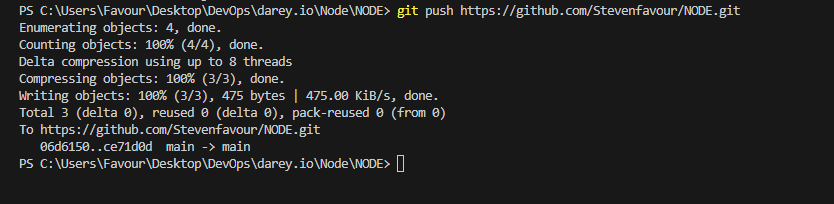

### Writing the GitHub Action Workflow

Create a .github/workflow folder in our repo (local repo is recommended for easier push) and add a workflow file named node.js.yml 

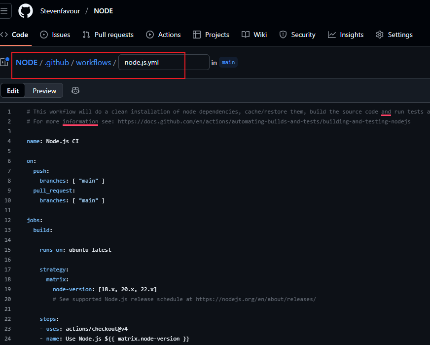

Inside the workflow file we will have;

```
# Name of the workflow
name: Node.js CI

# Specifies when the workflow should be triggered
on:
  # Triggers the workflow on 'push' events to the 'main' branch
  push:
    branches: [ main ]
  # Also triggers the workflow on 'pull_request' events targeting the 'main' branch
  pull_request:
    branches: [ main ]

# Defines the jobs that the workflow will execute
jobs:
  # Job identifier
  build:
    # Specifies the type of virtual host environment (runner) to use
    runs-on: ubuntu-latest

    # Strategy for running the jobs
    strategy:
      # A matrix build strategy to test against multiple versions of Node.js
      matrix:
        # It's best practice to use a current LTS and a widely used older version
        # Current LTS is 20.x, Active LTS is 18.x. 14.x and 16.x are end-of-life.
        node-version: [22.x]

    # Steps represent a sequence of tasks that will be executed as part of the job
    steps:
      - # Checks-out your repository under $GITHUB_WORKSPACE, so the job can access it
        # Updated to the current stable major version
        uses: actions/checkout@v4

      - # Sets up the specified version of Node.js
        name: Use Node.js ${{ matrix.node-version }}
        # Updated to the current stable major version
        uses: actions/setup-node@v4
        with:
          # CORRECTED: The variable reference must use ${{ matrix.<variable> }}
          node-version: ${{ matrix.node-version }}
          # Recommended for caching node dependencies for faster subsequent runs
          cache: 'npm' 

      - # Installs node modules as specified in the project's package-lock.json
        # 'npm ci' is correct for CI/CD builds
        run: npm ci

      - # This command will only run if a build script is defined in the package.json
        run: npm run build --if-present

      - # Runs tests as defined in the project's package.json
        run: npm test


```


Explanation:

name: This simply names your workflow. It's what appears on GitHub when the workflow is running.

on: This section defines when the workflow is triggered. Here, it's set to activate on push and pull request events to the main branch.

jobs: Jobs are a set of steps that execute on the same runner. In this example, there's one job named build.

runs-on: Defines the type of machine to run the job on. Here, it's using the latest Ubuntu virtual machine.

strategy.matrix: This allows you to run the job on multiple versions of Node.js, ensuring compatibility.

steps: A sequence of tasks executed as part of the job.

actions/checkout@v2: Checks out your repository under $GITHUB_WORKSPACE.

actions/setup-node@v1: Sets up the Node.js environment.

npm ci: Installs dependencies defined in package-lock.json.

npm run build --if-present: Runs the build script from package.json if it's present.

npm test: Runs tests specified in package.json.

This workflow is a basic example for a Node.js project, demonstrating how to automate testing across different Node.js versions and ensuring that your code integrates and works as expected in a clean environment.

Upon pushing the latest changes, a workflow is automatically triggered as specfied in  the workflow (line 7)

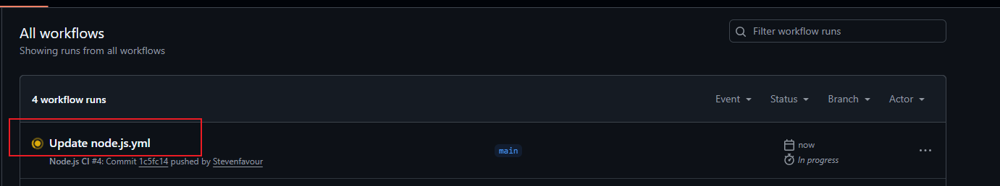

The workflow failed. Upon inestigation npm test step caused this because we have not specified any test (to test the node application)

We can see that other steps in the job ran as they should except npm test.

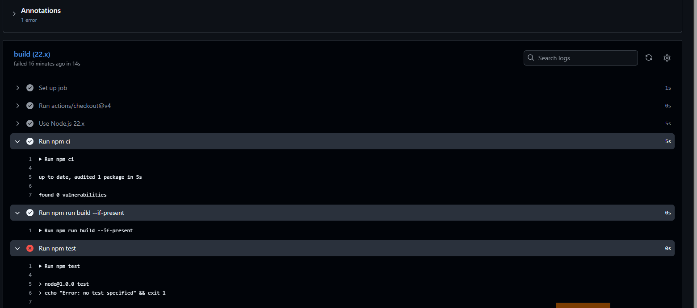

#### Setting up for npm Test

Adding automated tests is a great way to ensure the quality and stability of your Node.js application, and it will integrate perfectly into the GitHub Actions workflow we've already set up.

We will first need to install the testing framework into our Node.js project.
Run the following command to install jest (The testing framework)

```
npm install jest --save-dev

```

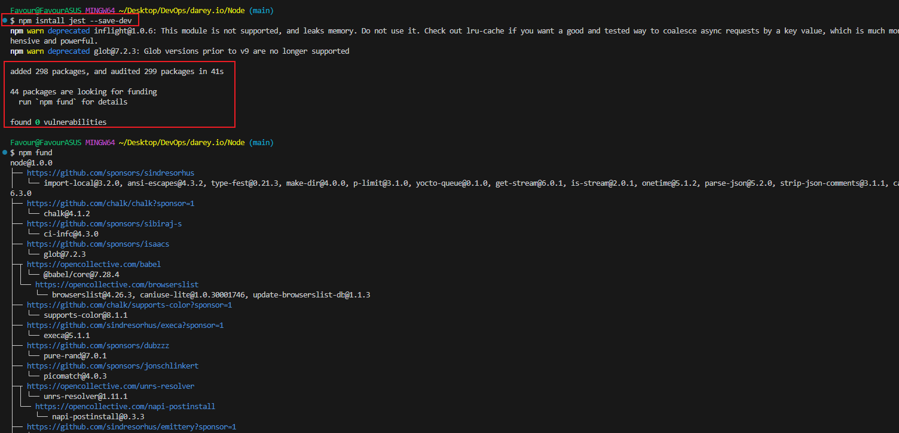

`npm fund` to verify our installation.

We then update the package.json file in our project and update the script section to define a test command that run Jest.

```
"scripts": {
  "test": "jest",
  "start": "node index.js"
  // ... other scripts
},

```
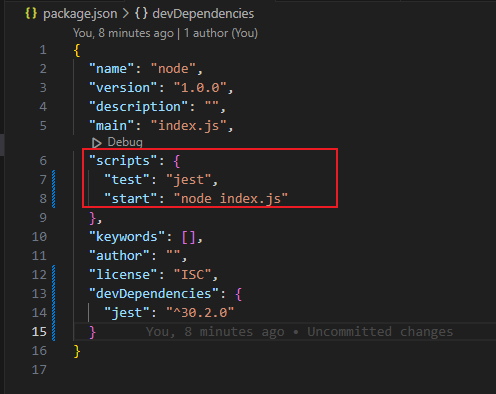

#### Writing a Simple Test
Create a new directory named tests in your project root, and then add a test file (e.g., sum.test.js).

Let's assume you have a simple function in a file named sum.js

```
function sum(a, b) {
  return a + b;
}
module.exports = sum;
```

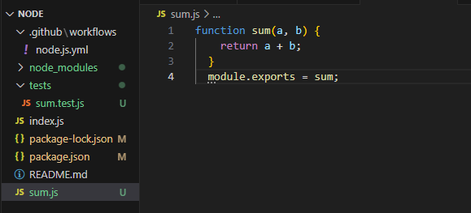

../sum.test.js

```
const sum = require('../sum');

test('adds 1 + 2 to equal 3', () => {
  expect(sum(1, 2)).toBe(3);
});

test('adds negative numbers correctly', () => {
  expect(sum(-1, -5)).toBe(-6);
});
```


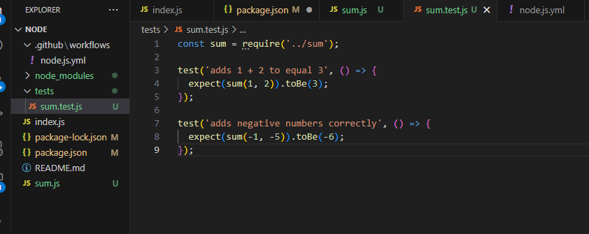

Typically sum.js and sum.test.js would be located in different places within your project structure.

Save thes files and run `npm test` on the terminal.

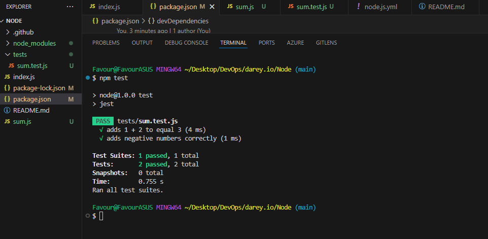

All test passed, we can push the code to the remote repo.

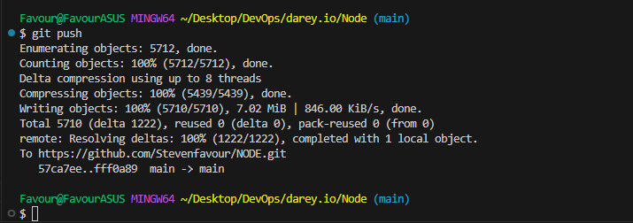

As soon as the changes are pushed, the workflow is triggered automatically.

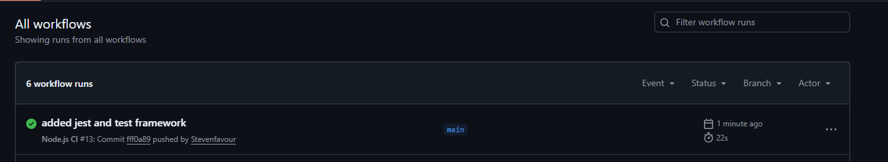

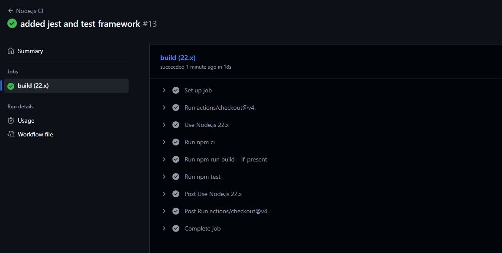

### Deployment to AWS

Since WE already have an AWS instance (EC2 server) running, we'll shift the deployment to using SSH and the AWS CodeDeploy service.

CodeDeploy is the standard AWS service for automating application deployments to servers, including EC2 instances.

#### Setting up Code Deploy on AWS

To start with, we will create an IAM role. We will attach this role to our EC2 instance (Server side). We will also give Mary (IAM user) a CodeDeploy permission as well (Deployment Initiator Side)

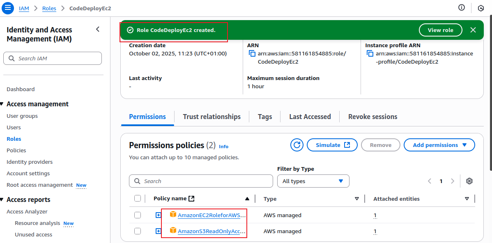

The image below shows the IAM modification for the EC2 instance.

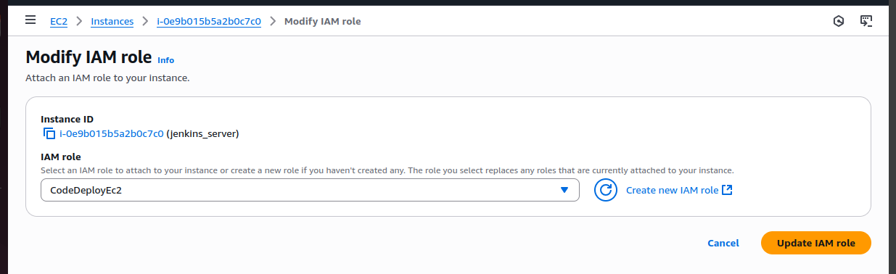

#### Installing CodeDeploy on the EC2 instance.

Runnning the following commands to install CodeDeplot agent

```
# Update package lists
sudo yum update

# Install Ruby (required for the agent installation script)
sudo yum install ruby-full wget -y

# Download the installation script (using eu-north-1 as example)
wget https://aws-codedeploy-eu-north-1.s3.eu-north-1.amazonaws.com/latest/install

# Make the script executable
chmod +x ./install

# Run the installer
sudo ./install auto

# Verify the agent is running
sudo service codedeploy-agent status
```

### Install Ruby
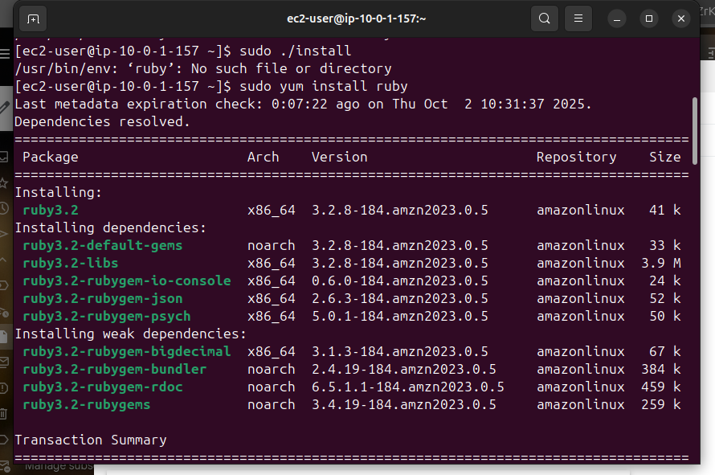

### Install Codedeploy

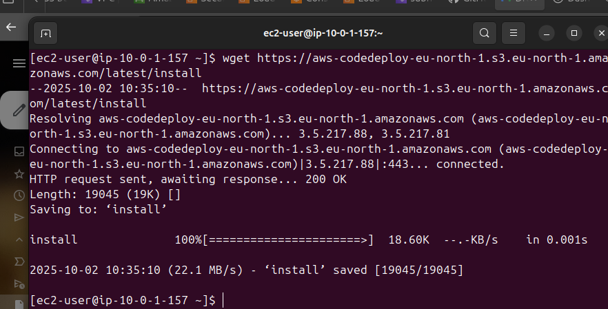

Give the neccessary permission and Run the Installer.

The image below verifies the CodeDeloy installation.

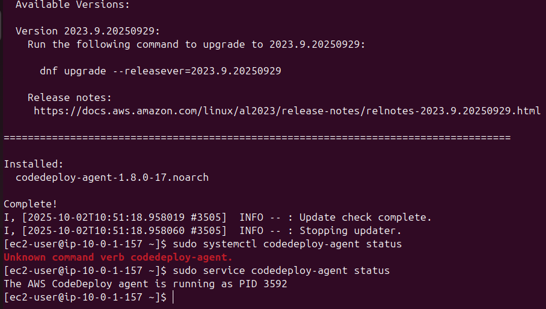

### Configure AWS CodeDeploy Service

#### Create CodeDeploy Application:

* Go to the AWS CodeDeploy console.

* Click Create application.

* Application Name: Enter the name you used in the workflow (e.g., MyNodeApp).

* Compute Platform: Select EC2/On-premises.

* Click Create application.

#### Create Deployment Group:

* On the application page, click Create deployment group.

* Deployment group name: Enter the name you used in the workflow (e.g., MyDeploymentGroup).

* Service Role: Select an IAM service role that grants CodeDeploy access (you may need to create a new one with the AWSCodeDeployRole policy).

* Environment Configuration: Under Environment configuration, select Amazon EC2 Instances.

* Key: Use a tag key, like Name.

* Value: Use the value that identifies your specific EC2 instance (e.g., My-Production-Server).

* Click Create deployment group

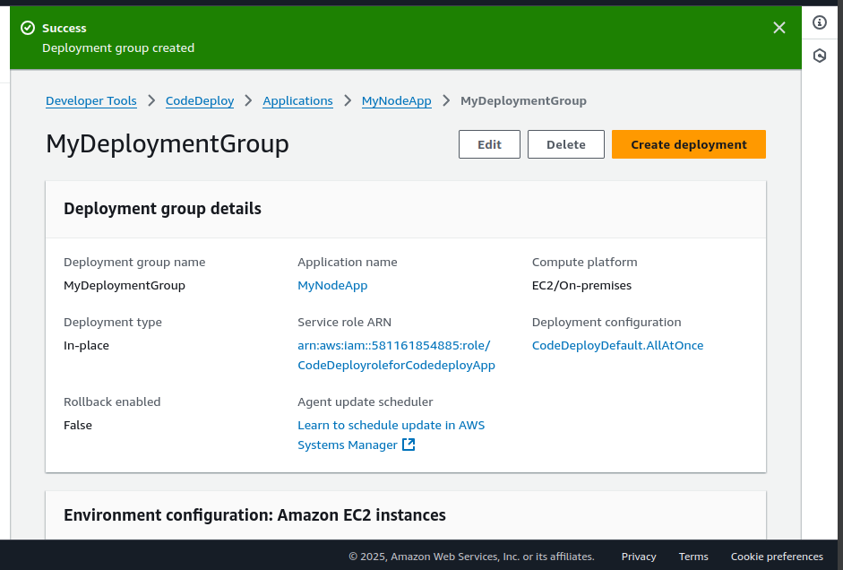

Before deployment, we will need to set up IAM user (Mary) credential in GitHub as secrets as we will NOT want to hardcode these credentials insde the workflow file.

Setting up your AWS credentials as GitHub Secrets is the standard and most secure way to allow your GitHub Actions workflows to communicate with your AWS account.

Security Note: Using secrets means the credentials are never stored in your workflow file (which is public) or logged in the console output. Only the GitHub Actions runner has temporary access during the job execution.

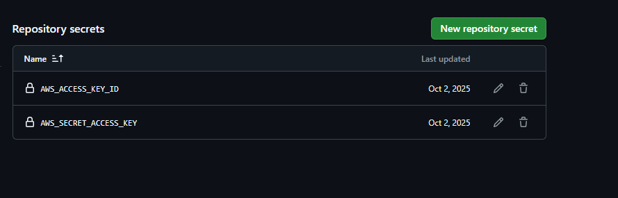

Finally before deployment, we will assign the IAM user permission  to deploy on the AWS console since its this user credential we are maing use of.

 To start the deployment, your GitHub Actions workflow runs the `aws deploy create-deployment` command using Mary's credentials.

 Mary must have the permissions to initiate and manage a CodeDeploy deployment.

Mary belongs a user group (Dev_Team) so all have to do is attach the right permission to the user group.

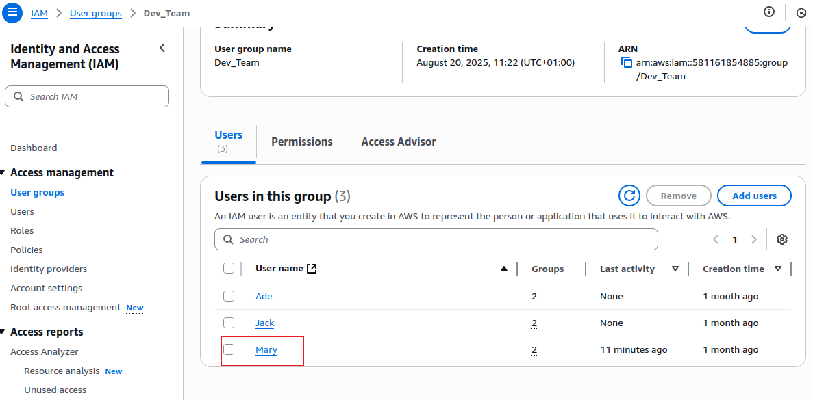

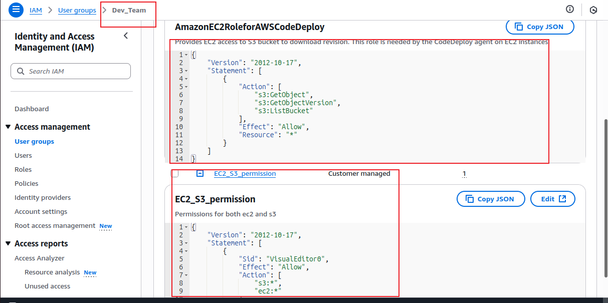

#### Workflow File (deploy-codedeploy.yml) 

Create a new workflow file named deploy-codedeploy.yml inside your .github/workflows/ directory.

```
name: Deploy via AWS CodeDeploy

on:
  push:
    branches:
      - main
  workflow_dispatch:

env:
  AWS_REGION: eu-north-1 # <-- Change this to your instance's region
  APPLICATION_NAME: MyNodeApp # <-- Must match the name in AWS CodeDeploy
  DEPLOYMENT_GROUP_NAME: MyDeploymentGroup # <-- Must match the name in AWS CodeDeploy

jobs:
  deploy:
    runs-on: ubuntu-latest

    steps:
      - name: Checkout Repository
        uses: actions/checkout@v4

      - name: Set up Node.js
        uses: actions/setup-node@v4
        with:
          node-version: '22.x'
          cache: 'npm'

      - name: Install Dependencies, Build, and Test
        run: |
          npm ci
          npm run build --if-present
          npm test
          # NOTE: If tests fail, the workflow will stop here.

      - name: Configure AWS Credentials
        uses: aws-actions/configure-aws-credentials@v4
        with:
          aws-access-key-id: ${{ secrets.AWS_ACCESS_KEY_ID }}
          aws-secret-access-key: ${{ secrets.AWS_SECRET_ACCESS_KEY }}
          aws-region: ${{ env.AWS_REGION }}

      - name: Create Deployment Bundle (Zip)
        run: |
          # 1. Create a CodeDeploy AppSpec file (required by CodeDeploy)
          echo "version: 0.0" > appspec.yml
          echo "os: linux" >> appspec.yml
          echo "files:" >> appspec.yml
          echo "  - source: /" >> appspec.yml
          echo "    destination: /var/www/html/mynodeapp" >> appspec.yml # <-- Change this path
          echo "hooks:" >> appspec.yml
          echo "  ApplicationStart:" >> appspec.yml
          echo "    - location: scripts/start_server.sh" >> appspec.yml
          
          # 2. Bundle all necessary files and the appspec.yml
          zip -r deployment-package.zip . -x "**/.git/*"

      - name: Upload to S3
        # Uploads the deployment package to a temporary S3 bucket
        run: |
          # Use AWS CLI to securely copy the zip file to your S3 bucket
          aws s3 cp deployment-package.zip s3://iamusermary001/${{ github.sha }}.zip


      - name: Deploy to EC2 via CodeDeploy
        # Initiates the deployment using the CodeDeploy service
        run: |
          aws deploy create-deployment \
            --application-name ${{ env.APPLICATION_NAME }} \
            --deployment-group-name ${{ env.DEPLOYMENT_GROUP_NAME }} \
            --deployment-config-name CodeDeployDefault.OneAtATime \
            --s3-location bucket=iamusermary001,key=${{ github.sha }}.zip,bundleType=zip


```

Push the changes to GitHub.

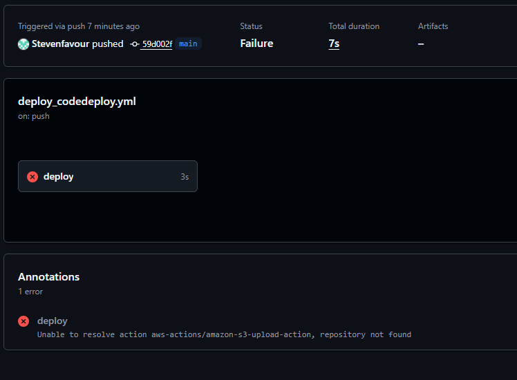

From the image above, we can observe that the `aws-actions/amazon-s3-uphold-action` is causing the workflow to fail.

To solve this, we will modify the `Upload to s3` action from this

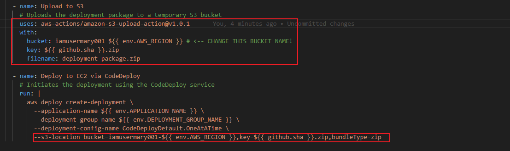

To, 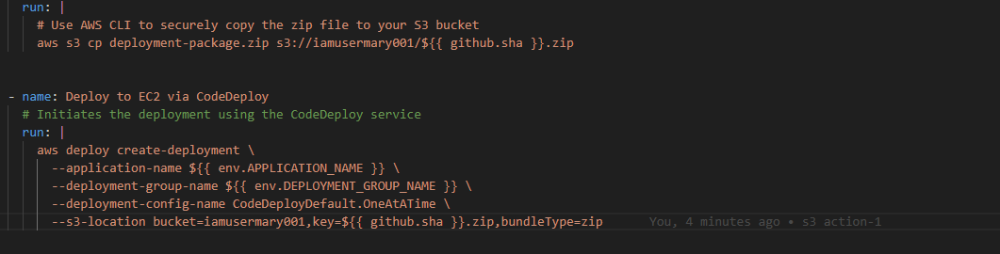

Save the changes and Push.

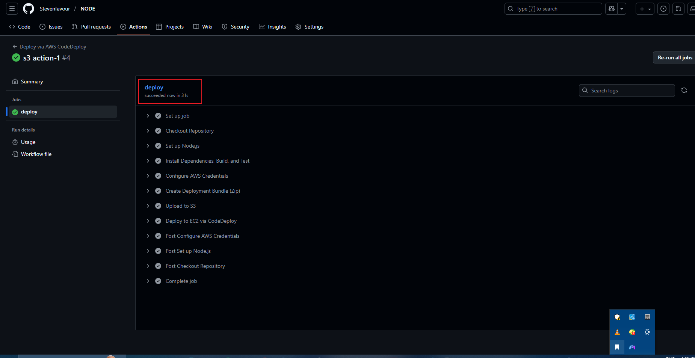

Deploy was succesfull

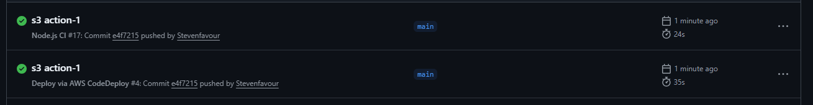

Navigate back to our s3 bucket for verification.

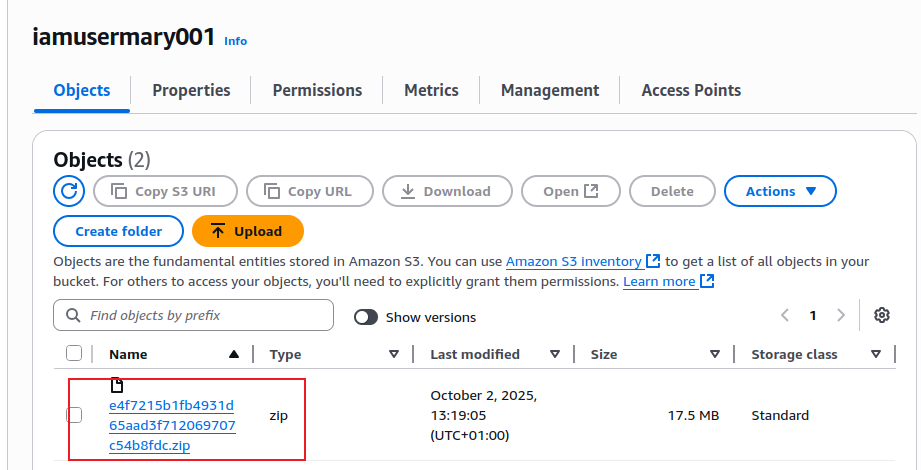

We can see the zipped file 

But to verify our deployment, head back to the Code Deployment section, Under Deployemnts.

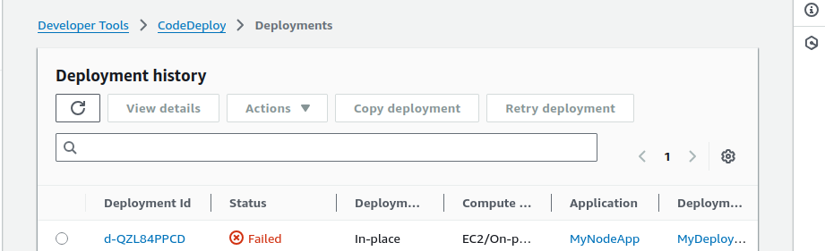

The above image indicates the deployment failed to deploy to the EC2 instance.

Upon  investigation by checking through the events logs

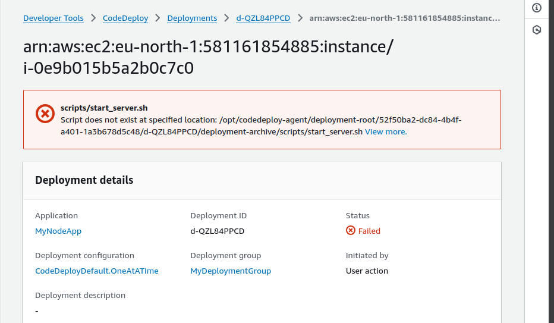

We can see that a file named start_server.sh is missing.

This can be fixed by modifying the workflow to create a file named `start_server.sh`

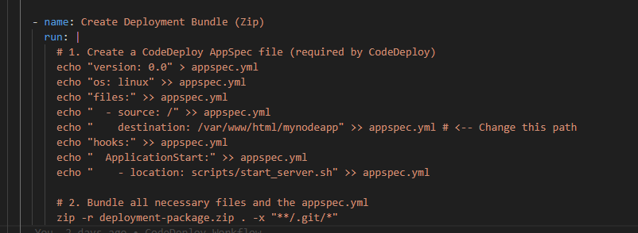

The image above shows the action to be modified in the workflow.

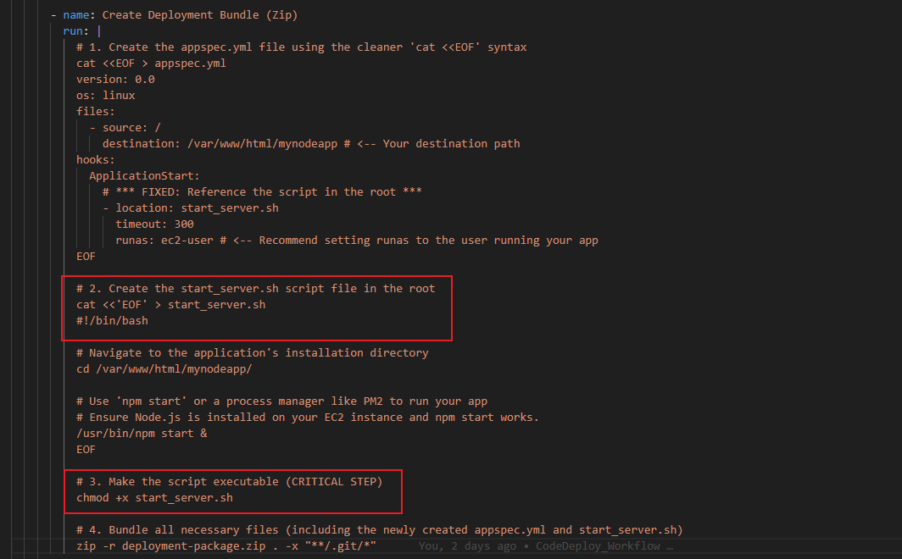

 The image below shighlights the tasks modified in the action.

 Push the changes to remote repo.

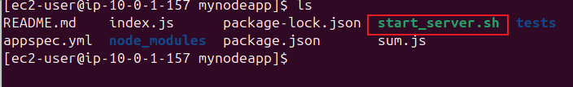

 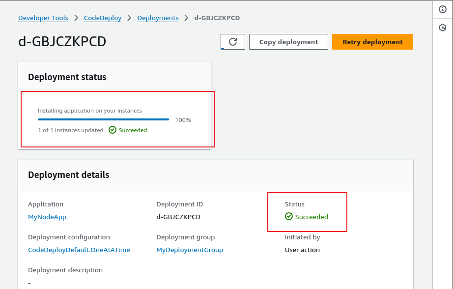


 Successfully deployment.


