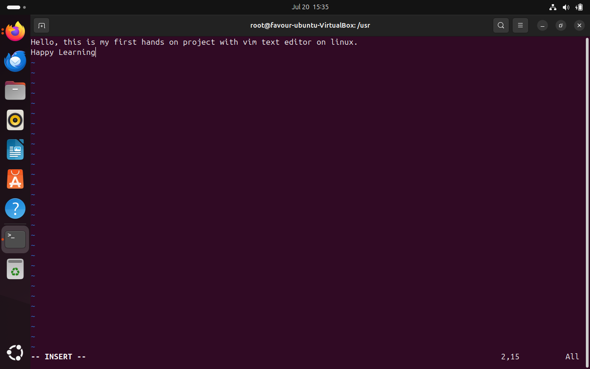
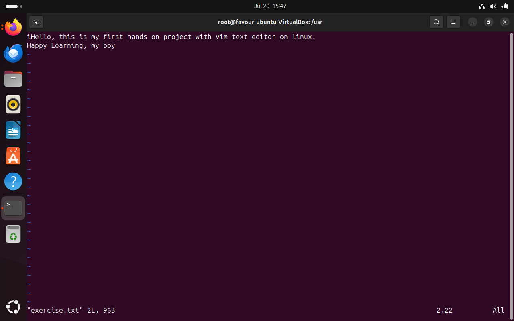
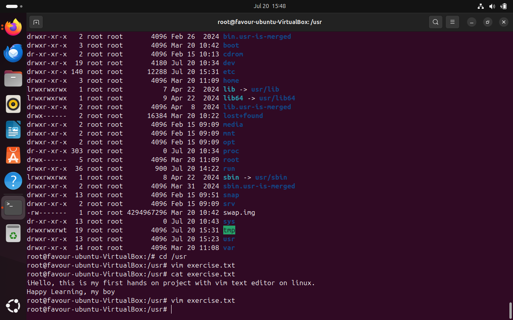
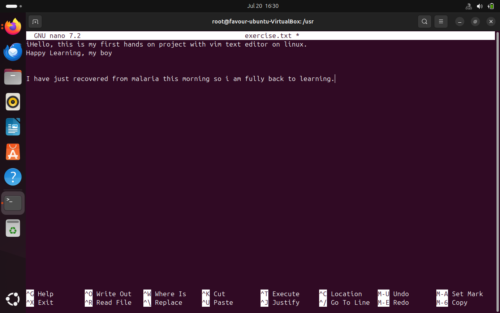
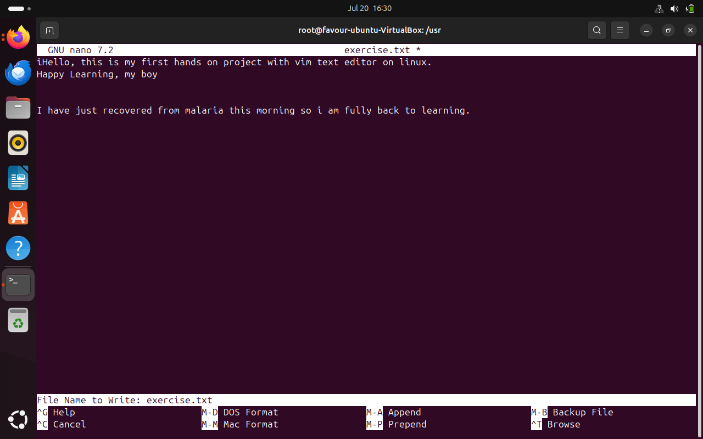
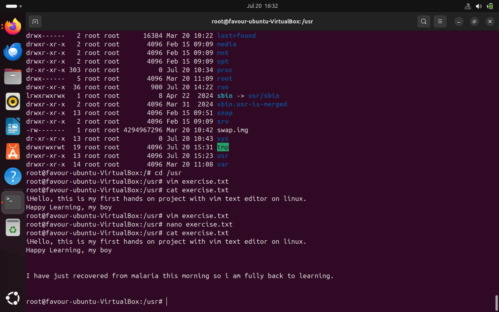
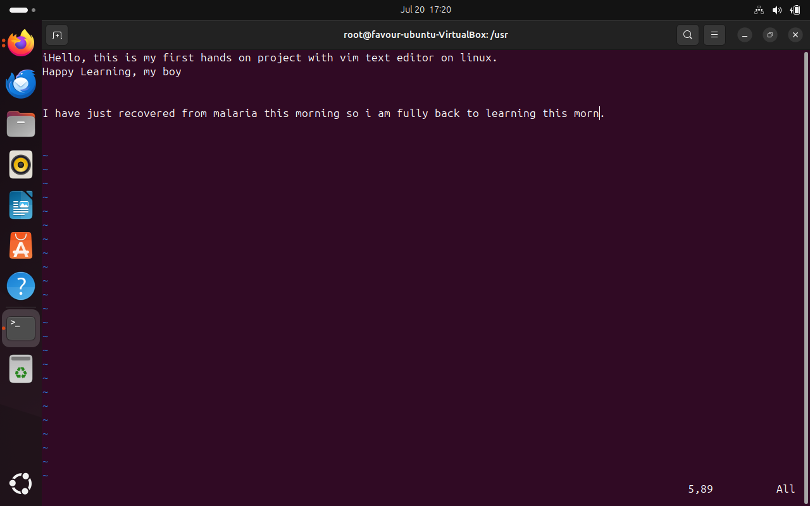
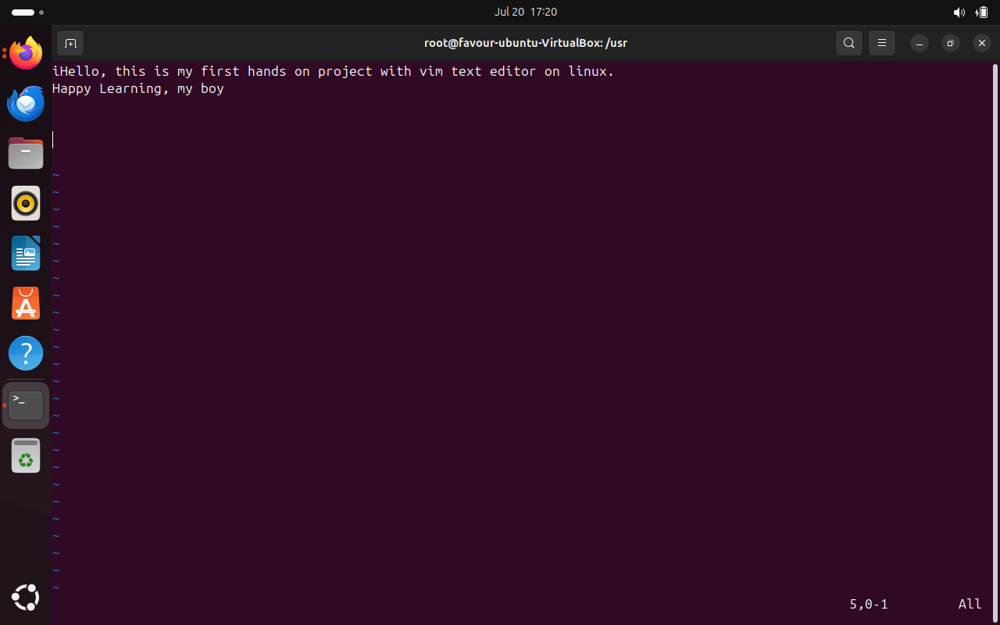
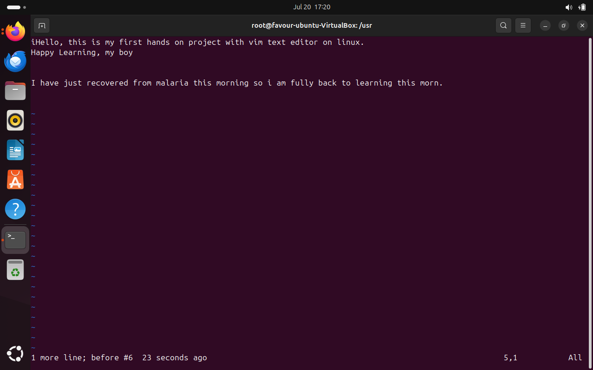

<<<<<<< HEAD
## Working with VIM text editor

The first image indicates the Insert Mode onn the text editor and texts are being added to teh txt file.

Next image is exiting the Insert mode by pressing the esc key. 

By using the :wq command, we then write (save) and quit the editor. the image below shows this. 

The next image verifies the changes made to the exercise.txt file by using the cat exercise.txt command. 

## Working with NANO text editor

Now entering the Nano Text editor using the nano exercise.txt command. Also in this mode text modification can occur. This iamge shows there has been a few added lines to the previous exercise.txt

Now saving the modified file using the ctrl + O command and the Enter key. 

Verifying the saved changes. 

=======
## Working with the VIM text editor

The first image indicates the Insert Mode on the text editor, and text are being added to the txt file.

The next image shows exiting Insert mode by pressing the Esc key. 

By using the :wq command, we then write (save) and quit the editor. The image below shows this. 

The next image verifies the changes made to the exercise.txt file by using the cat exercise.txt command. 

The images below show the use of dd command to delete the line of text 

Next up, shows the u command being used, the undo command to undo the last changes made.

## Working with NANO text editor

Now entering the Nano Text editor using the nano exercise.txt command. Additionally, text modification can occur in this mode. This image shows that there have been a few added lines to the previous exercise.txt

Now saving the modified file using the Ctrl + O command and the Enter key. 

Verifying the saved changes. 

Overall, Vim is optimized for efficiency and capability. Many experienced Linux users and developers eventually migrate to Vim (or Emacs, another powerful but complex editor) due to its power. While the Nano editor is predominantly for beginners and has a similar working principle to Notepad.
>>>>>>> a90996b03a7e969c4559c3110485420de20a2c9d
