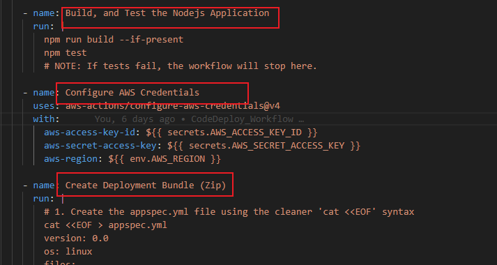
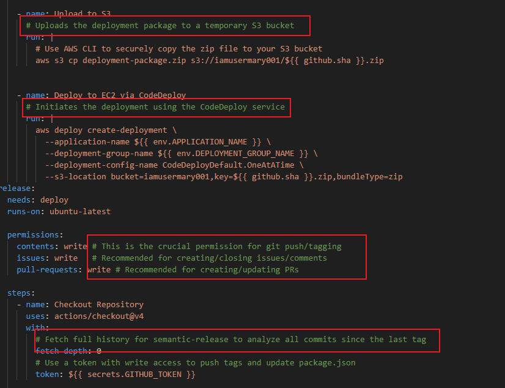
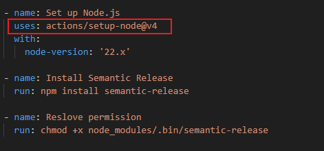
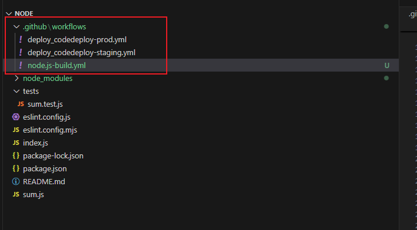
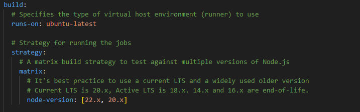
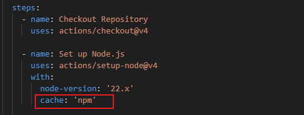
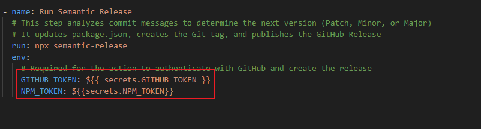

## Github Action and CI/CD -- Best Practices

In this session, we will be making use of the previous workflow `deploy-codedeploy-prod.yml` to demostrate Github Actions best practices.

Below is the entire workflow we will be focusing on.

```
name: Deploy via AWS CodeDeploy

on:
  push:
    branches:
      - main
  workflow_dispatch:

env:
  AWS_REGION: eu-north-1 # <-- Change this to your instance's region
  APPLICATION_NAME: MyNodeApp # <-- Must match the name in AWS CodeDeploy
  DEPLOYMENT_GROUP_NAME: MyDeploymentGroup # <-- Must match the name in AWS CodeDeploy

jobs:
  deploy:
    runs-on: ubuntu-latest

    steps:
      - name: Checkout Repository
        uses: actions/checkout@v4

      - name: Set up Node.js
        uses: actions/setup-node@v4
        with:
          node-version: '22.x'
          cache: 'npm'

      - name: Install Dependencies
        run: npm ci

      #- name: Code Quality Checks (lint test)
       # run: npm run lint
       # I want to suspend code quality check gate

      - name: Build, and Test
        run: |
          npm run build --if-present
          npm test
          # NOTE: If tests fail, the workflow will stop here.

      - name: Configure AWS Credentials
        uses: aws-actions/configure-aws-credentials@v4
        with:
          aws-access-key-id: ${{ secrets.AWS_ACCESS_KEY_ID }}
          aws-secret-access-key: ${{ secrets.AWS_SECRET_ACCESS_KEY }}
          aws-region: ${{ env.AWS_REGION }}

      - name: Create Deployment Bundle (Zip)
        run: |
          # 1. Create the appspec.yml file using the cleaner 'cat <<EOF' syntax
          cat <<EOF > appspec.yml
          version: 0.0
          os: linux
          files:
            - source: /
              destination: /var/www/html/mynodeapp # <-- Your destination path
          hooks:
            ApplicationStart:
              # *** FIXED: Reference the script in the root ***
              - location: start_server.sh
                timeout: 300
                runas: ec2-user # <-- Recommend setting runas to the user running your app
          EOF
          
          # 2. Create the start_server.sh script file in the root
          cat <<'EOF' > start_server.sh
          #!/bin/bash
          
          # Navigate to the application's installation directory
          cd /var/www/html/mynodeapp/
          
          # Use 'npm start' or a process manager like PM2 to run your app
          # Ensure Node.js is installed on your EC2 instance and npm start works.
          /usr/bin/npm start &
          EOF
          
          # 3. Make the script executable (CRITICAL STEP)
          chmod +x start_server.sh
          
          # 4. Bundle all necessary files (including the newly created appspec.yml and start_server.sh)
          zip -r deployment-package.zip . -x "**/.git/*"

      - name: Upload to S3
        # Uploads the deployment package to a temporary S3 bucket
        run: |
          # Use AWS CLI to securely copy the zip file to your S3 bucket
          aws s3 cp deployment-package.zip s3://iamusermary001/${{ github.sha }}.zip


      - name: Deploy to EC2 via CodeDeploy
        # Initiates the deployment using the CodeDeploy service
        run: |
          aws deploy create-deployment \
            --application-name ${{ env.APPLICATION_NAME }} \
            --deployment-group-name ${{ env.DEPLOYMENT_GROUP_NAME }} \
            --deployment-config-name CodeDeployDefault.OneAtATime \
            --s3-location bucket=iamusermary001,key=${{ github.sha }}.zip,bundleType=zip
  release:
    needs: deploy
    runs-on: ubuntu-latest

    permissions:
      contents: write # This is the crucial permission for git push/tagging
      issues: write   # Recommended for creating/closing issues/comments
      pull-requests: write # Recommended for creating/updating PRs

    steps:
      - name: Checkout Repository
        uses: actions/checkout@v4
        with:
          # Fetch full history for semantic-release to analyze all commits since the last tag
          fetch-depth: 0 
          # Use a token with write access to push tags and update package.json
          token: ${{ secrets.GITHUB_TOKEN }} 

      - name: Set up Node.js
        uses: actions/setup-node@v4
        with:
          node-version: '22.x'

      - name: Install Semantic Release
        run: npm install semantic-release

      - name: Reslove permission
        run: chmod +x node_modules/.bin/semantic-release


      - name: Run Semantic Release
        # This step analyzes commit messages to determine the next version (Patch, Minor, or Major)
        # It updates package.json, creates the Git tag, and publishes the GitHub Release
        run: npx semantic-release
        env:
          # Required for the action to authenticate with GitHub and create the release
          GITHUB_TOKEN: ${{ secrets.GITHUB_TOKEN }}
          NPM_TOKEN: ${{secrets.NPM_TOKEN}}

```

### Writing maintainable workflow.

The two points for writing maintainable workflows are:

1.  **Use Clear and Descriptive Names:** Give your workflows, jobs, and steps names that clearly explain what they do, such as `Build and Test Node.js Application`, so they are easy to understand at a glance.

The image below demonstrates this.



2.  **Document Your Workflows:** Add comments directly into your configuration files (like YAML) to explain the purpose and functionality of any complex or non-obvious steps.

We can see how comments really helps to easily understand what certain section of the workflow does.




### Code organization and Modular Workflow.

**Modularize Common Tasks:**
Create reusable workflows or actions for common tasks.

Use `uses` to reference other actions or workflows.

This practice encourages breaking down repetitive parts of a workflow into reusable components, which improves maintainability and consistency.



**Organize workflow files:**

Storing only worflow files in a dedicated directory (./github/workflow) as well as using separate and descriptive names to name these workflows.

From the image below, we can see the three different workflows each with a descriptive names thst tells us what each of these wrokflows are for.



### Performance optimization

#### Optimizing Workflow Execution Time

**Parallel Jobs** 

Break the workflow into multiple jobs that can run in parallel. (This improves speed by running independent tasks simultaneously.)

Use `strategy.matrix` for testing mulitple version of node across multiple environments. (This is a technique to run the same job multiple times with different combinations of variables, such as OS or language versions.)




**Caching Dependencies for faster builds** By using the `actions/cache` action to cache depemdencies and build outputs.



### Implementing Security Best practices

#### 1. Least Privilege Principle

This is a foundational security concept that applies not just to human users but also to your automated systems and workflows.

**Grant Minimum Permissions:** This means configuring your workflow's identity (often a service account or runner) to have only the permissions it absolutely needs to complete its task, and nothing more. For example, a job that only builds code should have read access to the repository and write access to the artifact registry, but it should not have the ability to modify production databases or manage user accounts.

**Benefits:**

Reduces Attack Surface: If an attacker compromises a pipeline or a single step, the damage (the "blast radius") is severely limited because that identity only has minimal privileges.

Prevents Privilege Creep: Regularly reviewing and updating permissions helps prevent a system from gradually accumulating unnecessary, high-risk access over time.

Compliance: Adhering to this principle helps meet many regulatory compliance standards.

Best Practice: Use features like Just-In-Time (JIT) access to grant elevated privileges only for the brief moment they are needed (e.g., for a deployment) and then immediately revoke them.

#### 2. Audit and Monitor Workflow Runs
This practice is essential for security, performance, and compliance, ensuring you have visibility into what your automated system is doing.

Regularly Check Workflow Run Logs: This goes beyond just checking if a job passed or failed. You need to inspect the logs for:

Unexpected Activity: Look for commands being run that aren't part of the normal process, or access attempts to unauthorized resources (which would indicate a security breach attempt).

Compliance Trail: Detailed logs provide an audit trail that proves what changes were deployed, by whom (or which workflow), and when, which is critical for compliance and security reviews.

**Monitoring Best Practices:**


Track Key Metrics: Monitor key performance indicators (KPIs) like build duration, deployment frequency, and change failure rate to spot bottlenecks or instability.

Automate Alerting: Set up automated alerts for critical scenarios, such as pipeline failures, excessive run times, or specific security warnings found in the logs.

End-to-End Observability: Use monitoring tools to get a holistic view that connects the workflow logs with the application and infrastructure performance to quickly diagnose the root cause of issues.

### Securing secrets and sensitive Information

**Use encrypted secrets**

Store sensitive information like tokens and keys in GitHub Encrypted Secrets.

This is a recommendation for keeping sensitive data secure within a GitHub-based workflow, such as a GitHub Actions pipeline.





