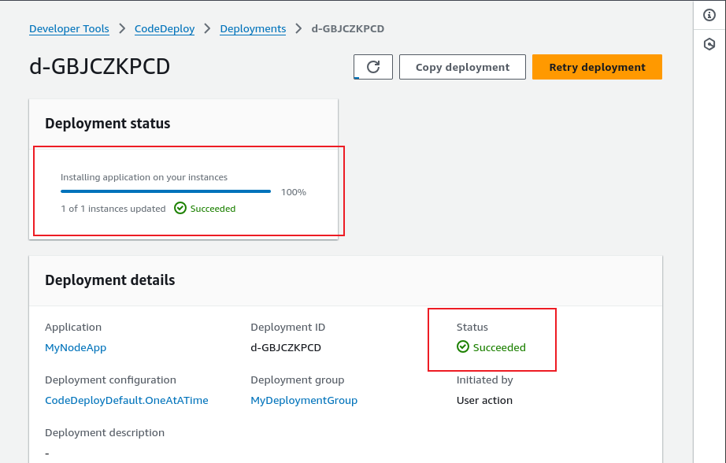

## Capstone Project: E-commerce Application and CI/CD Pipeline

In this project, we are focused on developing and maintaining and e-commerce platform. This platform has two primary componentS: 

**Ecommerce API** Backend service handles product listing, user accounts and order processing

**Ecommerce Frontend** A webapp for users to browse products, manage their accounts and place orders

The goal is to automate the integration and deployment process for both components using GitHub Actions, ensuring continuous deleivery and integration.

### Task 1: Set up git repository

A new repository for the project is created and initialized. Two directories for each component named `api` and `webapp` is also created.
The iamge below shows this task.

### Initialize GitHub Actions 

The .github/workflow is also created and initialized with an empty `main.yml` file

### Task 3: Backend API Setup

In the API directory, we setup a simple Node/Express application that handles basic e-commerce operations. 

The Image above shows the content of the API folder containing the neccessary dependencies to run the application `server.js`

The api codebase can also be seen.

Login was successful.

### Task 4: Frontend application setup

We created a simple React application that interacts with the backend API, we also ensured the front end has basic features like product listing, user login, and order placement.

This is what the webapage looks like

### Task 5: Continuous Integration Workflow

Here, we write a Github action workflow for both components to Install Dependencies, run tests and build the applications

Using the empty main.yml file we initialized.
We weill create the workflow that will install dependencied, run tests and build both applications.

The wokflow above contains two actions one for the frontend build and the other for the back end build as the names suggests.

### Task 6: Docker Integration

We will create docker files for both components and then modify the workflow to build these docker images.

### Task 7: Deloy to Cloud

Here, we will modify our workflow to deploy both applications to AWS using CodeDeploy.

We push these changes to the remote repo, the worflow is automatically triggered and a successful deployment has been achieved.

From the workflow above, we can see that the workflow os set to be triggered when changes are pushed to the main branch of the remote repository.

Upon new pushes, the worflow is triggered and deployment has taken place once again.

### Performance and Security

Security: Working with Secrets
Secrets are encrypted variables set in the repository, which could be Github repository or as an environmental varible in the Azure DevOps environment. Ideal for storing sensitive data like keys, passwords, access tokens etc as we would not want hardcode these data.

 

Performance: Caching Dependencies for faster builds By using the actions/cache action to cache depemdencies and build outputs.

