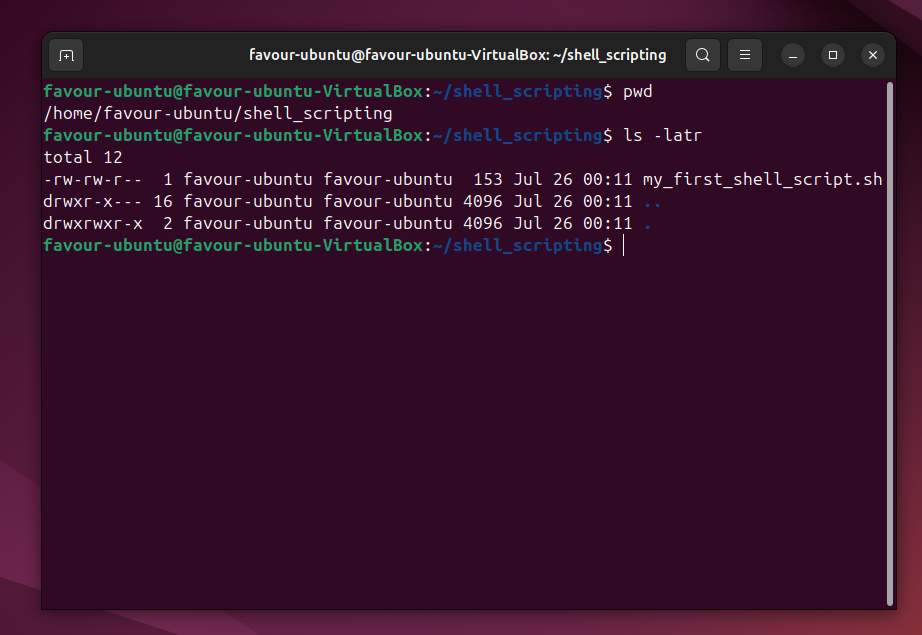

## SHELL SCRIPTING

Upon creating a Shell_Scripting folder on the server as shown in the iamge below 

We wiil then proceed to navigate into the newly created folder and then using the PWD command to verify this.

Next up is creating the new my_first_shell_script.sh file using the VIM 

Upon creation, we then write shell commands to create folders using mkdir command and also creating new users using sudo useradd commands. 

Saving the file.

Verifying using PWD and ls -latr

Executing the .sh file with "./" method, permission is denied because the .sh file has no permission to execute during creation. 

# Granting the required permission using Chmod command

By using the Chmod 774 permission, this grants all permissions to users, groups and only read permission to others.

Verifying this using the ls -latr command, this shows the updated permissions for the .sh file.

To then execute, user password has to be provided. 

After successful execution of the .sh file or script. The respective folders are created and also users that are also created. 

## Shebang and Varaible declaration and initialization.

The image shows the shebang command in the first line of the script also variable declaration and value retrieval variable using the "Read" command.

Next image shows value retrieval from user 

Final output. 

