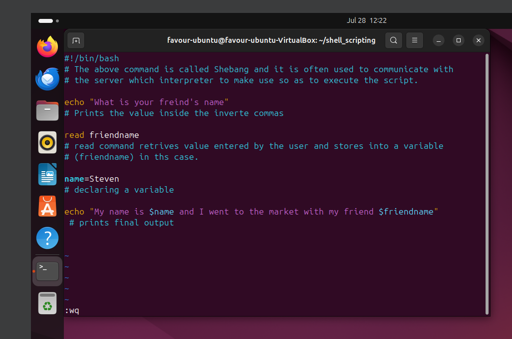
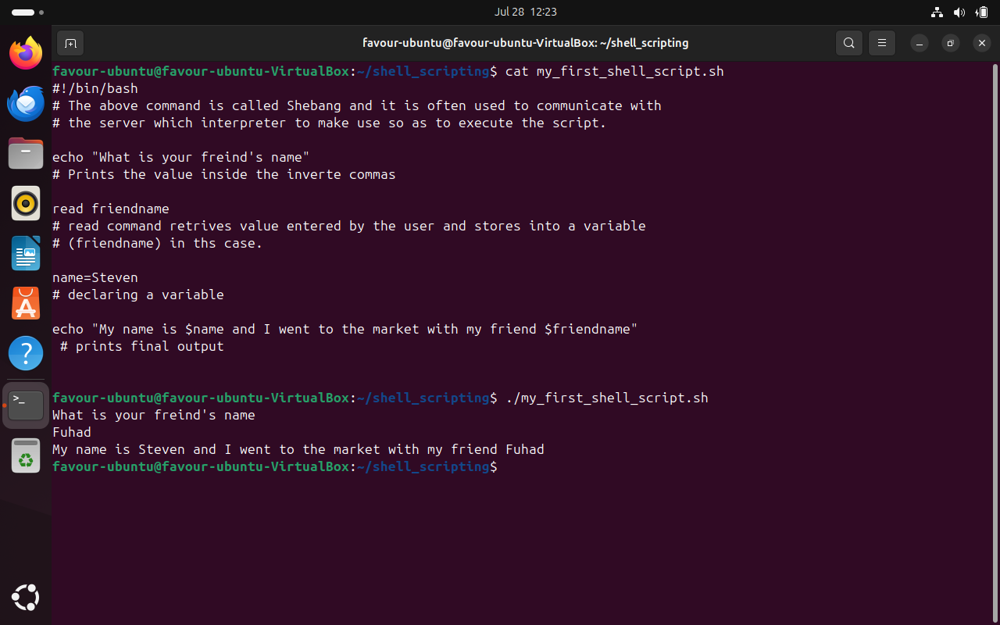

<<<<<<< HEAD
## Commenting in Shell Scripts

The image above of the shell script contains extra information on the scripts itself , The comments.

=======
## Commenting in Shell Scripts

The image above of the shell script contains extra information on the scripts itself , The comments.

>>>>>>> a90996b03a7e969c4559c3110485420de20a2c9d
Cat command is used to display the script on the Command Line Interface as a text format. Then the script is executed using the ./ command. This effectively shows the comments are not executed during the execution process.