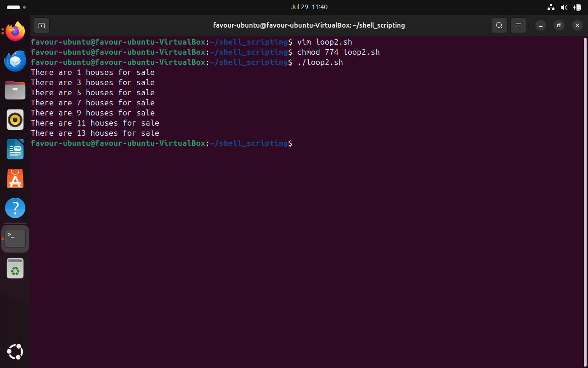

## Control Flow in Shell Scripting

Control Flow directs the order in which commands or instruction are executed in a script. Its more of a roadmap that decides which path to take based on certain conditions or how many times to visit a place. We will be focusing on these: If-else, for loops, while loops and until.

# 1. Task 1

Starting with the creation of control_flow.sh script file with the VIM command.

What this script above does is simply to capture input from user and store it into the num variable.

Upon execution, permission is denied. Chmod 774 is then used to assign necessary permission for the script to execute.

Image shows the written code with comments to explain what each line of code does.
Upon execution, input value is requested from the user, 4 is then entered.

The output is shown above.

## If-else statements

Upon combining the above script with an If-else statement, we have a more comprehensive code. 

The if statement will determine if the number inputted by the user is a positive integer. 

The result is shown in the image below. 

ELIF is also a form of if statement that stands for "else if" allowing one to test additional conditions if the previous if conditions were not met. Helps to add more layers of decision making to the script.

This is then tested by entering a negative integer by the user. 

## For Statements (Loop)

The for loop is used to iterate a list a value or range of values. It is particularly useful when you know in advance how many times you need to execute the loop body. 

Result 

Another form of conditional statement for the for loop. The comments in the script also explains the condition.

Result 

### For loop in C programming form
This style allows one to specify an initializer, condition and increment/decrement expression. 

Upon execution, the output is shown below.

## While Loop

 The while loop is used to execute a block of commands repeatedly as long as a given condition remains true. It's a fundamental control flow structure for tasks that need to be performed until a certain criterion is met.

 
 
 The image below demonstrates the use of while loop. The comment also explains the lines of code. 

 The Result 

 

 ## Until Loop

 The until loop in Bash scripting is the logical inverse of the while loop. Instead of executing commands while a condition is true, the until loop executes commands until a condition becomes true.

 

 The image above demonstrates the use of Until loop. The comment also explains the lines of code. 

 The result. Given the condition stated, nothing is outputted and rightly so. 

 

 Upon modifying the conditions. 

  

  Result

  

