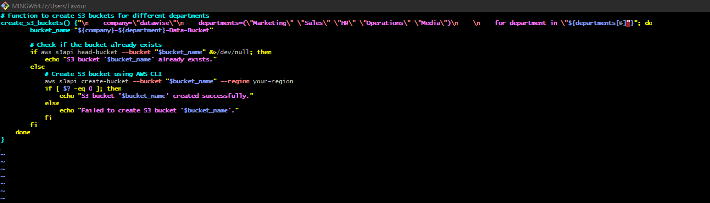

## Handling S3 Bucket Existence Error
In the context of our script to create S3 buckets, an error scenario could arise if the bucket already exists when attempting to create it. To handle this error, we can modify the script to check if the bucket exists before attempting to create it. If the bucket already exists, we can display a message indicating that the bucket is already present.

If you try to run your script more than once, you will end up creating more EC2 instances than required, and S3 bucket creation will fail because the bucket would already exist.

The image below show the code to execute while implementing error handling with s3 bucket creation on aws. 

## Summary on Error Handling in shell scripting. 

Error handling in shell scripting is vital for anticipating and managing issues that may arise during script execution, improving reliability and usability. Effective implementation involves identifying potential errors, utilizing conditional statements to check for conditions and command exit statuses, and providing informative error messages. A common scenario, particularly when working with AWS S3, is handling an S3 bucket existence error. To address this, scripts should verify if a bucket already exists before attempting creation, preventing unnecessary resource provisioning (like EC2 instances) and ensuring the script functions correctly even if run multiple times.